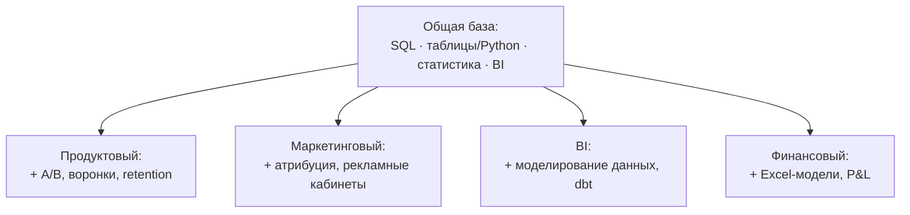

:::tip[Коротко]
«Аналитик данных» — зонтик над несколькими специализациями. Базовый стек (SQL + таблицы/Python + BI) у всех общий, а различаются они **доменом и метриками**: продуктовый живёт в retention и воронках, маркетинговый — в CAC и ROMI, BI — в дашбордах и витринах, финансовый — в P&L и прогнозах. Выбирать специализацию заранее не обязательно: начни с общей базы, домен подтянется на работе.
:::

## Зачем разбираться в видах

Вакансии называются по-разному: «продуктовый аналитик», «BI-аналитик», «marketing analyst». За названиями стоят разные задачи, метрики и даже инструменты. Понимая разницу, ты яснее читаешь вакансии, не пугаешься незнакомых аббревиатур и выбираешь, куда расти.

## Пять основных специализаций

| Вид | Главный вопрос | Ключевые метрики | Акцент в стеке |
|-----|----------------|------------------|----------------|
| **Продуктовый** | Как пользователи ведут себя в продукте? | Retention, DAU/MAU, воронки, LTV | SQL, Python, A/B, продуктовая аналитика |
| **Маркетинговый** | Окупается ли реклама? | CAC, ROMI, ДРР, конверсия каналов | SQL, Excel, атрибуция, рекламные кабинеты |
| **BI / Reporting** | Как видеть бизнес на дашбордах? | Любые бизнес-KPI | SQL, BI (Tableau/Power BI), моделирование данных |
| **Финансовый** | Сходится ли экономика? | Выручка, маржа, P&L, прогноз | Excel (глубоко), SQL, финмодели |
| **Системный / бизнес** | Как устроены процессы и требования? | Не цифры, а процессы и ТЗ | BPMN/UML, SQL, документация |

## Чем они реально отличаются

**Продуктовый аналитик** работает бок о бок с продакт-менеджерами. Считает, удерживаются ли пользователи, где отваливаются в воронке, какая фича повышает вовлечённость. Главный инструмент проверки гипотез — [A/B-тесты](/09-ab-testing/01-fundamentals/).

**Маркетинговый аналитик** отвечает за деньги на привлечение. Сводит расходы по каналам с выручкой, считает окупаемость, борется с проблемой атрибуции (какой канал на самом деле привёл клиента).

**BI-аналитик** делает данные видимыми для всей компании: строит дашборды, договаривается об определениях метрик, следит, чтобы «выручка» считалась везде одинаково. Часто ближе всего к [инструментам визуализации](/07-bi-tools/).

**Финансовый аналитик** ближе к финансам, чем к ИТ. Excel у него на экспертном уровне, строит модели юнит-экономики и прогнозы. SQL — по необходимости.

**Системный / бизнес-аналитик** — отдельная ветка: меньше про цифры, больше про требования, процессы и постановку задач разработке. Часто не считается «дата-аналитиком» в узком смысле, но названия в вакансиях пересекаются.

:::caution[Не выбирай специализацию слишком рано]
Junior почти всегда нанимают на «общую» аналитику. Глубокая специализация приходит с конкретной командой и продуктом. Поэтому сначала качай универсальную базу (SQL → статистика → BI), а ярлык появится сам.
:::

## Как пересекается стек

Видно, что ~70% навыков общие. Сменить специализацию внутри аналитики гораздо проще, чем войти в профессию с нуля.

## Задачи для самопроверки

1. Вакансия: «считать окупаемость кампаний, сводить расходы по каналам с выручкой». Какой это аналитик?

Маркетинговый. Ключевые слова — окупаемость, каналы, расходы на привлечение (CAC, ROMI). Понадобятся SQL, Excel и понимание атрибуции.

2. У всех видов общий базовый стек. Что в нём точно есть?

SQL (везде обязателен), работа с таблицами или Python, базовая статистика и какой-нибудь BI-инструмент. Различия — в доменных метриках и надстройках (A/B, атрибуция, финмодели).

3. Стоит ли junior'у искать строго «продуктового аналитика»?

Не обязательно. На джуниор-позициях специализация часто размыта, и компании учат под себя. Надёжнее показать сильную общую базу, а домен выбрать уже внутри. Сужать поиск на старте — значит резать число откликов.

## Что дальше

- [Стек по рынку 2026](/00-intro/market-stack-2026/) — что из этого реально спрашивают рекрутеры.
- [Дорожная карта обучения](/00-intro/learning-roadmap/) — в каком порядке осваивать общую базу.
- [Продуктовая аналитика](/08-product-analytics/01-key-metrics/) и [A/B-тесты](/09-ab-testing/01-fundamentals/) — если тянет в продукт.
