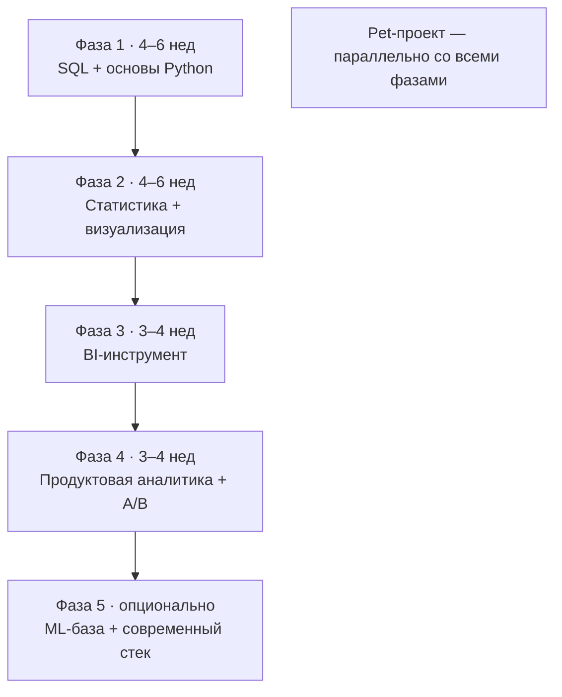

:::tip[Коротко]
Учись по порядку зависимостей, а не по интересу. Базовый путь до уровня «можно идти на junior»: **SQL → Python/pandas → статистика → визуализация и BI → продуктовая аналитика → A/B**. На это уходит примерно 4–6 месяцев при ~10–15 часах в неделю. ML и современный стек — уже сверх минимума, после трудоустройства. Параллельно с самого начала веди pet-проект — без него резюме пустое.
:::

## Зачем нужен порядок

Темы зависят друг от друга: A/B-тесты не понять без статистики, продуктовые метрики — без SQL. Если прыгать по интересному, упрёшься в пробелы и будешь буксовать. Карта ниже выстроена так, чтобы каждый шаг опирался на предыдущий.

## Фазы обучения

### Фаза 1 (4–6 недель): SQL + основы Python

Фундамент. SQL — главный навык аналитика, поэтому ему максимум внимания. Python подключай, когда SQL уже уверенный.

- [SQL](/02-sql/01-rdbms-concepts/): SELECT, фильтры, агрегации, JOIN, подзапросы, CTE, оконные функции.
- [Python для анализа](/04-python/01-python-basics-for-analyst/): базовый синтаксис, затем pandas.

### Фаза 2 (4–6 недель): статистика + визуализация

- [Статистика](/05-statistics/01-descriptive-stats/): описательные статистики, распределения, доверительные интервалы, проверка гипотез.
- [Визуализация](/06-visualization/01-principles/): какой график для какой задачи, как не врать графиком.

### Фаза 3 (3–4 недели): BI-инструмент

Выбери **один** инструмент и доведи до уверенного уровня — не распыляйся на все сразу.

- [BI-инструменты](/07-bi-tools/): Power BI или Tableau (смотри по рынку, куда целишься).

### Фаза 4 (3–4 недели): продуктовая аналитика + A/B

- [Продуктовая аналитика](/08-product-analytics/01-key-metrics/): метрики, воронки, retention, когорты.
- [A/B-тестирование](/09-ab-testing/01-fundamentals/): дизайн эксперимента, размер выборки, интерпретация.

### Фаза 5 (опционально): ML-база + современный стек

Не обязательно для junior, но усиливает резюме и открывает рост.

- [Основы ML](/10-ml-basics/01-ml-landscape/), [современный стек данных](/11-modern-stack/01-cloud-dwh-overview/).

## Сводный план

| Фаза | Темы | Срок | Зачем |
|------|------|------|-------|
| 1 | SQL + Python | 4–6 нед | Без этого никуда не возьмут |
| 2 | Статистика + визуализация | 4–6 нед | Мышление и подача результата |
| 3 | BI-инструмент | 3–4 нед | Дашборды просят почти везде |
| 4 | Продуктовая аналитика + A/B | 3–4 нед | Главные темы продуктовых собесов |
| 5 | ML + современный стек | по желанию | Рост сверх junior |

:::caution[Главная ошибка новичка]
Бесконечно смотреть курсы и не сделать ни одного проекта. Теория без практики не запоминается, а в резюме нужен **результат**. Начинай pet-проект уже в фазе 1, на том, что освоил.
:::

:::note[Сроки — ориентир, не догма]
4–6 месяцев — при ~10–15 часах в неделю с нуля. Если есть бэкграунд (Excel, программирование, математика), часть фаз пройдёшь быстрее. Не гонись за календарём — гонись за тем, чтобы реально решать задачи.
:::

1. Почему A/B-тесты стоят после статистики, а не раньше?

Потому что A/B-тест — это проверка гипотез на практике: p-value, доверительные интервалы, ошибки I/II рода, размер выборки. Без статистической базы тест превращается в ритуал с непонятными числами. Сначала теория, потом применение.

2. Стоит ли учить сразу и Power BI, и Tableau?

Нет. Возьми один и доведи до уверенного уровня — инструменты похожи, второй потом осваивается за пару недель. Распыление на оба сразу замедляет и не даёт глубины ни в одном.

3. Когда начинать pet-проект?

Как можно раньше — уже в фазе 1, на доступных данных и SQL. Проект растёт вместе с навыками: добавишь Python, потом дашборд, потом A/B-разбор. К концу обучения будет готовый кейс для резюме, а не паника «нечего показать».

## Что дальше

- [Как пользоваться сайтом](/00-intro/how-to-use-this-site/) — навигация и формат страниц.
- [SQL](/02-sql/01-rdbms-concepts/) — стартуем с фазы 1.
- [Идеи pet-проектов](/12-career/09-pet-project-ideas/) — чтобы начать практику сразу.
