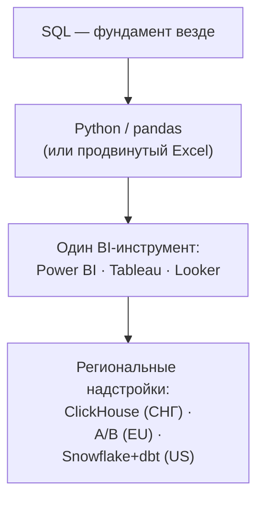

:::tip[Коротко]
Во всех регионах ядро одинаковое: **SQL обязателен везде**, дальше — Python (или продвинутый Excel) и один BI-инструмент. Различия в деталях: СНГ любит Power BI и ClickHouse, Европа — Tableau/Power BI и A/B-культуру, США — облачные хранилища (Snowflake/BigQuery) и dbt. Учить «всё подряд» не надо: закрой ядро, остальное добирается под конкретную вакансию.
:::

## Зачем смотреть на рынок

Учиться «в пустоту» обидно. Если знать, что реально пишут в вакансиях junior/middle DA, можно не распыляться: сначала то, что спрашивают в 90% объявлений, и только потом — модное и нишевое. Ниже — выжимка по требованиям, сгруппированная по регионам.

## Что общее везде

Эти навыки встречаются в подавляющем большинстве вакансий независимо от страны — это и есть твой обязательный минимум:

| Навык | Насколько обязателен |
|-------|----------------------|
| **SQL** | Обязателен почти в 100% вакансий |
| **Таблицы / визуализация** | Обязательны (Excel/Sheets + хотя бы один BI) |
| **Аналитическое мышление** | Проверяют на каждом собесе (кейсы, метрики) |
| **Базовая статистика** | Ожидается на middle, плюс для junior |
| **Python (pandas)** | Сильное преимущество, на middle часто обязателен |

## СНГ (hh.ru и аналоги)

Типичный набор для junior/middle:

- **SQL** — ядро, спрашивают всегда. Часто упоминают конкретно **PostgreSQL** и **ClickHouse**.
- **Python** (pandas, иногда визуализация) — на middle почти всегда.
- **Excel / Google Sheets** — по-прежнему обязателен, особенно ближе к бизнесу.
- **BI: Power BI** лидирует, плюс **Yandex DataLens**, Superset/Metabase.
- A/B и продуктовые метрики — в продуктовых компаниях.

:::note[Локальная специфика СНГ]
ClickHouse и Yandex-стек (DataLens, Метрика) встречаются заметно чаще, чем в остальном мире. Power BI популярнее Tableau. Это стоит учитывать, если ищешь работу именно здесь.
:::

## Европа (Glassdoor/LinkedIn: DE, UK, NL, скандинавия)

- **SQL** — обязателен.
- **Python или R** — Python доминирует, R ещё встречается в исследовательских командах.
- **BI: Tableau и Power BI** примерно наравне, плюс Looker.
- **A/B-тестирование и статистика** — ценят выше, чем в среднем по СНГ; продуктовая культура зрелая.
- Облачные хранилища (BigQuery, Snowflake) — в продуктовых и tech-компаниях.

## США (LinkedIn, Glassdoor)

- **SQL** — обязателен, часто на хорошем уровне (оконные функции, оптимизация).
- **Python** — почти везде на middle+.
- **BI: Tableau** исторически №1, плюс Looker и Power BI.
- **Облачный стек: Snowflake / BigQuery / Redshift + dbt** — встречается чаще, чем где-либо.
- A/B и эксперименты — в продуктовых компаниях это базовое требование.

## Сводная картина

:::caution[Не гонись за списком технологий]
В вакансиях часто перечислены 15 инструментов «через запятую». Это wishlist, а не обязательное. Рекрутер реально проверяет SQL, мышление на кейсах и один BI. Глубокое ядро бьёт поверхностное знакомство с десятком модных штук.
:::

## Задачи для самопроверки

1. Какой навык точно учить первым, в каком бы регионе ты ни искал работу?

SQL. Он обязателен практически в 100% вакансий DA по всему миру, и именно его проверяют на собеседовании в первую очередь. Всё остальное — после него.

2. В вакансии 14 технологий в требованиях. Стоит ли отказываться от отклика, зная половину?

Нет. Списки технологий — это wishlist. Откликайся, если закрываешь ядро (SQL + BI + аналитическое мышление). Многие требования «желательны», и компании учат под себя, особенно на junior.

3. Чем стек США заметно отличается от СНГ?

В США чаще требуют облачные хранилища (Snowflake/BigQuery/Redshift) и dbt, а из BI лидирует Tableau. В СНГ — больше ClickHouse и Power BI, заметен Yandex-стек. Ядро (SQL + Python + BI) при этом одинаковое.

## Что дальше

- [Дорожная карта обучения](/00-intro/learning-roadmap/) — превращаем этот список в план по неделям.
- [SQL](/02-sql/01-rdbms-concepts/) — начинаем с фундамента.
- [Карьерный раздел](/12-career/) — резюме, поиск работы, собеседования и переговоры о зарплате.
