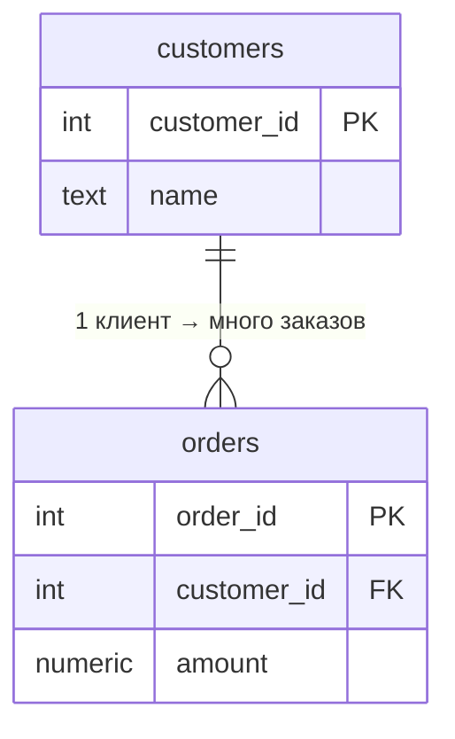

:::tip[Коротко]
Реляционная БД хранит данные в **таблицах** (строки = записи, столбцы = атрибуты).

- **Первичный ключ (PK)** — уникально идентифицирует строку (`customer_id`).
- **Внешний ключ (FK)** — ссылка на PK другой таблицы (`orders.customer_id → customers.customer_id`).
- **Нормализация** — раскладываем данные по таблицам без дублирования; собираем обратно через `JOIN`.
:::

## Зачем это нужно

Прежде чем писать запросы, надо понимать, **как данные устроены**. Почему клиенты в одной таблице, заказы в другой, и что их связывает. Без этого `JOIN` кажется магией, а дубли и потерянные строки — необъяснимыми.

## Таблица, строка, столбец

Таблица — как лист Excel со строгими правилами: у каждого столбца свой **тип данных**, и все значения в нём этому типу подчиняются.

| customer_id | name  | country | created_at |
|-------------|-------|---------|------------|
| 1           | Аня   | RU      | 2026-01-10 |
| 2           | Борис | RU      | 2026-02-03 |

- **Строка (row, запись)** — один объект: один клиент.
- **Столбец (column, поле)** — один атрибут у всех объектов: `country` у всех клиентов.

## Ключи: PK и FK

**Первичный ключ (PRIMARY KEY)** — столбец (или набор), который уникально определяет строку. Не повторяется и не бывает `NULL`. Обычно это `id`.

**Внешний ключ (FOREIGN KEY)** — столбец, который ссылается на PK другой таблицы. Так таблицы связываются: `orders.customer_id` указывает, какому клиенту принадлежит заказ.



```sql
CREATE TABLE customers (
    customer_id int PRIMARY KEY,
    name        text NOT NULL
);

CREATE TABLE orders (
    order_id    int PRIMARY KEY,
    customer_id int REFERENCES customers(customer_id),  -- внешний ключ
    amount      numeric
);
```

## Виды связей

| Связь | Пример | Как реализуется |
|-------|--------|-----------------|
| Один-к-одному (1:1) | пользователь ↔ его профиль | FK с UNIQUE |
| Один-ко-многим (1:N) | клиент → заказы | FK на стороне «многих» |
| Многие-ко-многим (N:M) | заказы ↔ товары | промежуточная таблица (`order_items`) |

Связь N:M всегда разбивается на две связи 1:N через таблицу-связку. Поэтому в нашей схеме между `orders` и `products` стоит `order_items`.

## Типы данных

| Категория | Примеры (PostgreSQL) | Для чего |
|-----------|----------------------|----------|
| Числа | `int`, `bigint`, `numeric`, `real` | id, суммы, количества |
| Строки | `text`, `varchar(n)`, `char(n)` | имена, статусы |
| Дата/время | `date`, `timestamp`, `timestamptz` | события, регистрации |
| Логический | `boolean` | флаги |
| Структуры | `json`, `jsonb`, массивы | гибкие данные |

:::caution[numeric для денег, не float]
Деньги храни в `numeric`/`decimal`, а не в `real`/`float`. Числа с плавающей точкой дают ошибки округления: `0.1 + 0.2 ≠ 0.3`. Для финансов это недопустимо.
:::

## Нормализация на пальцах

Нормализация — это раскладывание данных так, чтобы **ничего не дублировалось**. Если хранить всё в одной таблице:

| order_id | customer_name | customer_country | product |
|----------|---------------|------------------|---------|
| 101      | Аня           | RU               | Кофе    |
| 102      | Аня           | RU               | Книга   |

Имя и страна Ани дублируются. Поменяется страна — править в куче строк (и где-то забудешь → данные разъедутся). Решение — вынести клиента в отдельную таблицу и ссылаться по `customer_id`.

Три нормальные формы «на пальцах»:

- **1НФ** — в каждой ячейке одно значение (не список «Кофе, Книга» в одном поле).
- **2НФ** — все столбцы зависят от **всего** ключа, а не от его части.
- **3НФ** — нет столбцов, которые зависят от других неключевых столбцов (страну клиента не храним в таблице заказов).

:::note[OLTP vs OLAP]
Нормализованные схемы — это про **OLTP** (приложения, много мелких операций). В аналитике (**OLAP**) данные часто наоборот **денормализуют** в широкие таблицы ради скорости чтения. Подробнее — в разделе [Современный стек](/11-modern-stack/).
:::

<details>
<summary>1. Почему страну клиента не стоит хранить в таблице orders?</summary>

Это дублирование (3НФ): у клиента много заказов, и страна повторится в каждой строке. При смене страны придётся обновлять все заказы, и легко получить рассинхрон. Страна зависит от клиента, а не от заказа — значит, её место в `customers`.

</details>

<details>
<summary>2. Как связать заказы и товары, если в одном заказе много товаров и один товар в многих заказах?</summary>

Это связь N:M. Нужна промежуточная таблица `order_items(order_id, product_id, qty)` с двумя внешними ключами — она разбивает N:M на две связи 1:N.

</details>

<details>
<summary>3. Чем PRIMARY KEY отличается от обычного UNIQUE-столбца?</summary>

PK = UNIQUE + NOT NULL + (по смыслу) главный идентификатор строки, на который ссылаются внешние ключи. UNIQUE-столбцов в таблице может быть несколько, а PK — один.

</details>

## Что дальше

- [Установка окружения](/02-sql/02-environment-setup/) — поднять PostgreSQL и демо-БД, чтобы пробовать запросы.
- [SELECT и WHERE](/02-sql/03-select-basics/) — первые запросы к этим таблицам.

**Практика:** интерактивный тренажёр по моделированию — [dbdiagram.io](https://dbdiagram.io/); теория связей — на [sql-ex.ru](https://sql-ex.ru/) в разделе обучения.
