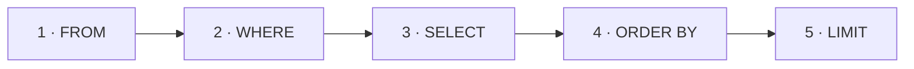

:::tip[Коротко]
Базовый запрос читается так: «**из** какой таблицы (`FROM`), **что** оставить (`WHERE`), **какие** столбцы показать (`SELECT`), **как** отсортировать (`ORDER BY`) и **сколько** строк вернуть (`LIMIT`)».

```sql
SELECT name, amount
FROM orders
WHERE status = 'paid'
ORDER BY amount DESC
LIMIT 10;
```

Запоминаем: пишем `SELECT` первым, а выполняется он почти последним.
:::

:::note[Поток данных]
Вход: таблица в БД
→ Обработка: `FROM` берёт таблицу → `WHERE` отсекает строки → `SELECT` выбирает столбцы → `ORDER BY`/`LIMIT` сортируют и ограничивают
→ Выход: таблица результата.
Зачем: достать из базы ровно нужные строки и столбцы — основа любого запроса.
:::

## Зачем это нужно

`SELECT` — это «прочитать данные». 95% работы аналитика — именно чтение: выгрузить, отфильтровать, отсортировать. Всё остальное (`JOIN`, агрегаты, окна) надстраивается над этим скелетом.

```sql title="Демо-данные"
CREATE TABLE customers (
    customer_id int PRIMARY KEY,
    name        text,
    country     text
);

CREATE TABLE orders (
    order_id    int PRIMARY KEY,
    customer_id int,
    status      text,
    amount      numeric
);

INSERT INTO customers VALUES
    (1, 'Аня', 'RU'), (2, 'Борис', 'RU'), (3, 'Кира', 'KZ'), (4, 'Лев', 'DE');

INSERT INTO orders VALUES
    (101, 1, 'paid', 2500), (102, 1, 'paid', 1800),
    (103, 2, 'cancelled', 990), (104, 3, 'paid', 4200), (105, 9, 'paid', 700);
```

## SELECT: какие столбцы показать

Перечисляешь нужные столбцы через запятую. `*` — все столбцы (удобно для разведки, но в рабочих запросах перечисляй явно — быстрее и предсказуемее).

```sql
SELECT order_id, amount FROM orders;
```

| order_id | amount |
|----------|--------|
| 101      | 2500   |
| 102      | 1800   |
| 103      | 990    |
| 104      | 4200   |
| 105      | 700    |

В `SELECT` можно считать выражения и давать им имена через `AS` (алиас):

```sql
SELECT order_id, amount, amount * 0.2 AS vat FROM orders WHERE order_id = 101;
```

| order_id | amount | vat   |
|----------|--------|-------|
| 101      | 2500   | 500.0 |

## WHERE: какие строки оставить

`WHERE` отсекает строки по условию. Операторы сравнения: `=`, `<>` (не равно), `<`, `>`, `<=`, `>=`. Условия комбинируются через `AND`, `OR`, `NOT`.

```sql
SELECT order_id, status, amount
FROM orders
WHERE status = 'paid' AND amount > 2000;
```

| order_id | status | amount |
|----------|--------|--------|
| 101      | paid   | 2500   |
| 104      | paid   | 4200   |

:::caution[Текст — в одинарных кавычках]
Строки в SQL — в `'одинарных'` кавычках: `status = 'paid'`. Двойные кавычки `"..."` — это имя столбца/таблицы, а не текст. И сравнение текста чувствительно к регистру: `'Paid' <> 'paid'`.
:::

## ORDER BY: сортировка

`ASC` — по возрастанию (по умолчанию), `DESC` — по убыванию. Можно сортировать по нескольким столбцам.

```sql
SELECT order_id, amount
FROM orders
WHERE status = 'paid'
ORDER BY amount DESC;
```

| order_id | amount |
|----------|--------|
| 104      | 4200   |
| 101      | 2500   |
| 102      | 1800   |
| 105      | 700    |

## LIMIT и OFFSET

`LIMIT n` — вернуть только первые `n` строк (топ-N после сортировки). `OFFSET k` — пропустить первые `k` (используется для постраничной выдачи).

```sql
-- топ-2 оплаченных заказа по сумме
SELECT order_id, amount
FROM orders
WHERE status = 'paid'
ORDER BY amount DESC
LIMIT 2;
```

| order_id | amount |
|----------|--------|
| 104      | 4200   |
| 101      | 2500   |

## DISTINCT: убрать дубли

`DISTINCT` оставляет только уникальные значения (или уникальные комбинации, если столбцов несколько).

```sql
SELECT DISTINCT status FROM orders;
```

| status    |
|-----------|
| paid      |
| cancelled |

## Логический порядок выполнения

Пишем мы в одном порядке, а СУБД выполняет в другом. Это объясняет частые ошибки новичков:



Отсюда два следствия:

- В `WHERE` **нельзя** использовать алиас из `SELECT` — на момент фильтрации его ещё не существует. `WHERE vat > 100` упадёт, нужно `WHERE amount * 0.2 > 100`.
- А в `ORDER BY` алиас уже **можно** — сортировка идёт после `SELECT`.

<details>
<summary>1. Выведи имена и страны клиентов не из России, по алфавиту.</summary>

```sql
SELECT name, country
FROM customers
WHERE country <> 'RU'
ORDER BY name;
```

Кира (KZ), Лев (DE).

</details>

<details>
<summary>2. Самый дешёвый оплаченный заказ — один.</summary>

```sql
SELECT order_id, amount
FROM orders
WHERE status = 'paid'
ORDER BY amount ASC
LIMIT 1;
```

Заказ 105 на 700.

</details>

<details>
<summary>3. Почему `WHERE revenue > 1000` выдаёт ошибку, а `ORDER BY revenue` — нет?</summary>

```sql
SELECT amount AS revenue FROM orders WHERE revenue > 1000;   -- ❌ ошибка
SELECT amount AS revenue FROM orders ORDER BY revenue;       -- ✅ работает
```

`WHERE` выполняется до `SELECT`, поэтому алиаса `revenue` ещё нет. `ORDER BY` — после `SELECT`, алиас уже доступен.

</details>

## Что дальше

- [Операторы фильтрации](/02-sql/04-filtering-operators/) — `BETWEEN`, `IN`, `LIKE`, `IS NULL`.
- [Агрегации](/02-sql/05-aggregations/) — посчитать сумму, среднее, количество по группам.

**Практика:** [SQLBolt](https://sqlbolt.com/) (уроки 1–6) и [sql-ex.ru](https://sql-ex.ru/) — первые задачи как раз на `SELECT`/`WHERE`.
