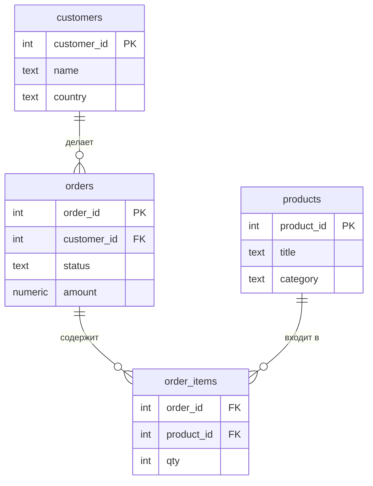

:::tip[Коротко]
`JOIN` соединяет строки из двух таблиц по условию (обычно по ключу).

- **INNER** — только совпадения в обеих таблицах.
- **LEFT** — все строки слева + совпадения справа (нет пары → `NULL`).
- **RIGHT** — зеркало LEFT.
- **FULL** — всё из обеих, несовпавшее добивается `NULL`.
- **CROSS** — каждая строка с каждой (декартово произведение).

90% запросов аналитика — это `INNER` и `LEFT JOIN`. Главная ловушка — **дубли строк** после соединения «один-ко-многим».
:::

:::note[Поток данных]
Вход: две таблицы с общим ключом (заказы + клиенты)
→ Обработка: `JOIN ... ON` сопоставляет строки по ключу; тип (`INNER`/`LEFT`/...) решает судьбу несовпавших
→ Выход: одна объединённая таблица.
Зачем: собрать данные из разных таблиц в один результат (к заказу — имя клиента).
:::

## Зачем это нужно

Данные в нормальной БД разложены по таблицам: клиенты отдельно, заказы отдельно. Чтобы ответить на вопрос «сколько потратил каждый клиент» — данные нужно **соединить**. Этим и занимается `JOIN`.

### Наша демо-схема

Дальше во всех примерах раздела используем простую схему интернет-магазина. Заведи её у себя (PostgreSQL) и повторяй запросы руками — так усваивается в разы лучше.



```sql title="Демо-данные"
CREATE TABLE customers (
    customer_id int PRIMARY KEY,
    name        text,
    country     text
);

CREATE TABLE orders (
    order_id    int PRIMARY KEY,
    customer_id int,
    status      text,
    amount      numeric
);

INSERT INTO customers VALUES
    (1, 'Аня',   'RU'),
    (2, 'Борис', 'RU'),
    (3, 'Кира',  'KZ'),
    (4, 'Лев',   'DE');   -- Лев ещё ничего не заказывал

INSERT INTO orders VALUES
    (101, 1, 'paid',      2500),
    (102, 1, 'paid',      1800),
    (103, 2, 'cancelled',  990),
    (104, 3, 'paid',      4200),
    (105, 9, 'paid',       700);  -- customer_id = 9, такого клиента нет

CREATE TABLE products (
    product_id int PRIMARY KEY,
    title      text,
    category   text
);

CREATE TABLE order_items (
    order_id   int,
    product_id int,
    qty        int
);

INSERT INTO products VALUES
    (10, 'Кофе',   'Еда'),
    (20, 'Кружка', 'Посуда'),
    (30, 'Книга',  'Книги');

INSERT INTO order_items VALUES
    (101, 10, 2),   -- в заказе 101 две позиции
    (101, 20, 1),
    (102, 30, 1),
    (104, 10, 1),
    (104, 30, 3);
```

Обрати внимание на две «нестыковки», которые и показывают разницу между джойнами:

- **Лев (id 4)** есть в `customers`, но у него нет заказов.
- **Заказ 105** ссылается на `customer_id = 9`, которого нет в `customers` (так бывает в реальных «грязных» данных).

## INNER JOIN

Возвращает только те строки, где нашлось совпадение **в обеих** таблицах. Нет пары — строка выпадает из результата.

```sql
SELECT c.name, o.order_id, o.amount
FROM customers AS c
INNER JOIN orders AS o ON o.customer_id = c.customer_id;
```

| name  | order_id | amount |
|-------|----------|--------|
| Аня   | 101      | 2500   |
| Аня   | 102      | 1800   |
| Борис | 103      | 990    |
| Кира  | 104      | 4200   |

Лев пропал (нет заказов), заказ 105 пропал (нет такого клиента). `INNER` — это пересечение.

:::note[JOIN = INNER JOIN]
Если написать просто `JOIN`, СУБД понимает это как `INNER JOIN`. Слово `INNER` необязательно, но в учебных запросах пиши явно — читается понятнее.
:::

## LEFT JOIN

Берёт **все строки левой таблицы**, а справа подставляет совпадения. Если пары нет — в правых столбцах будет `NULL`.

```sql
SELECT c.name, o.order_id, o.amount
FROM customers AS c
LEFT JOIN orders AS o ON o.customer_id = c.customer_id;
```

| name  | order_id | amount |
|-------|----------|--------|
| Аня   | 101      | 2500   |
| Аня   | 102      | 1800   |
| Борис | 103      | 990    |
| Кира  | 104      | 4200   |
| Лев   | NULL     | NULL   |

Теперь Лев на месте — с `NULL` вместо заказа. Это самый частый джойн в аналитике: «покажи **всех** клиентов, даже без заказов».

### Найти строки без пары

Классический приём — `LEFT JOIN` + фильтр по `NULL`. Так находят клиентов без заказов, товары без продаж и т.п.:

```sql {4}
SELECT c.name
FROM customers AS c
LEFT JOIN orders AS o ON o.customer_id = c.customer_id
WHERE o.order_id IS NULL;   -- остались только те, у кого пары не нашлось
```

| name |
|------|
| Лев  |

Только клиенты, для которых справа не нашлось ни одной строки.

:::caution[ON vs WHERE при LEFT JOIN]
Условие на правую таблицу, поставленное в `WHERE`, превращает `LEFT JOIN` обратно в `INNER`:

```sql
-- ❌ Лев исчезнет: WHERE отфильтрует строку с NULL-статусом
LEFT JOIN orders o ON o.customer_id = c.customer_id
WHERE o.status = 'paid'

-- ✅ условие в ON — Лев останется (с NULL в столбцах заказа)
LEFT JOIN orders o ON o.customer_id = c.customer_id AND o.status = 'paid'
```

Правило: фильтр по **правой** таблице в `LEFT JOIN` ставь в `ON`, иначе теряешь смысл «левого» соединения.
:::

## RIGHT JOIN

Зеркало `LEFT`: берёт все строки **правой** таблицы. На практике почти не используется — обычно проще поменять таблицы местами и написать `LEFT`. Эти два запроса эквивалентны:

```sql
SELECT * FROM customers c RIGHT JOIN orders o ON o.customer_id = c.customer_id;
SELECT * FROM orders o LEFT JOIN customers c ON o.customer_id = c.customer_id;
```

Второй вариант (через `LEFT`) покажет «осиротевший» заказ 105 — заказ есть, а клиента нет.

## FULL OUTER JOIN

Берёт **всё из обеих** таблиц. Несовпавшие строки с обеих сторон добиваются `NULL`. Удобно для сверки двух источников: «что есть слева, но нет справа, и наоборот».

```sql
SELECT c.name, o.order_id
FROM customers AS c
FULL OUTER JOIN orders AS o ON o.customer_id = c.customer_id;
```

| name  | order_id |
|-------|----------|
| Аня   | 101      |
| Аня   | 102      |
| Борис | 103      |
| Кира  | 104      |
| Лев   | NULL     |
| NULL  | 105      |

Здесь видно обе аномалии сразу: Лев без заказа и заказ 105 без клиента.

## CROSS JOIN

Декартово произведение: **каждая** строка слева сцепляется с **каждой** справа. Без `ON`. Если в таблицах 4 и 5 строк — на выходе 20.

```sql
-- все возможные пары "клиент × месяц" — каркас для отчёта без пропусков
SELECT c.name, m.month
FROM customers AS c
CROSS JOIN (VALUES ('2026-01'), ('2026-02'), ('2026-03')) AS m(month);
```

| name  | month   |
|-------|---------|
| Аня   | 2026-01 |
| Аня   | 2026-02 |
| Аня   | 2026-03 |
| Борис | 2026-01 |
| …     | …       |

4 клиента × 3 месяца = **12 строк**. Такой каркас потом `LEFT JOIN`-ят с фактами, чтобы в отчёте были даже пустые месяцы (с нулями вместо пропусков).

:::caution[CROSS JOIN множит строки]
`CROSS JOIN` на больших таблицах — это взрыв: 100k × 100k = 10 млрд строк. Используй осознанно (генерация календарей, сетки комбинаций), а не по ошибке (забытое условие `ON` в некоторых диалектах превращается в крест).
:::

## SELF JOIN

Таблица соединяется сама с собой — через алиасы. Нужен для иерархий: сотрудник → руководитель, категория → родительская категория. Заведём маленькую таблицу сотрудников, где `manager_id` ссылается на `employee_id` в этой же таблице:

```sql
CREATE TABLE employees (
    employee_id int PRIMARY KEY,
    name        text,
    manager_id  int   -- ссылка на employee_id руководителя
);

INSERT INTO employees VALUES
    (1, 'Светлана', NULL),  -- руководитель верхнего уровня
    (2, 'Игорь',    1),
    (3, 'Майя',     1),
    (4, 'Олег',     2);
```

```sql
-- кто чей руководитель
SELECT e.name AS employee, m.name AS manager
FROM employees AS e
LEFT JOIN employees AS m ON e.manager_id = m.employee_id;
```

| employee | manager  |
|----------|----------|
| Светлана | NULL     |
| Игорь    | Светлана |
| Майя     | Светлана |
| Олег     | Игорь    |

`LEFT` здесь не случаен: у Светланы `manager_id IS NULL`, и с `INNER JOIN` она бы выпала из результата.

## Соединение нескольких таблиц

`JOIN`-ы сцепляются цепочкой. Чтобы добраться от клиента до названий товаров, идём через `order_items`:

```sql
SELECT c.name, p.title, oi.qty
FROM customers   AS c
JOIN orders      AS o  ON o.customer_id = c.customer_id
JOIN order_items AS oi ON oi.order_id   = o.order_id
JOIN products    AS p  ON p.product_id  = oi.product_id
WHERE o.status = 'paid';
```

| name | title  | qty |
|------|--------|-----|
| Аня  | Кофе   | 2   |
| Аня  | Кружка | 1   |
| Аня  | Книга  | 1   |
| Кира | Кофе   | 1   |
| Кира | Книга  | 3   |

Каждый `JOIN` добавляет одну таблицу и своё условие в `ON`. Порядок написания на результат `INNER JOIN` не влияет (планировщик сам решает, как выполнять), но влияет на читаемость — иди по логическим связям.

## Главная ловушка: дубли после JOIN

Самая частая ошибка джуна. Соединяешь «один-ко-многим» — и строки **размножаются**. Если потом считать агрегат, получишь завышенные числа.

У Ани два заказа. Считаем «выручку по клиентам», случайно подключив лишнюю таблицу:

```sql
-- ❌ amount задвоится: order_items "размножил" строки заказа
SELECT c.name, SUM(o.amount) AS revenue
FROM customers   AS c
JOIN orders      AS o  ON o.customer_id = c.customer_id
JOIN order_items AS oi ON oi.order_id   = o.order_id
GROUP BY c.name;
```

| name | revenue | а должно быть |
|------|---------|---------------|
| Аня  | 6800    | 4300          |
| Кира | 8400    | 4200          |

У Ани заказ 101 содержит 2 позиции, поэтому его `amount` (2500) посчитался дважды: `2500 × 2 + 1800 = 6800` вместо `2500 + 1800 = 4300`. У Киры заказ 104 с двумя позициями — `4200 × 2 = 8400`. Чем больше позиций в заказе, тем сильнее завышение.

:::caution[Как лечить дубли]
- **Агрегируй на нужном уровне до соединения** (через подзапрос или CTE): сначала схлопни `order_items` до сумм по заказу, потом джойни.
- Проверяй **гранулярность**: на каком уровне одна строка результата? Один заказ? Одна позиция? Если перемешал уровни — будут дубли.
- Сомневаешься — сравни `COUNT(*)` до и после `JOIN`. Выросло сильнее, чем ожидал, — ищи fan-out.
:::

## Когда что применять

| Задача | JOIN |
|--------|------|
| Только сматченные записи (заказы с известным клиентом) | `INNER` |
| Все объекты, даже без связей (все клиенты, в т.ч. без заказов) | `LEFT` |
| Найти записи без пары (клиенты без заказов) | `LEFT` + `WHERE ... IS NULL` |
| Сверить два источника на расхождения | `FULL OUTER` |
| Все комбинации (календарь, сетка) | `CROSS` |
| Иерархия внутри одной таблицы | `SELF` (`LEFT JOIN` на себя) |

Решай на демо-схеме выше. Ответ — под спойлером, но сначала напиши сам.

<details>
<summary>1. Выведи всех клиентов и количество их оплаченных заказов (включая тех, у кого 0).</summary>

```sql
SELECT c.name, COUNT(o.order_id) AS paid_orders
FROM customers AS c
LEFT JOIN orders AS o
       ON o.customer_id = c.customer_id
      AND o.status = 'paid'      -- фильтр в ON, чтобы не потерять клиентов без заказов
GROUP BY c.name
ORDER BY paid_orders DESC;
```

`COUNT(o.order_id)` считает только не-`NULL`, поэтому у Льва и Бориса (заказ отменён) будет 0. Условие `status = 'paid'` стоит в `ON`, а не в `WHERE`.

</details>

<details>
<summary>2. Найди заказы, ссылающиеся на несуществующего клиента.</summary>

```sql
SELECT o.order_id, o.customer_id
FROM orders AS o
LEFT JOIN customers AS c ON c.customer_id = o.customer_id
WHERE c.customer_id IS NULL;
```

Результат: заказ 105. Это типичная проверка целостности данных.

</details>

<details>
<summary>3. Почему этот запрос может вернуть выручку больше реальной?</summary>

```sql
SELECT SUM(o.amount)
FROM orders o
JOIN order_items oi ON oi.order_id = o.order_id;
```

`JOIN` с `order_items` размножает строку заказа по числу позиций (fan-out), и `amount` суммируется по разу за каждую позицию. Правильно — сначала свернуть `order_items` в подзапросе или вовсе не подключать его, если нужна только сумма по заказам.

</details>

## Что дальше

- [Подзапросы](/02-sql/07-subqueries/) — как агрегировать «до JOIN», чтобы убить дубли.
- [CTE](/02-sql/08-cte/) — тот же приём, но читаемее, через `WITH`.
- [Агрегации](/02-sql/05-aggregations/) — если подзабыл `GROUP BY` / `HAVING`.

**Практика:** на [sql-ex.ru](https://sql-ex.ru/) задачи 25–50 как раз про джойны; на [LeetCode](https://leetcode.com/problemset/database/) фильтруй по тегу *Join*.
