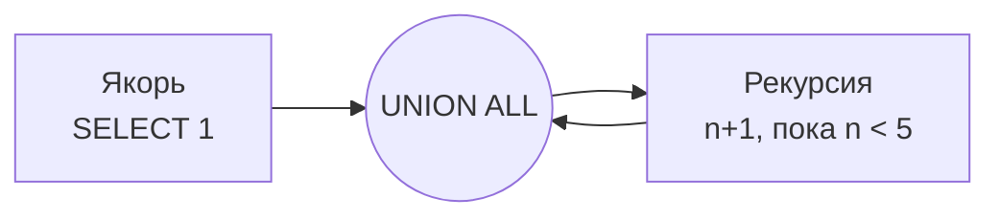

:::tip[Коротко]
CTE (`WITH name AS (...)`) — это **именованный подзапрос**, объявленный в начале запроса. Тот же результат, что у подзапроса, но читается сверху вниз, как шаги.

```sql
WITH paid AS (
    SELECT * FROM orders WHERE status = 'paid'
)
SELECT customer_id, SUM(amount) FROM paid GROUP BY customer_id;
```

Несколько CTE можно сцепить, а рекурсивный CTE обходит иерархии (сотрудник → начальник → начальник начальника).
:::

## Зачем это нужно

Когда запрос разрастается до вложенных подзапросов, его невозможно читать. CTE разбивает логику на **именованные шаги**: сначала «оплаченные заказы», потом «выручка по клиентам», потом «топ». Каждый шаг виден и переиспользуется.

```sql title="Демо-данные"
INSERT INTO orders VALUES
    (101,1,'paid',2500),(102,1,'paid',1800),
    (103,2,'cancelled',990),(104,3,'paid',4200),(105,3,'paid',700);
```

## Синтаксис: WITH ... AS

CTE объявляется до основного `SELECT`. Дальше к нему обращаешься как к обычной таблице:

```sql
WITH paid AS (
    SELECT customer_id, amount
    FROM orders
    WHERE status = 'paid'
)
SELECT customer_id, SUM(amount) AS revenue
FROM paid
GROUP BY customer_id
ORDER BY revenue DESC;
```

| customer_id | revenue |
|-------------|---------|
| 3           | 4900    |
| 1           | 4300    |

Тот же результат дал бы подзапрос в `FROM`, но `WITH paid AS (...)` читается как «возьми оплаченные → сгруппируй».

## Несколько CTE

Через запятую объявляешь цепочку — каждый следующий может ссылаться на предыдущие:

```sql
WITH paid AS (
    SELECT customer_id, amount FROM orders WHERE status = 'paid'
),
by_customer AS (
    SELECT customer_id, SUM(amount) AS revenue
    FROM paid
    GROUP BY customer_id
)
SELECT * FROM by_customer WHERE revenue > 4000;
```

| customer_id | revenue |
|-------------|---------|
| 3           | 4900    |
| 1           | 4300    |

Это и есть главная сила CTE: **разложить сложный запрос на последовательность понятных шагов**.

## CTE против дублей после JOIN

Любимый приём аналитика — свернуть «многие» в CTE, а потом джойнить (лечение fan-out из [JOIN-ов](/02-sql/06-joins/)):

```sql
WITH item_counts AS (
    SELECT order_id, SUM(qty) AS items
    FROM order_items
    GROUP BY order_id
)
SELECT o.order_id, o.amount, ic.items
FROM orders o
LEFT JOIN item_counts ic ON ic.order_id = o.order_id;
```

То же самое, что подзапрос в `FROM`, но именованный и переиспользуемый.

## Рекурсивный CTE

`WITH RECURSIVE` обходит иерархии и графы: дерево категорий, цепочку «сотрудник → руководитель», нумерацию рядов. Структура всегда одна: **якорь** (старт) + `UNION ALL` + **рекурсивная часть**, которая ссылается на сам CTE.

```sql
-- сгенерировать числа 1..5
WITH RECURSIVE nums AS (
    SELECT 1 AS n              -- якорь
    UNION ALL
    SELECT n + 1 FROM nums WHERE n < 5   -- шаг рекурсии
)
SELECT n FROM nums;
```

| n |
|---|
| 1 |
| 2 |
| 3 |
| 4 |
| 5 |



Классический кейс — развернуть иерархию сотрудников: «все подчинённые такого-то на всех уровнях».

:::caution[Не зациклься]
В рекурсивном CTE обязательно нужно условие остановки (`WHERE n < 5`). Без него запрос будет крутиться бесконечно. На графах с циклами добавляй защиту от повторного посещения узлов.
:::

## CTE vs подзапрос vs временная таблица

| Инструмент | Когда |
|------------|-------|
| **Подзапрос** | простой одноразовый шаг внутри запроса |
| **CTE (`WITH`)** | несколько шагов, нужна читаемость, переиспользование внутри одного запроса |
| **Временная таблица** | тяжёлый промежуточный результат, который нужен в **нескольких** запросах |

:::note[Производительность]
Раньше в PostgreSQL CTE были «барьером оптимизации» (материализовались всегда). С версии 12 простые CTE могут встраиваться, как подзапросы. В большинстве аналитических запросов разница не критична — выбирай по читаемости.
:::

<details>
<summary>1. Через CTE: клиенты с выручкой выше средней по клиентам.</summary>

```sql
WITH rev AS (
    SELECT customer_id, SUM(amount) AS revenue
    FROM orders WHERE status = 'paid'
    GROUP BY customer_id
)
SELECT * FROM rev
WHERE revenue > (SELECT AVG(revenue) FROM rev);
```

CTE `rev` считается один раз, и к нему обращаемся дважды — в этом и удобство.

</details>

<details>
<summary>2. Сгенерируй календарь дат на январь 2026 рекурсивным CTE.</summary>

```sql
WITH RECURSIVE days AS (
    SELECT DATE '2026-01-01' AS d
    UNION ALL
    SELECT d + 1 FROM days WHERE d < DATE '2026-01-31'
)
SELECT d FROM days;
```

Каркас дат потом `LEFT JOIN`-ят с фактами, чтобы в отчёте были даже пустые дни.

</details>

<details>
<summary>3. В чём разница между CTE и временной таблицей?</summary>

CTE живёт только внутри одного запроса и нигде не сохраняется. Временная таблица (`CREATE TEMP TABLE`) сохраняется на время сессии и доступна в нескольких последующих запросах — полезно, если тяжёлый промежуточный результат нужен многократно.

</details>

## Что дальше

- [Оконные функции](/02-sql/09-window-functions/) — ранги, running total, топ-N в группе; часто пишутся в связке с CTE.
- [Типичные паттерны](/02-sql/16-common-patterns/) — RFM, когорты, retention почти всегда строятся на CTE.

**Практика:** [LeetCode SQL](https://leetcode.com/problemset/database/) (medium/hard) и [StrataScratch](https://www.stratascratch.com/) — там без CTE уже не обойтись.
