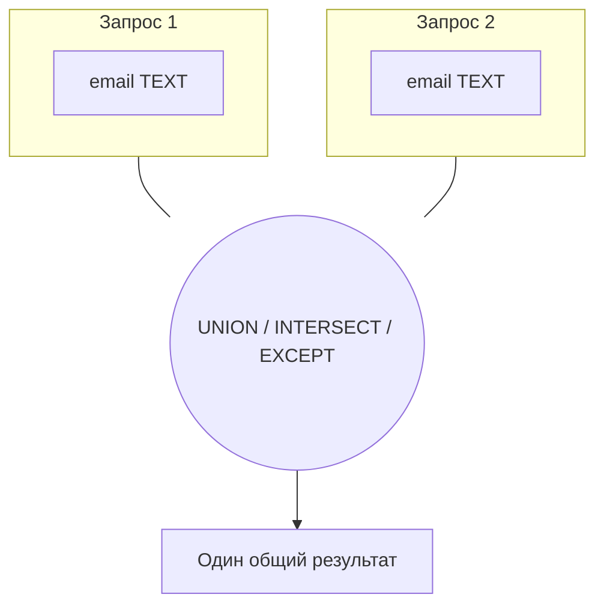

:::tip[Коротко]
Операции над множествами **склеивают результаты двух запросов** по вертикали (строки под строки), а не по горизонтали (как `JOIN`).

- `UNION` — объединить, **убрав дубли**.
- `UNION ALL` — объединить, **оставив дубли** (быстрее).
- `INTERSECT` — только строки, что есть в **обоих**.
- `EXCEPT` — строки из первого, которых **нет** во втором.

Условие: у запросов одинаковое число столбцов и совместимые типы.
:::

## Зачем это нужно

Когда данные лежат в разных таблицах одинаковой структуры (архив и актуальные заказы, два источника лидов) — их склеивают `UNION`. А `INTERSECT`/`EXCEPT` отвечают на «кто есть и там, и там» и «кто есть здесь, но не там» без джойнов.

```sql title="Демо-данные"
CREATE TABLE web_users   (email text);
CREATE TABLE app_users   (email text);

INSERT INTO web_users VALUES ('a@x.ru'), ('b@x.ru'), ('c@x.ru');
INSERT INTO app_users VALUES ('b@x.ru'), ('c@x.ru'), ('d@x.ru');
```

## UNION vs UNION ALL

`UNION ALL` просто склеивает строки. `UNION` дополнительно убирает дубли — а значит, делает сортировку/хеширование, и потому **медленнее**.

```sql
SELECT email FROM web_users
UNION ALL
SELECT email FROM app_users;
```

| email  |
|--------|
| a@x.ru |
| b@x.ru |
| c@x.ru |
| b@x.ru |
| c@x.ru |
| d@x.ru |

```sql
SELECT email FROM web_users
UNION            -- дубли убраны
SELECT email FROM app_users;
```

| email  |
|--------|
| a@x.ru |
| b@x.ru |
| c@x.ru |
| d@x.ru |

:::tip[По умолчанию бери UNION ALL]
Если ты **точно знаешь**, что дублей нет (или они не мешают) — используй `UNION ALL`: он не тратит время на дедупликацию. `UNION` пиши только когда дубли реально нужно убрать.
:::

## INTERSECT: пересечение

Строки, которые есть в **обоих** запросах. «Пользователи, которые есть и в вебе, и в приложении»:

```sql
SELECT email FROM web_users
INTERSECT
SELECT email FROM app_users;
```

| email  |
|--------|
| b@x.ru |
| c@x.ru |

## EXCEPT: разность

Строки из первого запроса, которых **нет** во втором. «Веб-пользователи, не дошедшие до приложения»:

```sql
SELECT email FROM web_users
EXCEPT
SELECT email FROM app_users;
```

| email  |
|--------|
| a@x.ru |

В Oracle тот же оператор называется `MINUS`. `INTERSECT` и `EXCEPT` тоже убирают дубли (как `UNION`).

## Правила и ловушки



:::caution[Совместимость столбцов]
- Число столбцов в обоих запросах должно **совпадать**, а типы — быть совместимыми. `SELECT id, name UNION SELECT name` упадёт.
- Имена столбцов в результате берутся из **первого** запроса.
- `ORDER BY` пишется **один раз** в самом конце — он применяется ко всему объединённому результату, а не к отдельным частям.
:::

<details>
<summary>1. Все уникальные email из обоих источников.</summary>

```sql
SELECT email FROM web_users
UNION
SELECT email FROM app_users
ORDER BY email;
```

`UNION` уберёт повторы `b@x.ru` и `c@x.ru`.

</details>

<details>
<summary>2. Кто пользуется только приложением (нет в вебе)?</summary>

```sql
SELECT email FROM app_users
EXCEPT
SELECT email FROM web_users;
```

`d@x.ru`. Порядок запросов важен: `app EXCEPT web`, а не наоборот.

</details>

<details>
<summary>3. Когда UNION ALL предпочтительнее UNION?</summary>

Когда дублей заведомо нет или они допустимы. `UNION` делает дедупликацию (сортировка/хеш всего результата) — это лишняя работа. На больших объёмах `UNION ALL` заметно быстрее.

</details>

## Что дальше

- [JOIN-ы](/02-sql/06-joins/) — объединение «по горизонтали» (столбцы), в отличие от `UNION` «по вертикали».
- [CASE и условные выражения](/02-sql/12-case-and-conditionals/) — иногда `UNION` нескольких запросов заменяется одним `CASE`.

**Практика:** задачи на `UNION`/`EXCEPT` есть на [sql-ex.ru](https://sql-ex.ru/) и [LeetCode SQL](https://leetcode.com/problemset/database/).
