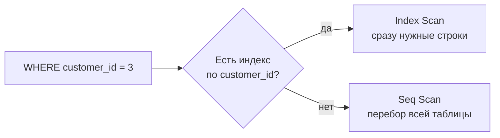

:::tip[Коротко]
Индекс — как алфавитный указатель в книге: ускоряет поиск строк, но занимает место и замедляет запись.

- Индекс помогает в `WHERE`, `JOIN`, `ORDER BY` по проиндексированному столбцу.
- `EXPLAIN ANALYZE` показывает **реальный план** запроса — главный инструмент диагностики.
- `Seq Scan` (полный перебор) на большой таблице по фильтру — сигнал, что не хватает индекса.
:::

## Зачем это нужно

Когда запрос «висит» на проде, нужно понять **почему**. Аналитику не обязательно быть DBA, но читать план запроса и понимать, где не хватает индекса, — базовый навык. Иначе твой дашборд грузится минуту вместо секунды.

## Что такое индекс (B-Tree)

Без индекса СУБД читает всю таблицу строку за строкой (`Seq Scan`). Индекс — отдельная отсортированная структура (чаще всего **B-Tree**), по которой нужные строки находятся за `log(n)` вместо `n`.

```sql
-- создать индекс по столбцу, по которому часто фильтруешь/джойнишь
CREATE INDEX idx_orders_customer ON orders (customer_id);
```



## Когда индекс помогает, а когда нет

| Помогает | Не помогает / вредит |
|----------|----------------------|
| фильтр по столбцу (`WHERE customer_id = 3`) | таблица крошечная (проще перебрать) |
| `JOIN` по ключу | столбец с низкой селективностью (`is_active` = да/нет) |
| `ORDER BY` / `LIMIT` по индексу | функция над столбцом: `WHERE LOWER(email) = ...` (если нет индекса по выражению) |
| уникальность (`UNIQUE`) | очень частые `INSERT/UPDATE` (индекс тоже обновляется) |

:::caution[Функция «отключает» индекс]
`WHERE date_trunc('day', ts) = '2026-01-05'` не использует обычный индекс по `ts` — СУБД считает функцию для каждой строки. Перепиши через диапазон: `ts >= '2026-01-05' AND ts < '2026-01-06'` — и индекс заработает (либо создай индекс по выражению).
:::

## EXPLAIN и EXPLAIN ANALYZE

`EXPLAIN` показывает **план** (как СУБД собирается выполнять). `EXPLAIN ANALYZE` реально выполняет запрос и показывает **фактическое** время и число строк.

```sql
EXPLAIN ANALYZE
SELECT * FROM orders WHERE customer_id = 3;
```

```text
Index Scan using idx_orders_customer on orders
  (cost=0.29..8.31 rows=2 width=40)
  (actual time=0.018..0.020 rows=2 loops=1)
Planning Time: 0.1 ms
Execution Time: 0.04 ms
```

Что читать в плане:

- **Тип доступа:** `Index Scan` (хорошо) vs `Seq Scan` (перебор — на большой таблице подозрительно).
- **cost** — оценка стоимости (относительная), **actual time** — реальное время.
- **rows** ожидаемые vs фактические: сильное расхождение → устаревшая статистика, помогает `ANALYZE table;`.

## Типичные тормоза

- **`SELECT *`** вместо нужных столбцов — лишний ввод-вывод, мешает index-only scan.
- **Функция над столбцом** в `WHERE` (см. выше) — индекс не используется.
- **`OR` по разным столбцам** — часто не использует индексы; иногда быстрее `UNION ALL`.
- **N+1 запросов** из приложения: вместо одного `JOIN` — цикл из сотен мелких запросов. Лечится одним запросом с `JOIN`/`IN`.
- **Отсутствие индекса на FK** — медленные `JOIN` и каскадные проверки.

## Партиционирование и денормализация (обзор)

- **Партиционирование** — разбить огромную таблицу на куски (обычно по дате). Запрос за один месяц читает одну партицию, а не всё. Актуально на миллиардах строк.
- **Денормализация** — намеренно продублировать данные (например, хранить `customer_country` прямо в `orders`), чтобы не джойнить. В OLTP это плохо (см. [нормализацию](/02-sql/01-rdbms-concepts/)), а в аналитике (OLAP, витрины) — частая и оправданная практика ради скорости чтения.

:::note[Правило оптимизации]
Не оптимизируй вслепую. Сначала `EXPLAIN ANALYZE` → найди узкое место (Seq Scan, дорогой Sort, раздувание строк) → потом точечно лечи (индекс, переписать условие, убрать `SELECT *`). «Преждевременная оптимизация — корень зла».
:::

## Задачи для самопроверки

<details>
<summary>1. Запрос фильтрует по email, но тормозит. Что проверить?</summary>

`EXPLAIN ANALYZE` — если там `Seq Scan` по большой таблице, не хватает индекса по `email`: `CREATE INDEX ON users (email);`. Если фильтр вида `WHERE LOWER(email) = ...` — нужен индекс по выражению `LOWER(email)` или нормализовать данные заранее.

</details>

<details>
<summary>2. Почему индекс по столбцу is_active (true/false) обычно бесполезен?</summary>

Низкая селективность: значений всего два, и каждое покрывает ~половину таблицы. Прочитать половину строк через индекс дороже, чем просто перебрать таблицу, поэтому планировщик индекс проигнорирует.

</details>

<details>
<summary>3. Что такое проблема N+1 и как её лечить?</summary>

Это когда приложение делает 1 запрос за списком (N записей) и затем по запросу на каждую запись — итого N+1 обращений к БД. Лечится одним запросом с `JOIN` или `WHERE id IN (...)`, который тянет все связанные данные сразу.

</details>

## Что дальше

- [Диалекты SQL](/02-sql/15-dialects-comparison/) — в колоночных БД (ClickHouse, BigQuery) оптимизация устроена иначе.
- [Современный стек](/11-modern-stack/) — как устроены аналитические хранилища (DWH) и почему там денормализуют.

**Практика:** интерактивный разбор планов — [explain.dalibo.com](https://explain.dalibo.com/); [Use The Index, Luke](https://use-the-index-luke.com/) — лучший разбор индексов.
