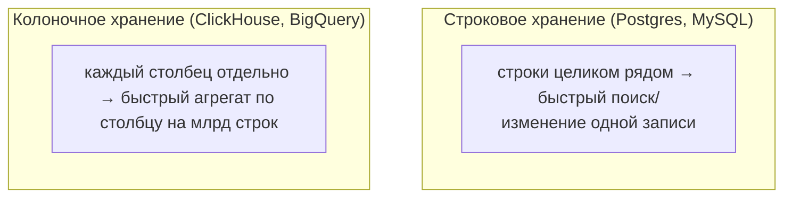

:::tip[Коротко]
SQL стандартизирован, но у каждой СУБД свой диалект: функции дат, строк, LIMIT-синтаксис и фишки отличаются.

- **PostgreSQL / MySQL** — строковые (OLTP) БД, основа приложений.
- **ClickHouse / BigQuery / Snowflake** — колоночные аналитические (OLAP), заточены под `GROUP BY` по миллиардам строк.

90% синтаксиса (`SELECT`, `JOIN`, `GROUP BY`, оконки) одинаково. Различия — в функциях и в том, **как** БД хранит данные.
:::

## Зачем это нужно

Аналитик редко сидит на одной БД: на проде ClickHouse, выгрузки в BigQuery, локально PostgreSQL. Важно понимать, что переносится между ними легко, а что придётся переписывать, и почему колоночные БД летают на аналитике.

## Строковые vs колоночные



- **Строковые (OLTP):** хранят строку целиком вместе. Быстро достать/изменить один заказ. Это PostgreSQL, MySQL — БД приложений.
- **Колоночные (OLAP):** хранят каждый столбец отдельно и сжатым. `SUM(amount)` по миллиарду строк читает только столбец `amount` — отсюда скорость аналитики. Это ClickHouse, BigQuery, Snowflake.

## PostgreSQL

Стандарт де-факто у аналитиков: богатый SQL, оконные функции, CTE, `jsonb`, регулярки, расширения. Характерное:

```sql
SELECT * FROM orders LIMIT 10;            -- LIMIT
SELECT '2026-01-01'::date;                -- кастинг через ::
SELECT name || ' ' || country FROM customers;  -- конкатенация через ||
```

## MySQL

Тоже строковая OLTP, но проще и с нюансами:

```sql
SELECT * FROM orders LIMIT 10;            -- LIMIT как в Postgres
SELECT CONCAT(name, ' ', country) ...;    -- || НЕ конкатенация (это OR!), нужен CONCAT
SELECT CAST('42' AS SIGNED);              -- кастинг через CAST, не ::
```

:::caution[Ловушки MySQL]
- `||` в MySQL по умолчанию — логическое `OR`, а не конкатенация. Используй `CONCAT`.
- Старый MySQL допускал `SELECT` несгруппированных столбцов при `GROUP BY` (`ONLY_FULL_GROUP_BY` выключен) — возвращал случайное значение. PostgreSQL за такое сразу ругается.
:::

## ClickHouse

Колоночная БД для огромных объёмов (часто в СНГ: Яндекс-стек, аналитика событий). Сверхбыстрые агрегаты, но другой подход:

```sql
SELECT count() FROM events;               -- count() без *
SELECT uniq(user_id) FROM events;         -- приближённый distinct-count
SELECT groupArray(amount) FROM orders;    -- агрегаты в массивы, ARRAY JOIN
```

Слабые места: `JOIN` тяжелее, чем в Postgres; `UPDATE`/`DELETE` дорогие (БД заточена на вставку и чтение, а не на изменение).

## BigQuery

Облачная колоночная БД Google, оплата за объём просканированных данных:

```sql
SELECT * FROM `project.dataset.orders` LIMIT 10;   -- имена в обратных кавычках
SELECT * FROM orders QUALIFY ROW_NUMBER() OVER (...) = 1;  -- QUALIFY: фильтр по оконке
```

Особенность: `QUALIFY` позволяет фильтровать по оконной функции напрямую (в Postgres для этого нужен CTE). Платишь за прочитанные байты — отсюда привычка не писать `SELECT *` и партиционировать по дате.

## Snowflake

Облачное хранилище с разделением хранения и вычислений. SQL близок к стандарту, есть `QUALIFY`, `MERGE`, удобная работа с полуструктурированными данными (`VARIANT`/JSON). Подробнее — в [Современном стеке](/11-modern-stack/02-snowflake/).

## Сводка отличий

| Тема | PostgreSQL | MySQL | ClickHouse | BigQuery |
|------|------------|-------|------------|----------|
| Тип | строковая | строковая | колоночная | колоночная |
| Профиль | OLTP/универсал | OLTP | OLAP | OLAP облако |
| Конкатенация | `\|\|` или `CONCAT` | `CONCAT` | `concat`/`\|\|` | `\|\|` или `CONCAT` |
| Кастинг | `::type` / `CAST` | `CAST` | `CAST`/`toInt32` | `CAST`/`SAFE_CAST` |
| Фильтр по оконке | через CTE | через CTE | через подзапрос | `QUALIFY` |
| `UPDATE/DELETE` | дёшево | дёшево | дорого | дорого |

:::note[Что переносится легко]
`SELECT`, `WHERE`, `JOIN`, `GROUP BY`, `HAVING`, оконные функции, CTE — почти идентичны везде. Переписывать обычно приходится: функции дат/строк, кастинг, верхнеуровневый синтаксис (`LIMIT` vs `TOP`), специфичные агрегаты. Учи стандартное ядро — диалектные мелочи гуглятся за минуту.
:::

<details>
<summary>1. Почему ClickHouse быстрее PostgreSQL на "SUM по миллиарду строк", но медленнее на "достать один заказ по id"?</summary>

Колоночное хранение: `SUM(amount)` читает только сжатый столбец `amount` — минимум ввода-вывода. Но «достать один заказ целиком» требует собрать все его столбцы из разных колоночных файлов, что для одной строки накладно. Строковый PostgreSQL хранит строку целиком — её достать дёшево.

</details>

<details>
<summary>2. Перенёс запрос с `||` из PostgreSQL в MySQL — строки «склеились» в 0/1. Почему?</summary>

В MySQL `||` по умолчанию — логическое `OR`, а не конкатенация. `'a' || 'b'` интерпретируется как булево выражение. Нужно `CONCAT('a', 'b')`.

</details>

<details>
<summary>3. Что делает QUALIFY в BigQuery и как это сделать в PostgreSQL?</summary>

`QUALIFY` фильтрует по результату оконной функции прямо в запросе (`QUALIFY ROW_NUMBER() OVER (...) = 1`). В PostgreSQL оконку нельзя в `WHERE`, поэтому её выносят в CTE/подзапрос и фильтруют снаружи.

</details>

## Что дальше

- [Современный стек](/11-modern-stack/) — Snowflake, BigQuery, ClickHouse подробно, плюс DWH и моделирование.
- [Типичные паттерны](/02-sql/16-common-patterns/) — паттерны аналитика, которые работают во всех диалектах.

**Практика:** [DB Fiddle](https://www.db-fiddle.com/) умеет переключать СУБД — один и тот же запрос можно прогнать на Postgres и MySQL и увидеть разницу.
