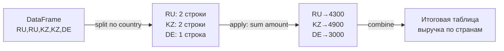

:::tip[Коротко]
**`groupby`** — это `GROUP BY` из SQL: разбить данные на группы и посчитать агрегат по каждой. `agg` считает несколько функций сразу, `transform` возвращает результат той же длины (для долей и нормировки), `pivot_table` строит сводную таблицу.
:::

:::note[Поток данных]
Вход: DataFrame со строками-событиями (заказы)
→ Обработка: **split** (разбить по ключу) → **apply** (посчитать агрегат) → **combine** (собрать обратно)
→ Выход: таблица «метрика по группам» (выручка по странам).
Зачем: свернуть тысячи строк в осмысленные цифры по срезам.
:::

Механика `groupby` — это «split-apply-combine»:



## Зачем это нужно

«Выручка по странам», «средний чек по статусу», «число заказов на клиента» — всё это группировки. `groupby` — один из самых частых инструментов в работе аналитика.

```python title="Демо-DataFrame df"
#  order_id country status  amount
#  101      RU      paid    2500
#  102      RU      paid    1800
#  104      KZ      paid    4200
#  105      KZ      cancel  700
#  106      DE      paid    3000
```

## groupby: основы

```python
df.groupby("country")["amount"].sum()
# RU    4300
# KZ    4900
# DE    3000

df.groupby("country")["amount"].mean()      # средний чек по стране
df.groupby(["country", "status"]).size()    # число строк в каждой группе
```

Шаблон: `df.groupby(КЛЮЧ)[СТОЛБЕЦ].ФУНКЦИЯ()`.

## Несколько агрегатов: agg

`agg` считает сразу несколько функций и даёт имена столбцам:

```python
df.groupby("country").agg(
    orders=("order_id", "count"),
    revenue=("amount", "sum"),
    avg_check=("amount", "mean"),
)
```

| country | orders | revenue | avg_check |
|---------|--------|---------|-----------|
| RU      | 2      | 4300    | 2150      |
| KZ      | 2      | 4900    | 2450      |
| DE      | 1      | 3000    | 3000      |

## transform: результат той же длины

В отличие от `agg` (даёт по строке на группу), `transform` возвращает значение для **каждой** исходной строки — удобно для долей:

```python
df["country_total"] = df.groupby("country")["amount"].transform("sum")
df["share"] = df["amount"] / df["country_total"]
```

Это прямой аналог оконной функции `SUM() OVER (PARTITION BY country)` из [SQL](/02-sql/09-window-functions/).

## pivot_table

Сводная таблица — агрегат на пересечении двух измерений:

```python
df.pivot_table(index="country", columns="status",
               values="amount", aggfunc="sum", fill_value=0)
```

| country | cancel | paid |
|---------|--------|------|
| RU      | 0      | 4300 |
| KZ      | 700    | 4200 |
| DE      | 0      | 3000 |

## crosstab

`crosstab` — частный случай для подсчёта частот (по умолчанию `count`):

```python
pd.crosstab(df["country"], df["status"])     # сколько заказов каждого статуса по странам
```

:::caution[Группировка молча выкидывает NaN в ключе]
Если в столбце-ключе есть пропуски (`NaN`), `groupby` по умолчанию исключает эти строки из результата. Проверь `df["country"].isna().sum()` перед группировкой или используй `dropna=False`.
:::

<details>
<summary>1. Как добавить к каждой строке долю заказа в выручке его страны?</summary>

Через `transform`: `df["share"] = df["amount"] / df.groupby("country")["amount"].transform("sum")`. `transform` возвращает сумму группы для каждой строки, не схлопывая таблицу — в отличие от `agg`.

</details>

<details>
<summary>2. Чем `agg` отличается от `transform`?</summary>

`agg` сворачивает группу в одну строку (одно число на группу). `transform` возвращает результат той же длины, что исходный DataFrame — то же значение проставляется во все строки группы. Первое — для сводок, второе — для долей и нормировки.

</details>

## Что дальше

- [pandas: объединение](/04-python/08-pandas-merging/) — склеить несколько таблиц.
- [Оконные функции в SQL](/02-sql/09-window-functions/) — тот же `transform`, но в базе.
