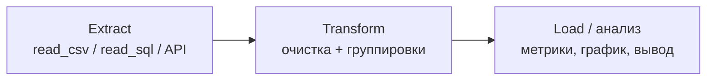

:::tip[Коротко]
Эта страница связывает всё из раздела в рабочие сценарии: **ETL-пайплайн** (загрузить → почистить → посчитать), **разбор выгрузки от продакта**, **когортный анализ** и **A/B-тест на pandas + scipy**. Это шаблоны, которые встречаются в работе и на собеседованиях почти дословно.
:::

:::note[Поток данных]
Вход: сырой источник (файл / БД / API)
→ Обработка: единый конвейер — загрузка → очистка → трансформация → анализ
→ Выход: вывод/график/таблица для решения.
Зачем: собрать кирпичи раздела в законченный анализ «from raw to insights».
:::

Типичный аналитический ноутбук — это конвейер из трёх шагов:



## Зачем это нужно

Отдельные приёмы (фильтры, группировки, merge) сами по себе — кирпичи. Ценность появляется, когда из них собран законченный анализ. Ниже — типовые сборки, которые можно брать за основу.

## ETL-пайплайн в одном ноутбуке

Классическая структура аналитического ноутбука — три шага сверху вниз:

```python
import pandas as pd

# 1. Extract — загрузка
df = pd.read_csv("orders.csv", parse_dates=["date"])

# 2. Transform — очистка и обогащение
df = (df
      .dropna(subset=["amount"])
      .query("status == 'paid'")
      .assign(month=lambda d: d["date"].dt.to_period("M")))

# 3. Load / анализ — агрегаты и вывод
revenue = df.groupby("month")["amount"].sum()
revenue.plot(kind="bar", title="Выручка по месяцам")
```

Один шаг — один логический блок. Это и есть «from raw to insights».

## Разбор выгрузки от продакта

Алгоритм, когда прислали незнакомый файл «посмотри, что тут»:

```python
df = pd.read_csv("export.csv")
df.shape                       # размер
df.head()                      # как выглядят данные
df.info()                      # типы и пропуски
df.describe()                  # числовая сводка
df.isna().sum()                # где дыры
df["category"].value_counts()  # что в категориях
```

Сначала понять данные (гранулярность, дубли, пропуски), и только потом считать метрики — иначе выводы будут на песке.

## Когортный анализ на pandas

Удержание по месячным когортам: группируем пользователей по месяцу первой покупки и смотрим активность в следующие месяцы.

```python
df["cohort"] = df.groupby("user_id")["date"].transform("min").dt.to_period("M")
df["period"] = (df["date"].dt.to_period("M") - df["cohort"]).apply(lambda x: x.n)

cohort = df.pivot_table(index="cohort", columns="period",
                        values="user_id", aggfunc="nunique")
retention = cohort.div(cohort[0], axis=0)     # доля от размера когорты
```

Теория и интерпретация — в [когортном анализе](/08-product-analytics/04-cohort-analysis/).

## A/B-тест на pandas + scipy

Сравнить конверсию двух групп и проверить значимость:

```python
from scipy import stats

a = df[df["group"] == "A"]["converted"]       # 0/1
b = df[df["group"] == "B"]["converted"]

# t-тест для сравнения средних (конверсий)
t, p = stats.ttest_ind(a, b)
print(f"Конверсия A={a.mean():.3f}, B={b.mean():.3f}, p-value={p:.4f}")
```

Если `p-value < 0.05` — различие статистически значимо. Полная методология (размер выборки, ошибки, подводные камни) — в [разделе A/B](/09-ab-testing/01-fundamentals/).

:::caution[p-value не отменяет здравый смысл]
Статзначимость (`p < 0.05`) говорит лишь, что различие вряд ли случайно. Она не говорит, что эффект **большой** или **важный для бизнеса**. Всегда смотри на размер эффекта и доверительный интервал, а не только на p-value.
:::

## Подача результатов

- **Вывод — в начало.** Сначала ответ («выручка упала из-за оттока KZ»), потом графики-доказательства.
- **График > таблица** для тренда; таблица — для точных чисел.
- **Один график — одна мысль**, подписанные оси, понятный заголовок.
- **Воспроизводимость**: ноутбук должен прогоняться сверху вниз (Restart & Run All).

<details>
<summary>1. Прислали CSV «посмотри, что интересного». С чего начать?</summary>

С понимания данных, не с метрик: `shape`, `head`, `info`, `describe`, `isna().sum()`, `value_counts()` по ключевым категориям. Определить гранулярность (что есть одна строка), найти пропуски и дубли. Считать что-либо до этого — риск ошибочных выводов.

</details>

<details>
<summary>2. A/B-тест показал p-value = 0.5. Что это значит?</summary>

Различие конверсий статистически незначимо — наблюдаемая разница вполне могла возникнуть случайно. Нельзя утверждать, что вариант B лучше A. Возможно, не хватает выборки или эффекта действительно нет.

</details>

## Что дальше

- [Продуктовая аналитика](/08-product-analytics/01-key-metrics/) — метрики, когорты, retention подробно.
- [A/B-тестирование](/09-ab-testing/01-fundamentals/) — полная методология экспериментов.
- [Типичные паттерны SQL](/02-sql/16-common-patterns/) — те же задачи на стороне базы.
