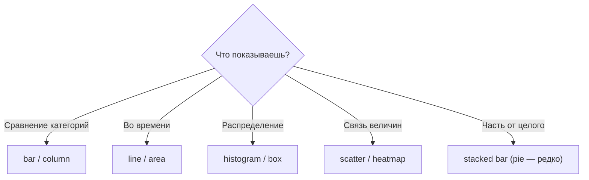

:::tip[Коротко]
Тип графика определяется **вопросом**, а не данными. Сравниваешь категории → столбики; динамика во времени → линия; распределение → гистограмма/боксплот; связь двух величин → scatter; часть от целого → (изредка) пирог. Сначала сформулируй, что хочешь показать, потом выбирай график.
:::

## Зачем это нужно

Один и тот же датасет можно показать десятком способов, но удачный — один-два. Неверный тип графика либо скрывает суть, либо вводит в заблуждение. Шпаргалка ниже экономит время и спасает от классических ошибок.

## По задаче

| Задача (что показать) | График |
|-----------------------|--------|
| Сравнить значения категорий | bar / column |
| Динамика во времени | line (area — если важен объём) |
| Распределение одной величины | histogram, box, violin |
| Связь двух величин | scatter |
| Связь матрицей (много пар) | heatmap |
| Часть от целого | stacked bar; pie — осторожно |
| Иерархия / вложенность | treemap, sunburst |

## Сравнение значений

**Bar/column** — рабочая лошадка. Для длинных подписей категорий бери горизонтальные (bar). Сортируй по значению, а не по алфавиту, — так сравнение читается быстрее.

## Динамика во времени

**Line** — стандарт для трендов: показывает направление и переломы. **Area** — когда важен накопленный объём, но осторожно со стэком (трудно читать отдельные слои).

## Распределение

- **Histogram** — форма распределения одной величины (где «горб», есть ли перекос).
- **Box plot** — медиана, квартили, выбросы; удобно сравнивать группы.
- **Violin** — боксплот + форма плотности; красиво, но требует пояснения аудитории.

Связь с [описательной статистикой](/05-statistics/01-descriptive-stats/) — прямая.

## Взаимосвязь

- **Scatter** — связь двух числовых величин (цена vs спрос); видно тренд, кластеры, выбросы.
- **Heatmap** — матрица значений цветом: корреляции, активность по дням/часам.

## Часть от целого

:::caution[Пирог — почти всегда не лучший выбор]
Пирог годится максимум для 2–3 категорий «часть от целого». При большем числе секторов углы сравнивать тяжело — столбики или stacked bar честнее. Никогда не делай 3D-пирог и не дроби его на 10 кусков.
:::

## Шпаргалка-схема

## Задачи для самопроверки

1. Нужно показать, как менялась выручка по месяцам за 2 года. Какой график?

Линейный (line): он лучше всего передаёт динамику во времени — тренд, сезонность, переломы. Столбики тоже можно, но при 24 точках линия читается чище. Пирог здесь бессмыслен — он не про время.

2. Хочешь увидеть, есть ли связь между ценой и числом продаж. Что строить?

Scatter plot: каждая точка — товар с координатами (цена, продажи). Сразу видно направление связи, кластеры и выбросы. Для оценки силы связи дополни [корреляцией](/05-statistics/08-correlation-regression/).

## Что дальше

- [Цвет и дизайн](/06-visualization/03-color-and-design/) — палитры и читаемость.
- [Принципы визуализации](/06-visualization/01-principles/) — почему столбики честнее пирогов.
