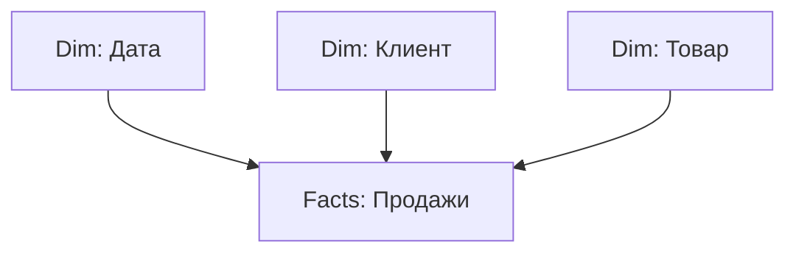

:::tip[Коротко]
Модель данных — это связанные между собой таблицы. Правильная архитектура — **звезда (star schema)**: центральная таблица фактов (продажи) и справочники-измерения (даты, клиенты, товары) вокруг. Связи **1:N** (один справочник → много фактов) с фильтрацией от справочника к фактам — основа корректных мер DAX.
:::

## Зачем нужна модель

Power BI считает меры **по связям между таблицами**. Если модель неправильная, DAX вернёт неверные числа или вообще не свяжет данные. Хорошая модель = простые меры и быстрый отчёт; плохая = боль и баги.

## Star vs Snowflake

- **Star schema (звезда)** — таблица фактов в центре, измерения напрямую вокруг. **Рекомендуемый** подход для Power BI: просто, быстро, понятно для DAX.
- **Snowflake (снежинка)** — измерения дополнительно разбиты на под-таблицы (товар → категория → отдел). Нормализованнее, но сложнее и медленнее. По возможности «расплющивай» в звезду.

## Типы связей (кардинальность)

| Связь | Что значит | Где типична |
|-------|-----------|-------------|
| **1:N** (один-ко-многим) | одна строка справочника ↔ много строк фактов | норма (клиент → заказы) |
| **1:1** | строка ↔ строка | редко, обычно сведи в одну таблицу |
| **N:N** (много-ко-многим) | обе стороны не уникальны | избегай, источник багов |

:::caution[N:N — источник проблем]
Связи «многие-ко-многим» часто дают неоднозначные результаты и задвоение, как [fan-out в джойнах](/02-sql/06-joins/). Если возникла N:N — почти всегда не хватает справочника-измерения с уникальными ключами. Введи его и сведи к двум связям 1:N.
:::

## Направление фильтрации

Связь фильтрует в направлении, и по умолчанию — **от измерения к фактам** (single direction). Выбор страны в справочнике фильтрует продажи — правильно. **Двунаправленную** (both) фильтрацию включай только при явной необходимости: она усложняет модель и порождает неоднозначности.

## Скрытие столбцов

Технические поля (ключи, служебные id) скрывают от пользователя (Hide). В отчёте остаются только осмысленные поля — модель чище и не вводит в заблуждение тех, кто строит визуалы.

## Задачи для самопроверки

1. Какая схема рекомендуется в Power BI и почему?

Звезда (star schema): таблица фактов в центре, справочники-измерения напрямую вокруг неё связями 1:N. Она проще, быстрее и предсказуемее для DAX, чем снежинка. Меры пишутся легче, отчёт работает быстрее.

2. Между двумя таблицами образовалась связь N:N и числа задваиваются. Что делать?

Ввести промежуточный справочник-измерение с уникальными ключами и заменить N:N на две связи 1:N. Многие-ко-многим почти всегда сигнализирует о нехватке измерения. Это та же логика, что предотвращение задвоения сумм в SQL-джойнах.

## Что дальше

- [DAX — основы](/07-bi-tools/power-bi/04-dax-basics/) — меры считаются по этой модели.
- [JOIN в SQL](/02-sql/06-joins/) — связи и задвоение в реляционной логике.
