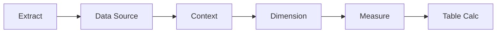

:::tip[Коротко]
Фильтры в Tableau применяются в **строгом порядке** (extract → data source → context → dimension → measure), и это объясняет «странные» результаты с [LOD](/07-bi-tools/tableau/04-lod-expressions/). **Параметр** — управляемое пользователем значение (порог, выбор метрики). **Action-фильтры** делают дашборд интерактивным: клик по графику фильтрует остальные.
:::

## Зачем это нужно

Фильтры решают, какие данные попадут в расчёт, а параметры — дают пользователю крутить дашборд. Непонимание порядка фильтров — источник ошибок «фильтр не действует на мой расчёт».

## Порядок применения фильтров

Tableau применяет фильтры всегда в этой последовательности:



| Фильтр | Что отсекает |
|--------|--------------|
| **Extract** | при создании `.hyper` |
| **Data Source** | на уровне источника |
| **Context** | задаёт «контекст» для FIXED и top-N |
| **Dimension** | по категориям (страна, дата) |
| **Measure** | по агрегату (sum > 1000) |

:::caution[FIXED считается до dimension-фильтров]
`FIXED` LOD вычисляется **после context-фильтров, но до dimension-фильтров**. Поэтому обычный фильтр по измерению может не повлиять на FIXED-расчёт. Решение: повысить нужный фильтр до **context filter** (правый клик → Add to Context) — тогда он подействует на FIXED.
:::

## Параметры

Параметр — одиночное значение, которым управляет пользователь (поле ввода, слайдер, список). Сам по себе ничего не фильтрует — его подключают в вычисляемое поле или фильтр:

```
// порог «крупного» заказа задаётся параметром
[Sales] > [Порог]
```

Типичные применения: переключатель метрики (Sales/Profit), порог отсечения, выбор периода, сценарии «what-if».

## Action-фильтры в дашбордах

Делают дашборд живым — взаимодействие между листами:

- **Filter action** — клик по элементу одного графика фильтрует другие (выбрал страну на карте → таблица показывает только её).
- **Highlight action** — подсветка связанных значений без фильтрации.
- **URL action** — клик открывает ссылку (например, карточку клиента во внешней системе).

Настраиваются: Dashboard → **Actions** → Add Action.

## Задачи для самопроверки

<details>
<summary>1. Фильтр по стране на дашборде не влияет на расчёт с FIXED. Почему и как исправить?</summary>

Потому что `FIXED` вычисляется до обычных dimension-фильтров. Чтобы фильтр подействовал, переведи его в context filter (Add to Context) — context-фильтры применяются раньше FIXED. Это прямое следствие порядка фильтров.

</details>

<details>
<summary>2. Нужно дать пользователю самому менять порог «крупного клиента» на дашборде. Чем?</summary>

Параметром: создать параметр-число «Порог» и использовать его в вычисляемом поле/фильтре (`[Sales] > [Порог]`). Пользователь меняет значение в контроле — дашборд пересчитывается. Параметры и созданы для управляемых пользователем величин.

</details>

## Что дальше

- [Дашборды](/07-bi-tools/tableau/06-dashboards/) — собираем листы и action-фильтры воедино.
- [LOD-выражения](/07-bi-tools/tableau/04-lod-expressions/) — почему важен порядок фильтров.
