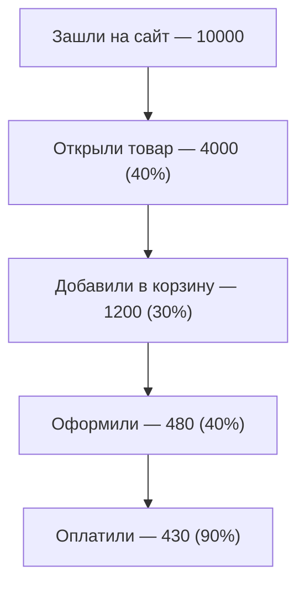

:::tip[Коротко]
Воронка показывает, как пользователи **отваливаются** по шагам пути (зашёл → положил в корзину → оплатил). Считаешь конверсию каждого шага, находишь **самый большой провал (dropoff)** — там и точка роста. Чинить узкое место выгоднее, чем равномерно «улучшать всё».
:::

## Зачем это нужно

Итоговая конверсия «3% из захода в покупку» ничего не говорит о том, **где** теряются люди. Воронка разбивает путь на шаги и показывает конкретный провал — это переводит «надо поднять продажи» в «надо починить шаг оплаты».

## Метрики воронки

- **Конверсия шага** — доля прошедших с предыдущего шага на следующий.
- **Сквозная конверсия** — доля дошедших от начала до конца.
- **Dropoff** — доля отвалившихся на шаге (`1 − конверсия шага`).

| Шаг | Юзеров | Конверсия шага | Dropoff |
|-----|--------|----------------|---------|
| Заход | 10000 | — | — |
| Товар | 4000 | 40% | 60% |
| Корзина | 1200 | 30% | **70%** ← узкое место |
| Оформление | 480 | 40% | 60% |
| Оплата | 430 | 90% | 10% |

Сквозная конверсия = 430 / 10000 = **4.3%**.

## Линейные и ветвящиеся воронки

- **Линейная** — строгая последовательность шагов (регистрация → онбординг → покупка).
- **Ветвящаяся** — несколько путей к цели (купил через поиск ИЛИ через рекомендации). Анализируется по сегментам пути.

## Как находить узкие места

1. Построй воронку по шагам, посчитай конверсию каждого.
2. Найди шаг с **максимальным dropoff** — в примере это «Товар → Корзина» (70%).
3. Сегментируй: проседает у всех или у конкретной группы (мобильные, новый регион)?
4. Сформулируй гипотезу и проверь [A/B-тестом](/09-ab-testing/01-fundamentals/).

:::caution[Чини большой провал, а не последний шаг]
Соблазн оптимизировать шаг оплаты (он ближе к деньгам), но если там dropoff 10%, а на «корзине» — 70%, потенциал в разы выше именно на корзине. Улучшение узкого места с 30% до 40% конверсии даст больше выручки, чем шлифовка и без того хорошего шага.
:::

1. Сквозная конверсия упала с 5% до 4%. С чего начать разбор?

Разбить воронку на шаги и сравнить конверсию каждого с прошлым периодом — найти, **на каком шаге** появился новый провал. Падение сквозной метрики само по себе не говорит где; проблема всегда локализована на конкретном переходе. Дальше — сегментировать (устройство, канал, регион).

2. На каком шаге воронки из примера наибольший потенциал роста?

«Товар → Корзина» с dropoff 70% (конверсия всего 30%). Это самый большой провал, поднять его проще и выгоднее, чем шаг оплаты (там уже 90%). Правило: оптимизируй самое узкое место, а не то, что ближе к деньгам.

## Что дальше

- [Когортный анализ](/08-product-analytics/04-cohort-analysis/) — как меняется поведение групп во времени.
- [A/B-тестирование](/09-ab-testing/01-fundamentals/) — проверка гипотез по улучшению воронки.
