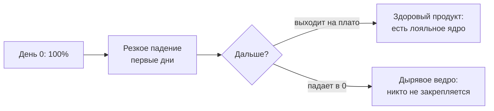

:::tip[Коротко]
Retention-кривая показывает, какая доля пользователей возвращается со временем. Три способа считать: **classic** (вернулся ровно в день N), **rolling** (вернулся в день N или позже), **range** (вернулся в окне дней). Здоровый продукт — тот, у которого кривая **выходит на плато**, а не падает в ноль. Для подписок есть денежный аналог — **NDR**.
:::

## Зачем это нужно

Retention — главный индикатор того, нужен ли продукт. Привлечение без удержания — «дырявое ведро»: льёшь трафик, а он вытекает. Кривая удержания показывает, удерживается ли ядро пользователей, и это важнее разовой конверсии.

## Classic retention

Доля пользователей, вернувшихся **именно в день N** после старта:

- День 1: 40%, День 7: 20%, День 30: 12%.
- Строгое определение; даёт «зубчатую» кривую (всплески по выходным/неделям).
- Стандарт для сравнения и бенчмарков.

## Rolling retention

Пользователь засчитан, если вернулся **в день N или позже**:

- Мягче classic, кривая глаже.
- Отвечает на вопрос «жив ли ещё пользователь», а не «зашёл ли в конкретный день».
- Удобна для продуктов с нерегулярным использованием.

## Range retention

Вернулся **в окне** (например, в дни 7–14). Компромисс: сглаживает шум classic, но привязан к диапазону. Часто используют для недельных/месячных продуктов.

## Плато retention

:::tip[Главное — выходит ли кривая на плато]
Здоровый продукт: кривая падает первые дни, потом **стабилизируется** на плато (например, ~15%) — это лояльное ядро, которое остаётся надолго. Плохой продукт: кривая безостановочно стремится к нулю — пользователи не закрепляются, бизнес держится только на постоянном притоке новых. Наличие плато важнее его высоты.
:::

## Net Dollar Retention (NDR)

Денежный retention для подписок/B2B: сколько **выручки** от когорты осталось через год с учётом оттока, апгрейдов и даунгрейдов.

- **NDR > 100%** — выручка от старых клиентов растёт даже без новых (апгрейды перекрывают отток). Признак сильного SaaS.
- **NDR < 100%** — когорта «тает» по деньгам.

В отличие от пользовательского retention, NDR учитывает, что оставшиеся клиенты могут платить **больше**.

## Задачи для самопроверки

1. Retention-кривая продукта стабилизировалась на 18% после дня 30. Это хорошо?

Да — наличие плато означает лояльное ядро, которое остаётся надолго, а не утекает в ноль. Это признак product-market fit. Высота плато зависит от типа продукта (соцсеть vs разовый сервис), но сам факт стабилизации — хороший сигнал.

2. NDR компании = 115% при оттоке клиентов. Как выручка растёт, если клиенты уходят?

Оставшиеся клиенты увеличивают платежи (апгрейды, расширение использования) сильнее, чем теряется на ушедших. NDR считает деньги, а не людей: даже теряя часть клиентов по количеству, можно расти по выручке от когорты. NDR > 100% — сильный признак для SaaS.

## Что дальше

- [RFM-сегментация](/08-product-analytics/06-rfm-analysis/) — сегментация по поведению.
- [Когортный анализ](/08-product-analytics/04-cohort-analysis/) — данные, на которых строятся кривые.
