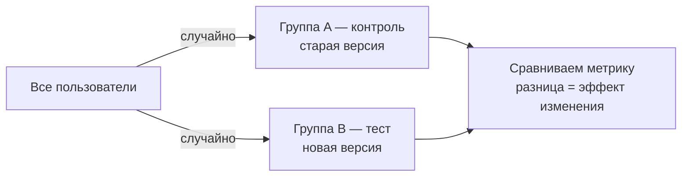
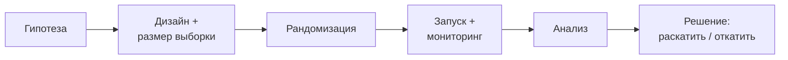

:::tip[Коротко]
A/B-тест — это **контролируемый эксперимент**: случайно делим пользователей на группы (A — контроль, B — изменение) и сравниваем метрику. Рандомизация — то, что превращает [корреляцию в причинность](/05-statistics/08-correlation-regression/): только так можно сказать «фича **вызвала** рост», а не «совпало».
:::

## Зачем это нужно

Без эксперимента любое «после редизайна выросли продажи» — догадка: могла помочь сезонность, акция, что угодно. A/B-тест изолирует эффект изменения. Это золотой стандарт продуктовых решений и обязательная тема собеседований в продуктовые компании.

## Почему A/B доказывает причинность

Случайное распределение делает группы статистически **одинаковыми во всём, кроме изменения**. Поэтому разница в метрике объясняется именно изменением, а не скрытыми факторами:

Это и отличает эксперимент от наблюдения: в наблюдательных данных всегда есть [скрытые переменные](/05-statistics/08-correlation-regression/).

## Когда A/B подходит, а когда нет

| Подходит | Не подходит |
|----------|-------------|
| много пользователей/событий | мало трафика (не наберётся [выборка](/09-ab-testing/03-sample-size/)) |
| изменение можно показать части юзеров | эффект только в долгосроке (бренд) |
| метрика измерима быстро | сетевые эффекты (соцсеть, маркетплейс) |
| группы независимы | нельзя разделить аудиторию |

:::caution[Сетевые эффекты ломают независимость]
A/B предполагает, что группы не влияют друг на друга. Но в соцсети или маркетплейсе пользователь B взаимодействует с пользователем A — изменение «протекает» между группами, и сравнение искажается. Там применяют специальные дизайны (кластерный, [switchback](/09-ab-testing/08-advanced-techniques/)), а не обычный A/B.
:::

## Альтернативы, когда A/B невозможен

- **Квазиэксперименты** — нет случайного деления, но есть «естественный» контроль: difference-in-differences (раскатили фичу в одном городе, сравнили с похожим), regression discontinuity.
- **Observational (наблюдательный) анализ** — только корреляции, без гарантии причинности; самый слабый, но иногда единственный вариант.
- **Before/after** без контроля — почти всегда ненадёжно (сезонность, тренды).

## Цикл эксперимента

Каждый шаг — отдельная страница этого раздела.

1. Почему A/B-тест доказывает причинность, а наблюдение за метрикой до/после — нет?

Рандомизация делает группы одинаковыми во всём, кроме изменения, поэтому разница в метрике объясняется именно им. В сравнении «до/после» одновременно меняется куча факторов (сезон, акции, тренд), и нельзя отделить эффект изменения от них — остаётся лишь корреляция.

2. Можно ли обычным A/B тестировать новую фичу в соцсети, где друзья видят действия друг друга?

Рискованно: сетевые эффекты нарушают независимость групп — пользователь из теста влияет на контроль через связи, и эффект «протекает». Обычный A/B занизит или исказит результат. Нужны кластерные дизайны (рандомизация по сообществам/городам) или switchback.

## Что дальше

- [Дизайн гипотезы](/09-ab-testing/02-hypothesis-design/) — как сформулировать, что проверяем.
- [Статистика: проверка гипотез](/05-statistics/06-hypothesis-testing/) — фундамент под A/B.
