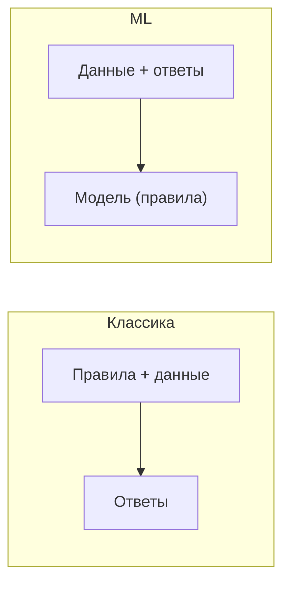

:::tip[Коротко]
Машинное обучение — это когда модель **сама находит закономерности в данных** вместо явно прописанных правил. Аналитику важно понимать виды задач (регрессия, классификация, кластеризация) и, главное, **когда ML не нужен**: часто SQL-запрос или простое правило решают задачу лучше и дешевле модели.
:::

## Зачем это нужно

Полноценный ML — работа Data Scientist'а, но аналитик обязан говорить с DS на одном языке, пользоваться готовыми моделями и не путать классификацию с регрессией на собеседовании. Плюс — трезво оценивать, где ML реально нужен, а где это overkill.

## ML на пальцах

Классическое программирование: человек пишет **правила** → программа выдаёт ответ. ML: даём **данные и ответы** → модель сама выводит правила, которые потом применяет к новым данным.

## Виды задач

| Задача | Что предсказываем | Пример |
|--------|-------------------|--------|
| **Регрессия** | число | прогноз выручки, цены |
| **Классификация** | категорию/класс | отток (да/нет), спам |
| **Кластеризация** | группы без меток | сегменты клиентов |
| **Рекомендации** | что предложить | «вам может понравиться» |

Первые две — [supervised](/10-ml-basics/02-supervised-vs-unsupervised/) (с разметкой), кластеризация — unsupervised.

## Когда ML не нужен

:::caution[Сначала спроси: а нужен ли ML вообще?]
ML — дорогой инструмент (данные, обучение, поддержка, риск ошибок). Часто он избыточен:

- Задачу решает **SQL-запрос** или агрегат — не строй модель для «суммы по регионам».
- Хватает **простого правила** («если чек > X и не заходил 30 дней → группа риска») — оно понятнее и надёжнее.
- **Мало данных** — модель не на чем учить.
- Нужна **прозрачность** решения — правило объяснимо, сложная модель нет.

Хороший аналитик предлагает ML только когда правила реально не справляются.
:::

## ML vs классическая аналитика

| | Классическая аналитика | ML |
|--|------------------------|-----|
| Вопрос | что произошло и почему | что будет / как классифицировать |
| Инструмент | SQL, BI, статистика | модели (sklearn, boosting) |
| Горизонт | прошлое и настоящее | прогноз будущего |
| Объяснимость | высокая | от средней до низкой |

Аналитик живёт в левой колонке, но граница размыта: [регрессия](/10-ml-basics/03-linear-regression/) и [оценка моделей](/10-ml-basics/08-model-evaluation/) — общая территория.

1. Нужно «находить клиентов из группы риска оттока». Это сразу задача для ML?

Не обязательно. Сначала проверь простое правило: «не заходил 30+ дней И падает частота покупок → риск». Часто оно работает не хуже модели, при этом прозрачно и дёшево. ML стоит подключать, когда правил много, они нелинейны и плохо ловят паттерн — тогда это классификация (отток да/нет).

2. «Спрогнозировать выручку на след. месяц» и «определить, спам письмо или нет» — какие это типы задач?

Первое — регрессия (предсказываем число), второе — классификация (предсказываем класс да/нет). Обе supervised: учатся на исторических данных с известными ответами. Различать тип задачи важно — от него зависят выбор модели и [метрики оценки](/10-ml-basics/08-model-evaluation/).

## Что дальше

- [Supervised vs unsupervised](/10-ml-basics/02-supervised-vs-unsupervised/) — два главных типа обучения.
- [Линейная регрессия](/10-ml-basics/03-linear-regression/) — первая и самая объяснимая модель.
