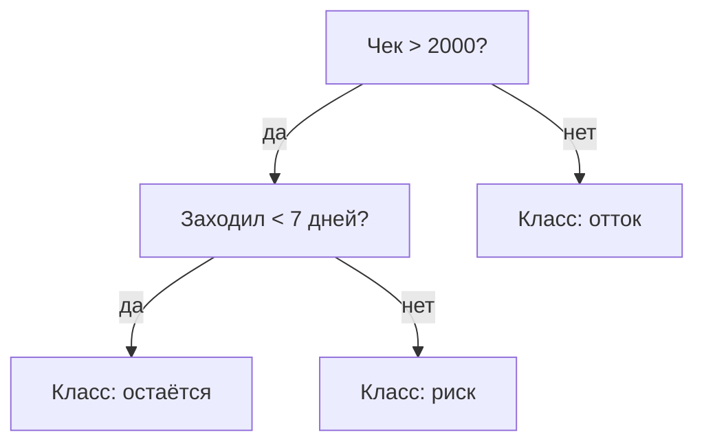

:::tip[Коротко]
Дерево решений делит данные серией вопросов «если-то» и легко переобучается. Чтобы это исправить, деревья объединяют в **ансамбли**: **Random Forest** (много независимых деревьев, голосуют) и **gradient boosting** (деревья учатся на ошибках друг друга). Бустинг (XGBoost/LightGBM/CatBoost) — чемпион на табличных данных и стандарт в индустрии.
:::

## Зачем это нужно

Деревья и бустинг ловят **нелинейные** связи и взаимодействия, которые [линейная регрессия](/10-ml-basics/03-linear-regression/) пропускает, и почти не требуют масштабирования признаков. На табличных данных (а это хлеб аналитика) бустинг обычно бьёт всё остальное — поэтому его и спрашивают.

## Дерево решений

Серия бинарных вопросов по признакам, ведущая к предсказанию:

Где делать **split**, выбирают по уменьшению «беспорядка»: **gini** или **entropy** для классификации (насколько чисты получившиеся группы), MSE — для регрессии.

:::caution[Одиночное дерево почти всегда переобучается]
Глубокое дерево может идеально разбить обучающую выборку (вплоть до листа на каждого клиента), но на новых данных провалится — это классический [overfitting](/10-ml-basics/09-overfitting/). Поэтому одиночные деревья на практике почти не используют — берут ансамбли (ниже) или жёстко ограничивают глубину.
:::

## Random Forest

Строит **много деревьев** на случайных подвыборках данных и признаков, а ответ усредняет (регрессия) или берёт голосованием (классификация). За счёт усреднения независимых деревьев резко снижает переобучение и устойчив «из коробки» — хороший дефолт.

## Gradient boosting

Деревья строятся **последовательно**: каждое следующее исправляет ошибки предыдущих. Результат — очень точная модель.

| | Random Forest | Gradient Boosting |
|--|---------------|-------------------|
| Деревья | независимы, параллельно | последовательно, на ошибках |
| Склонность к переобучению | низкая | выше (нужна настройка) |
| Точность | хорошая | обычно лучшая на табличных |
| Сложность настройки | низкая | выше |

## XGBoost vs LightGBM vs CatBoost

Три топовые реализации бустинга:

- **XGBoost** — классика, проверенный стандарт.
- **LightGBM** — быстрее на больших данных (растит деревья по листьям).
- **CatBoost** — отлично работает с **категориальными** признаками «из коробки», меньше ручной подготовки.

Для junior достаточно знать, что это все — gradient boosting, и выбор между ними — нюансы скорости и типа данных, а не принципиальная разница.

1. Почему одиночное глубокое дерево — плохая идея на практике?

Оно переобучается: разбивает обучающие данные почти идеально (вплоть до отдельных наблюдений в листьях), но не обобщается на новые. Решение — ансамбли (Random Forest усредняет много деревьев, boosting исправляет ошибки) или ограничение глубины/листьев. Одно дерево используют разве что для наглядной интерпретации.

2. В чём ключевое отличие Random Forest от gradient boosting?

Random Forest строит деревья независимо и параллельно, усредняя их (снижает дисперсию, устойчив к переобучению). Boosting строит деревья последовательно, каждое исправляет ошибки предыдущих (снижает смещение, точнее, но требует аккуратной настройки, чтобы не переобучиться). Boosting обычно точнее на табличных данных.

## Что дальше

- [Кластеризация](/10-ml-basics/06-clustering/) — unsupervised-задачи.
- [Overfitting](/10-ml-basics/09-overfitting/) — почему деревья переобучаются и как это ловить.
