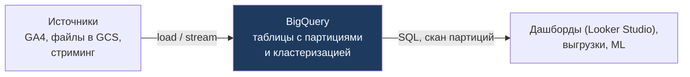

:::tip[Коротко]
BigQuery — **serverless** DWH от Google: не управляешь серверами вообще, просто пишешь SQL. Главная модель оплаты — **on-demand: платишь за объём данных, прочитанных запросом**. Поэтому ключевой навык — **партиционирование и кластеризация**, чтобы запрос сканировал меньше и стоил дешевле.
:::

:::note[Поток данных]
Вход: данные грузятся в BigQuery (load jobs, стриминг, внешние таблицы из GCS)
→ Обработка: serverless-движок сканирует нужные партиции/кластеры по SQL-запросу
→ Выход: результат для дашбордов, выгрузок и ML.
Зачем: аналитика без администрирования серверов; платишь за объём просканированных данных.
:::

## Зачем это нужно

BigQuery популярен в продуктовых компаниях и нативно связан с экосистемой Google (GA4, [Looker Studio](/07-bi-tools/looker/01-intro/)). Неэффективный запрос здесь бьёт по кошельку напрямую — понимание модели оплаты экономит реальные деньги.

## Архитектура

Полностью **serverless**: нет кластеров, которыми надо управлять (в отличие от warehouse'ов Snowflake). Google сам выделяет ресурсы под запрос. Ты просто загружаешь данные и пишешь SQL — инфраструктура невидима.



## Как подключиться и загрузить данные

- **Подключение:** веб-консоль BigQuery, CLI `bq`, клиентские библиотеки (Python `google-cloud-bigquery`), нативно — [Looker Studio](/07-bi-tools/looker/01-intro/).
- **Загрузка:** разовый импорт файла, постоянный стриминг или **внешние таблицы** прямо поверх файлов в GCS:

```bash
bq load --source_format=CSV dataset.orders gs://bucket/orders.csv
```

GA4 умеет лить события в BigQuery нативно — отсюда его популярность в продуктовой аналитике.

## Standard vs Legacy SQL

Раньше был свой «Legacy SQL», сейчас стандарт — **Standard SQL** (соответствует ANSI, как в обычных БД). Всегда используй Standard SQL; Legacy встречается только в очень старых проектах.

## Партиционирование и кластеризация

Главные инструменты экономии, раз оплата — за просканированный объём:

- **Партиционирование** (обычно по дате) — таблица физически бьётся на части. Запрос с фильтром по дате читает только нужные партиции, а не всю таблицу.
- **Кластеризация** — данные внутри партиции упорядочены по выбранным столбцам, что ещё сокращает чтение при фильтрах по ним.

```sql
-- задаём партиционирование по дню и кластеризацию по стране при создании таблицы
CREATE TABLE `project.dataset.orders`
PARTITION BY DATE(event_ts)
CLUSTER BY country AS
SELECT * FROM `project.dataset.orders_raw`;

-- фильтр по партиционированному полю резко снижает объём скана и цену
SELECT country, SUM(amount)
FROM `project.dataset.orders`
WHERE DATE(event_ts) BETWEEN '2026-01-01' AND '2026-01-31'   -- читает 1 месяц, не всё
GROUP BY country;
```

:::tip[Считай деньги: сколько байт прочитает запрос]
On-demand стоит порядка **$6 за 1 ТБ** просканированных данных. Перед запуском смотри объём: в UI BigQuery справа есть оценка «This query will process X», или из CLI — `bq query --dry_run` (выполнение не запускается, только показывает байты). Если таблица событий 5 ТБ, а фильтр по партиции сокращает скан до 50 ГБ — это разница $30 против $0.30 за один запуск.
:::

## Оплата: on-demand vs slots

| Модель | Как платишь | Когда |
|--------|-------------|-------|
| **On-demand** | за ТБ, прочитанные запросом | непредсказуемая нагрузка |
| **Slots (capacity)** | за зарезервированную мощность (фикс/мес) | большой стабильный объём |

:::caution[`SELECT *` в BigQuery бьёт по кошельку]
При on-demand ты платишь за **прочитанные столбцы**. `SELECT *` по широкой таблице сканирует все колонки и стоит дорого, даже если нужны два поля. Выбирай только нужные столбцы и фильтруй по партиции. Превью данных смотри через интерфейс/`LIMIT` в режиме, не считающемся как полный скан, — но помни, что `LIMIT` сам по себе НЕ снижает объём скана при on-demand.
:::

## BI Engine

Ускоритель в памяти для дашбордов: кеширует данные, чтобы BI-инструменты (Looker Studio и др.) отдавали отчёты с задержкой в доли секунды. Полезно, когда поверх BigQuery много интерактивных дашбордов.

<details>
<summary>1. Почему `SELECT *` в BigQuery — дорогая привычка?</summary>

При on-demand оплата идёт за объём прочитанных данных, а BigQuery колоночный — `SELECT *` читает все столбцы, даже ненужные. Выбрав 2 нужных поля вместо всех 50, платишь в разы меньше. Плюс фильтр по партиционированной дате сокращает объём ещё сильнее.

</details>

<details>
<summary>2. Таблица событий огромная, но запросы почти всегда за конкретный период. Что настроить?</summary>

Партиционирование по дате события: тогда запрос с фильтром по дате читает только нужные партиции, а не всю таблицу — быстрее и дешевле. Дополнительно — кластеризация по часто фильтруемым столбцам (например, country) для ещё меньшего скана.

</details>

## Что дальше

- [ClickHouse](/11-modern-stack/04-clickhouse/) — популярное в СНГ OLAP-хранилище.
- [Looker Studio](/07-bi-tools/looker/01-intro/) — нативно подключается к BigQuery.
