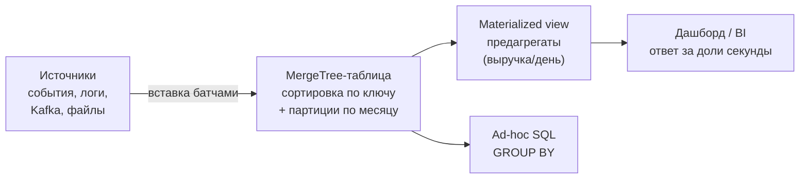

:::tip[Коротко]
ClickHouse — сверхбыстрая колоночная OLAP-БД с открытым кодом, созданная в Яндексе. Заточена под **аналитические запросы в масштабе** (миллиарды строк за секунды). Сердце — семейство движков **MergeTree**. В СНГ-вакансиях встречается очень часто, поэтому знать её основы особенно полезно именно здесь.
:::

:::note[Поток данных]
Вход: события / логи / выгрузки (INSERT, Kafka, файлы, S3)
→ Обработка: MergeTree сортирует, сжимает и сливает части; materialized view считает агрегаты при вставке
→ Выход: молниеносные `GROUP BY` для дашбордов и ad-hoc.
Зачем: аналитика на миллиардах строк за секунды там, где обычная БД встанет.
:::

## Зачем это нужно

В СНГ ClickHouse — почти стандарт для продуктовой аналитики (его используют Яндекс и множество компаний вокруг). Если ищешь работу здесь, велик шанс работать именно с ним, а не со Snowflake/BigQuery ([обзор стека](/00-intro/market-stack-2026/)). Типичный сценарий — аналитика событий: миллиарды строк логов/кликов, по которым нужны быстрые `GROUP BY`.

## Колоночное хранение на пальцах

«Колоночная» — ключевое слово. Возьмём одну и ту же таблицу:

| order_id | country | amount |
|----------|---------|--------|
| 1 | RU | 2500 |
| 2 | KZ | 4200 |
| 3 | RU | 1800 |

Разница — **как она физически лежит на диске**:

| Способ | Как лежит на диске | Что читает `SUM(amount)` |
|--------|--------------------|--------------------------|
| Строковое (PostgreSQL) | `(1,RU,2500)` `(2,KZ,4200)` `(3,RU,1800)` — строки целиком | **все** столбцы всех строк |
| Колоночное (ClickHouse) | `[1,2,3]` · `[RU,KZ,RU]` · `[2500,4200,1800]` — каждый столбец отдельно | **только** столбец `amount` |

Поэтому агрегат по миллиарду строк в ClickHouse — это чтение **одного столбца**, а не всей таблицы. Плюс однотипные значения в столбце отлично сжимаются. Отсюда скорость.

## Как это работает целиком

Весь путь данных от источника до дашборда — одной схемой:



Дальше — по шагам этой схемы: как поставить, как загнать данные, как организовать таблицу и как с ней работать.

## Как поставить и подключиться

Откуда он берётся — два пути:

- **Self-hosted** — поднять у себя. Быстрее всего через Docker:

```bash
docker run -d --name ch -p 8123:8123 -p 9000:9000 clickhouse/clickhouse-server
clickhouse-client            # интерактивный SQL-клиент в терминале
```

- **ClickHouse Cloud** — управляемый сервис, не надо администрировать сервер.

Подключаются к нему по трём интерфейсам:

| Интерфейс | Порт | Для чего |
|-----------|------|----------|
| **HTTP** | 8123 | запросы из кода/скриптов, REST |
| **Native (TCP)** | 9000 | `clickhouse-client`, самый быстрый |
| **ODBC / JDBC-драйвер** | — | подключение [BI-инструментов](/07-bi-tools/) |

## Как данные попадают внутрь

ClickHouse любит **пакетную вставку** (вставляй тысячами строк, а не по одной):

```sql
INSERT INTO events VALUES (...), (...);          -- вручную
INSERT INTO events FROM INFILE 'data.csv' FORMAT CSV;   -- из файла
```

Для постоянного потока используют **интеграционные движки** — таблицы, которые сами тянут данные из источника: `Kafka` (стрим событий), `PostgreSQL`/`MySQL` (реплика OLTP), `S3` (файлы из озера). Часто над таким источником вешают [materialized view](#материализованные-представления), которая на лету складывает данные в MergeTree-таблицу.

:::caution[Не вставляй по одной строке]
ClickHouse создаёт на каждую вставку отдельную «часть» (part) и сливает их фоном. Тысячи мелких `INSERT` по одной строке порождают тысячи частей и убивают производительность. Копи и вставляй **батчами** — это главное правило загрузки.
:::

## Как организованы данные: MergeTree

Основное семейство таблиц. Данные пишутся частями (parts), которые фоном сливаются (merge), и хранятся отсортированными по **ключу сортировки** (`ORDER BY` в DDL):

```sql
CREATE TABLE events (
    event_date Date,
    user_id UInt64,
    event_type String,
    amount Float64
) ENGINE = MergeTree()
PARTITION BY toYYYYMM(event_date)   -- разбивка на части по месяцам
ORDER BY (event_date, user_id);     -- ключ сортировки = быстрые диапазонные запросы
```

- **`ORDER BY`** (ключ сортировки) работает как первичный индекс — даёт быстрый поиск по диапазону.
- **`PARTITION BY`** физически бьёт таблицу на части (обычно по месяцу): запрос с фильтром по дате читает только нужные партиции, а старые легко удалять целиком (`DROP PARTITION`).

У MergeTree есть **варианты движка** — они по-разному «схлопывают» строки с одинаковым ключом сортировки при фоновом слиянии:

| Движок | Что делает при слиянии | Когда |
|--------|------------------------|-------|
| **MergeTree** | ничего, хранит все строки | сырые события |
| **ReplacingMergeTree** | оставляет последнюю версию по ключу | дедупликация, «последнее состояние» |
| **SummingMergeTree** | суммирует числовые столбцы по ключу | предагрегаты |
| **AggregatingMergeTree** | хранит состояния агрегатов | сложные предрасчёты с MV |

:::caution[«Схлопывание» происходит не сразу]
ReplacingMergeTree убирает дубли только при фоновом слиянии частей — момент не контролируется. Чтобы гарантированно увидеть схлопнутый результат, добавляй модификатор `FINAL` (`SELECT ... FROM t FINAL`) — но он медленный, не злоупотребляй им на больших данных.
:::

### ARRAY JOIN

ClickHouse умеет хранить **массивы** в ячейке (например, список товаров в заказе). `ARRAY JOIN` «разворачивает» массив в строки — аналог unnest:

```sql
SELECT user_id, item
FROM orders
ARRAY JOIN items AS item;     -- одна строка с [a,b,c] → три строки
```

### Материализованные представления

**Materialized view** работает как триггер на вставку: при записи в исходную таблицу автоматически считает агрегат и складывает в другую таблицу.

```sql
-- MV считает дневную выручку прямо при вставке новых событий
CREATE MATERIALIZED VIEW revenue_daily_mv
ENGINE = SummingMergeTree()
ORDER BY day AS
SELECT toDate(event_date) AS day, sum(amount) AS revenue
FROM events
GROUP BY day;
```

Теперь дашборд читает крошечную `revenue_daily_mv` (одна строка на день) вместо агрегации миллиардов строк `events` при каждом открытии.

## Как с этим работать

Запросы пишут на SQL, близком к стандарту, плюс свои функции: `uniq()` (приближённый `COUNT DISTINCT`, очень быстрый), `quantile()`, `toDate/toStartOfMonth`, `arrayJoin`. Работают через `clickhouse-client`, HTTP или подключённый [BI](/07-bi-tools/) (Metabase, Tableau, Yandex DataLens — по драйверу).

:::caution[ClickHouse — не для частых UPDATE/DELETE]
Это OLAP-движок: блестящ на чтении и пакетной вставке, но **точечные UPDATE/DELETE дорогие и асинхронные** (через `ALTER ... UPDATE`, «мутации»). Не используй его как транзакционную БД приложения — для этого есть [OLTP](/11-modern-stack/01-cloud-dwh-overview/). Он для аналитики, а не для «обновить статус заказа».
:::

**Итог потока:** события льются батчами/стримом в MergeTree-таблицу, сортируются и партиционируются, MV считают предагрегаты — и дашборд получает ответ по миллиардам строк за доли секунды.

## Задачи для самопроверки

<details>
<summary>1. Скрипт делает 50 000 одиночных INSERT в ClickHouse и всё тормозит. В чём дело?</summary>

ClickHouse на каждую вставку создаёт отдельную часть (part) и сливает их фоном. Тысячи одиночных `INSERT` порождают тысячи частей — деградация. Нужно копить и вставлять **батчами** (тысячи строк за раз) или лить через буфер/Kafka-движок. Это ключевое правило загрузки в ClickHouse.

</details>

<details>
<summary>2. Команда хочет хранить в ClickHouse заказы с частым обновлением статуса. Хорошая идея?</summary>

Плохая. ClickHouse — OLAP-движок, точечные UPDATE дорогие и асинхронные (мутации). Частое обновление статусов — OLTP-нагрузка, для неё нужна транзакционная БД (PostgreSQL). ClickHouse держи для аналитики событий: быстрые чтения и пакетные вставки, а не построчные апдейты.

</details>

<details>
<summary>3. Зачем материализованное представление?</summary>

Чтобы считать агрегаты заранее, в момент вставки. MV работает как триггер: новые строки исходной таблицы автоматически агрегируются в целевую (например, выручка по дням). Дашборды читают маленький предрассчитанный результат вместо тяжёлого пересчёта по миллиардам строк.

</details>

## Что дальше

- [dbt](/11-modern-stack/05-dbt-basics/) — трансформации данных как код (работает и поверх ClickHouse).
- [Стек по рынку 2026](/00-intro/market-stack-2026/) — почему ClickHouse так важен в СНГ.
