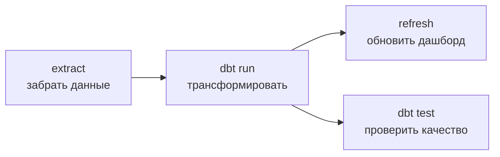

:::tip[Коротко]
Airflow — оркестратор пайплайнов: описываешь **DAG** (граф задач с зависимостями) на Python, и Airflow запускает задачи **по расписанию** в нужном порядке, следит за статусом и перезапускает упавшие. Аналитику обычно не нужно писать DAG'и с нуля — нужно понимать, как читать пайплайн, где смотреть логи и что такое backfill.
:::

:::note[Поток данных]
Вход: расписание или внешний триггер
→ Обработка: DAG запускает задачи в нужном порядке (extract → dbt → refresh), следит за статусом, перезапускает упавшие
→ Выход: обновлённые витрины и дашборды по графику.
Зачем: автоматизация и контроль пайплайна — данные обновляются сами, видно, где что сломалось.
:::

## Зачем это нужно

Отчёт должен обновляться сам: ночью забрать данные → трансформировать ([dbt](/11-modern-stack/05-dbt-basics/)) → обновить дашборд. Airflow связывает эти шаги в управляемый процесс. Видеть, почему «данные за вчера не обновились», и читать граф задач — рабочий навык в командах с DWH.

## Что такое Airflow

Инструмент для **оркестрации** (управления порядком и расписанием) задач обработки данных. Сам данные не обрабатывает — он **дирижёр**: говорит, что и когда запустить, и в какой последовательности.

## Где живёт и как ставится

Airflow — сервер с веб-интерфейсом (планировщик + UI с историей запусков и логами). Откуда берётся:

- **Self-host** — поднять самим (Docker Compose с готовым `docker-compose.yaml` от Airflow); для теста — `pip install apache-airflow`.
- **Managed** — не админить сервер: **MWAA** (AWS), **Cloud Composer** (Google), **Astronomer**.

DAG'и кладут как Python-файлы в папку `dags/` — Airflow сам их подхватывает. Подключения к источникам (БД, DWH, API) хранятся в **Connections** в UI, а не в коде.

## DAG и tasks

**DAG** (Directed Acyclic Graph) — граф задач без циклов: задачи и стрелки-зависимости «что после чего».



- **Task** — отдельный шаг (забрать файл, выполнить SQL, запустить dbt).
- Стрелки задают порядок: `C` не стартует, пока не выполнен `B`.
- DAG описывается кодом на Python (расписание, задачи, зависимости).

Как выглядит минимальный DAG в коде:

```python
from airflow import DAG
from airflow.operators.bash import BashOperator
import pendulum

with DAG(
    dag_id="daily_marts",
    schedule="0 6 * * *",                  # каждый день в 06:00 (cron)
    start_date=pendulum.datetime(2026, 1, 1),
    catchup=False,                          # не догонять все пропущенные дни автоматически
) as dag:
    extract = BashOperator(task_id="extract", bash_command="python extract.py")
    transform = BashOperator(task_id="dbt_run", bash_command="dbt build")
    extract >> transform                    # порядок: сначала extract, потом dbt
```

## Базовые операторы

Task создаётся **оператором** — шаблоном под тип работы:

- **PythonOperator** — выполнить Python-функцию.
- **BashOperator** — команду оболочки.
- **SQL-операторы** — запрос к БД/DWH.
- **Sensor** — ждать события (появился файл, готова таблица-источник).
- Готовые интеграции — запуск dbt, выгрузка из источников и т.д.

:::caution[Задачи должны быть идемпотентными]
Airflow перезапускает упавшие задачи (`retries`) и гоняет backfill — поэтому повторный запуск за тот же день **не должен** задваивать данные. Пиши шаги так, чтобы повтор давал тот же результат: не `INSERT` вслепую, а перезапись партиции/`MERGE` по ключу за дату прогона. Неидемпотентный пайплайн при первом же retry задвоит выручку.
:::

## Scheduling

У DAG есть **расписание** (cron-выражение или пресет вроде `@daily`): Airflow сам запускает его в нужное время и отслеживает каждый прогон (run). В UI видно историю: что прошло, что упало, логи задач.

## Backfill

:::tip[Backfill — догнать пропущенные периоды]
Если пайплайн добавили позже или он простаивал, **backfill** запускает DAG задним числом за прошлые даты, чтобы заполнить исторические данные. Airflow параметризует запуск датой (`execution_date`), поэтому одну и ту же логику можно прогнать за любой день. Это частая операция — «пересчитать витрину за прошлый месяц».
:::

## Альтернативы

Airflow — стандарт, но есть современные конкуренты: **Prefect** и **Dagster** — удобнее в разработке и тестировании, с более «питоничным» API. Идея у всех одна (оркестрация пайплайнов); знать про их существование полезно, но Airflow всё ещё встречается чаще всего.

<details>
<summary>1. Airflow сам обрабатывает данные?</summary>

Нет, Airflow — оркестратор: он решает, что и когда запустить и в каком порядке (по DAG), но саму обработку делают вызываемые шаги — SQL в DWH, dbt, Python-скрипты. Он «дирижёр», а не «исполнитель». Путать оркестрацию с обработкой — частая ошибка.

</details>

<details>
<summary>2. Пайплайн настроили только сегодня, а нужны витрины и за прошлый месяц. Что использовать?</summary>

Backfill: запустить DAG задним числом за прошлые даты, чтобы заполнить исторические данные. Airflow параметризует прогон датой исполнения, поэтому одну и ту же логику можно прогнать за любой период. Это штатный механизм «досчитать прошлое».

</details>

## Что дальше

- [Моделирование данных](/11-modern-stack/07-data-modeling/) — как проектировать витрины, которые строит пайплайн.
- [dbt](/11-modern-stack/05-dbt-basics/) — частый шаг внутри Airflow-DAG.
