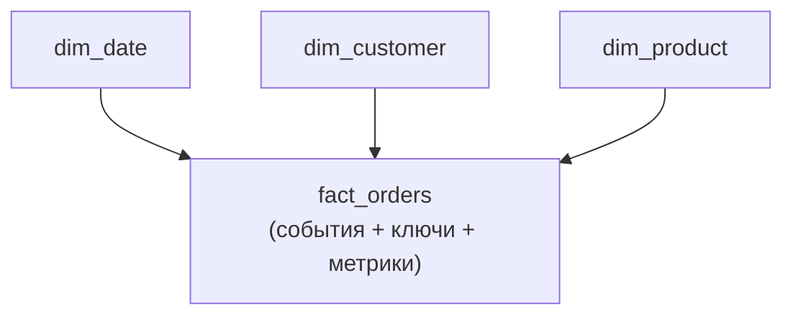

:::tip[Коротко]
Моделирование данных — как организовать таблицы в DWH под аналитику. Стандарт — **подход Кимбалла** и **star schema**: центральная таблица **фактов** (события: заказы, клики) и вокруг — таблицы **измерений** (справочники: клиенты, товары, даты). Это та же звезда, что в [Power BI](/07-bi-tools/power-bi/03-data-model/), но на уровне всего хранилища.
:::

## Зачем это нужно

Хорошая модель = простые быстрые запросы и понятные дашборды; плохая = боль, дубли и медленные джойны. Аналитик и читает такие модели, и (на middle+) проектирует витрины. Терминологию Кимбалла спрашивают на собеседованиях по DWH.

## Подходы: Kimball, Inmon, Data Vault

| Подход | Идея | Где |
|--------|------|-----|
| **Kimball** | dimensional modeling, star schema «снизу вверх» | де-факто стандарт аналитики |
| **Inmon** | сначала нормализованное корпоративное хранилище «сверху вниз» | крупные традиционные DWH |
| **Data Vault** | гибкая модель под частые изменения источников | сложные меняющиеся ландшафты |

Для аналитика главное — **Kimball/star schema**; остальное полезно знать по названиям.

## Star schema: факты и измерения

- **Факты (fact)** — измеримые события: одна строка = заказ/клик/платёж. Содержат метрики (`amount`, `quantity`) и ключи на измерения.
- **Измерения (dimension)** — контекст: кто, что, когда, где. Справочники клиентов, товаров, дат.

Запрос «выручка по категории за квартал» = join факта с измерениями и `GROUP BY` — просто и быстро.

## Snowflake schema

Если измерения дополнительно нормализовать (товар → категория → отдел отдельными таблицами), звезда превращается в **снежинку**. Меньше дублирования, но больше джойнов и сложнее запросы. В аналитике обычно предпочитают «расплющенную» звезду ради скорости и простоты.

## Slowly Changing Dimensions (SCD)

:::caution[Атрибуты измерений со временем меняются — как хранить историю?]
Клиент переехал из Москвы в Берлин. Что делать со старыми заказами? Это проблема **SCD**:

- **SCD Type 1** — перезаписать (теряем историю): везде теперь Берлин.
- **SCD Type 2** — добавить новую версию строки с датами действия (храним историю): старые заказы остаются с Москвой, новые — с Берлином.

Выбор критичен: при Type 1 исторические отчёты «перепишутся задним числом». Для корректной аналитики во времени чаще нужен **Type 2**.
:::

## Суррогатные ключи

В измерениях вместо «естественного» бизнес-ключа (email, артикул) заводят **суррогатный** — технический id (1, 2, 3…). Зачем: бизнес-ключи меняются и не уникальны во времени (особенно при SCD Type 2, где у одного клиента несколько версий-строк), а суррогатный стабилен и компактен для джойнов.

## Задачи для самопроверки

1. Куда отнести «заказы», а куда «справочник клиентов» в star schema?

Заказы — это таблица фактов (измеримые события, одна строка = заказ, с метриками и ключами). Справочник клиентов — таблица измерения (контекст «кто»). Факты в центре, измерения вокруг; запросы джойнят факты с измерениями и агрегируют метрики.

2. Клиент сменил город. Почему важно, SCD Type 1 или Type 2?

При Type 1 город перезаписывается, и все прошлые отчёты «переедут» в новый город — история искажается. При Type 2 заводится новая версия строки с датами, старые заказы сохраняют прежний город. Для корректной аналитики «как было на тот момент» нужен Type 2; Type 1 проще, но теряет историю.

## Что дальше

- [Качество данных](/11-modern-stack/08-data-quality/) — как тестировать построенную модель.
- [Модель данных в Power BI](/07-bi-tools/power-bi/03-data-model/) — star schema на уровне BI.
