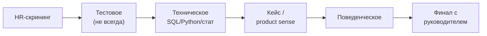

:::tip[Коротко]
Типичный процесс найма DA — это **воронка из 4–6 этапов**: HR-скрининг → (иногда) тестовое → техническое интервью (SQL/Python/статистика) → кейс на продуктовое мышление → поведенческое → финал с руководителем. Зная этапы заранее, к каждому готовишься прицельно, а не паникуешь «что вообще спросят».
:::

## Зачем это нужно

Каждый этап проверяет своё и срезает по разным причинам. Понимание структуры помогает понять, **где именно** ты теряешь офферы, и готовиться точечно. Это та же [воронка с конверсией по шагам](/08-product-analytics/03-funnels/), только про тебя.

## Этапы

### HR-скрининг

Короткий звонок (20–30 мин): мотивация, опыт в общих чертах, зарплатные ожидания, локация/формат. Цель HR — отсеять явные несовпадения. **Назови вилку** заранее, чтобы не тратить время впустую.

### Тестовое задание

Бывает не всегда. Обычно SQL-задачи и/или мини-анализ датасета с выводами.

:::caution[Тестовое не должно быть бесплатной работой]
Адекватное тестовое — на 2–4 часа на учебных/обезличенных данных. Если просят сделать реальный рабочий дашборд их компании на «настоящих» данных без оплаты и на много часов — это красный флаг. Разумный объём — ок, эксплуатация — нет.
:::

### Техническое интервью

Ядро отбора аналитика: [SQL, Python/pandas, статистика](/12-career/05-technical-interview/), часто live coding. Здесь решается, владеешь ли ты инструментом.

### Кейс / product sense

[Бизнес-задача без однозначного ответа](/12-career/06-case-interview/): «метрика упала, разберись», «как измерить успех фичи». Проверяют мышление, а не зубрёжку.

### Поведенческое

[Вопросы про опыт и софт-скиллы](/12-career/07-behavioral-interview/) по STAR: конфликты, ошибки, работа в команде. Проверяют, каково будет с тобой работать.

### Финал с руководителем

Будущий начальник оценивает «свой/не свой», обсуждает задачи команды. Часто здесь же финальные [переговоры по офферу](/12-career/08-salary-negotiation/).

## Тайминги

Весь процесс обычно занимает **2–5 недель** (бывает дольше в крупных компаниях). Между этапами — дни-недели. Это нормально; держи параллельно несколько процессов, чтобы не зависеть от одного и иметь рычаг на переговорах.

1. Просят за тестовое построить рабочий дашборд на реальных данных компании, ~15 часов, без оплаты. Норма?

Красный флаг. Адекватное тестовое — 2–4 часа на учебных/обезличенных данных и проверяет навык, а не решает рабочую задачу компании. Многочасовая работа на их реальных данных без оплаты похожа на бесплатную эксплуатацию — стоит уточнить условия или насторожиться.

2. Стабильно доходишь до техсобеса, но дальше не проходишь. Куда копать?

Проблема локализована на техническом этапе — значит, проседают SQL/Python/статистика или live coding под давлением. Резюме и скрининг ты проходишь (вход воронки ок), поэтому фокус подготовки — именно практика технических задач (LeetCode/StrataScratch) и проговаривание решения вслух.

## Что дальше

- [Техническое интервью](/12-career/05-technical-interview/) — ядро отбора.
- [Кейс-интервью](/12-career/06-case-interview/) — продуктовое мышление.
