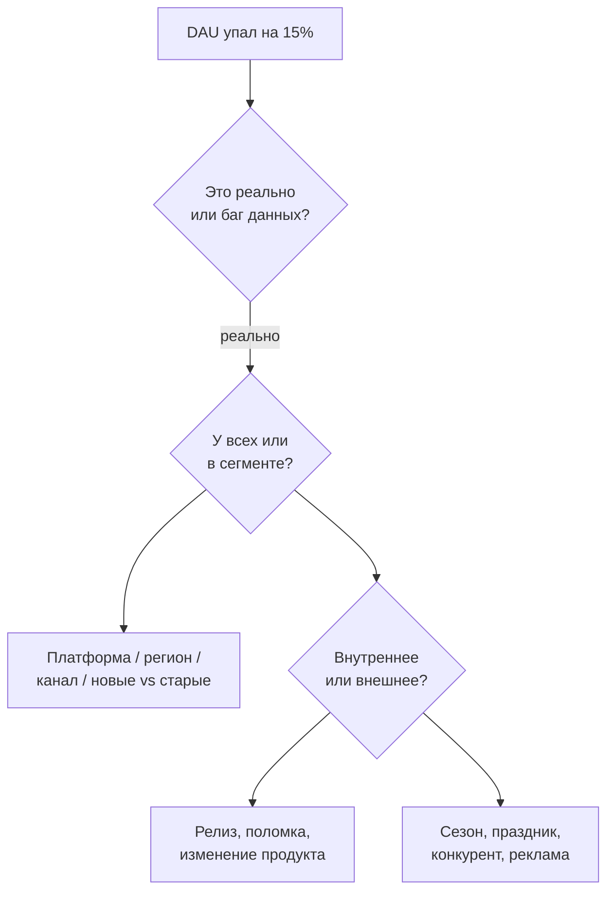

:::tip[Коротко]
Кейс-интервью проверяет **мышление, а не знание синтаксиса**. Главное — не выпалить ответ, а **структурировать**: уточнить вопрос, разложить на части, проговорить гипотезы. Самый частый тип — диагностика «почему упала метрика»: декомпозируешь её на множители и проверяешь по очереди. Тут пригождается всё из [продуктовой аналитики](/08-product-analytics/01-key-metrics/).
:::

## Зачем это нужно

Технически сильный, но «не думающий» аналитик бесполезен бизнесу. Кейсы проверяют, умеешь ли ты превращать размытый вопрос в план анализа — то, что отличает middle от junior. Ответа «по учебнику» здесь нет, оценивают подход.

## Фреймворк ответа

:::tip[Сначала структура, потом ответ]
Главная ошибка — сразу выдать «наверное, это баг». Правильно:

1. **Уточни** вопрос и контекст (период, сегмент, как считается метрика).
2. **Декомпозируй** на части/множители.
3. **Выдвини гипотезы** и проговори, как проверишь каждую.
4. **Сформулируй вывод** и следующий шаг.

Думай вслух — оценивают ход рассуждений.
:::

## Estimation (Fermi-задачи)

«Сколько такси в Москве?», «сколько пицц съедают в городе за день?». Точное число не важно — важна **логика оценки**: разложить на понятные множители (население → доля заказывающих → частота → средний чек) и прикинуть по шагам. Проверяют структурное мышление и работу с допущениями.

## Диагностика метрики

Классика: «DAU упал на 15% за неделю — почему?». Алгоритм:

1. **Уточни**: точно упал (не баг логирования)? за какой период? резко или плавно?
2. **Сегментируй**: у всех или у части — платформа (iOS/Android), регион, новые/старые, канал?
3. **Внутреннее vs внешнее**: релиз/изменение продукта vs сезонность/праздник/конкурент/маркетинг.
4. **Декомпозиция**: DAU = новые + вернувшиеся + удержанные — какая часть просела?

## Дизайн метрики

«Как измерить успех новой фичи / ленты рекомендаций?». Подход: чего хотим добиться → какая **одна главная метрика** это отражает (не выручка напрямую, а ценность) → плюс guardrail-метрики «что не сломать». Прямо связано с [North Star и OEC](/08-product-analytics/10-product-frameworks/).

## Дизайн A/B-теста

«Как проверить, что фича помогает?». Пройди по шагам [A/B](/09-ab-testing/02-hypothesis-design/): гипотеза → primary + guardrail метрики → юнит рандомизации → размер выборки/срок → как анализировать. Покажи, что помнишь про подводные камни (peeking, SRM).

1. «Конверсия в покупку упала на 10%». Какой первый шаг — назвать причину?

Нет. Сначала уточнить и структурировать: реально ли упала (не баг трекинга), за какой период, резко или плавно. Затем сегментировать (платформа, регион, канал) и декомпозировать воронку по шагам, чтобы найти, где именно провал. Озвучивать конкретную причину можно только после декомпозиции — иначе это гадание.

2. Просят оценить «сколько кофе выпивают в вашем городе за день». Как подступиться?

Это Fermi-задача: точное число не нужно, нужна логика. Разложить на множители: население → доля пьющих кофе → среднее число чашек в день → (при желании) средняя цена. Проговорить допущения вслух и прикинуть порядок. Оценивают структуру рассуждения, а не точность.

## Что дальше

- [Поведенческое интервью](/12-career/07-behavioral-interview/) — вопросы про опыт и софт-скиллы.
- [Продуктовые фреймворки](/08-product-analytics/10-product-frameworks/) — опора для кейсов на метрики.
