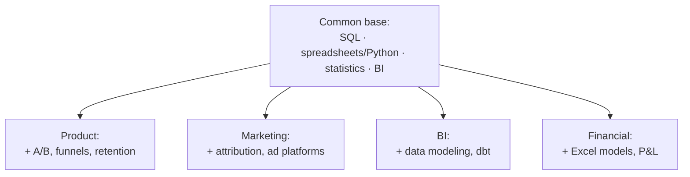

:::tip[In short]
"Data analyst" is an umbrella over several specializations. The core stack (SQL + spreadsheets/Python + BI) is shared by all; they differ by **domain and metrics**: the product analyst lives in retention and funnels, the marketing one in CAC and ROMI, BI in dashboards and marts, the financial one in P&L and forecasts. You don't have to pick a specialization upfront: start with the common base, the domain follows on the job.
:::

## Why understand the types

Job postings are titled differently: "product analyst", "BI analyst", "marketing analyst". Behind the titles are different tasks, metrics and even tools. Knowing the difference, you read postings more clearly, don't panic at unfamiliar acronyms, and choose where to grow.

## Five main specializations

| Type | Main question | Key metrics | Stack emphasis |
|------|---------------|-------------|----------------|
| **Product** | How do users behave in the product? | Retention, DAU/MAU, funnels, LTV | SQL, Python, A/B, product analytics |
| **Marketing** | Does the advertising pay off? | CAC, ROMI, ad spend ratio, channel conversion | SQL, Excel, attribution, ad platforms |
| **BI / Reporting** | How to see the business on dashboards? | Any business KPIs | SQL, BI (Tableau/Power BI), data modeling |
| **Financial** | Does the economics add up? | Revenue, margin, P&L, forecast | Excel (deep), SQL, financial models |
| **Systems / business** | How are processes and requirements built? | Not numbers, but processes and specs | BPMN/UML, SQL, documentation |

## How they actually differ

**The product analyst** works side by side with product managers. Measures whether users are retained, where they drop off in the funnel, which feature boosts engagement. The main tool for testing hypotheses is [A/B tests](/en/09-ab-testing/01-fundamentals/).

**The marketing analyst** owns the acquisition money. Reconciles channel spend with revenue, computes payback, fights the attribution problem (which channel actually brought the customer).

**The BI analyst** makes data visible to the whole company: builds dashboards, agrees metric definitions, keeps "revenue" computed the same way everywhere. Often closest to [visualization tools](/en/07-bi-tools/).

**The financial analyst** is closer to finance than to IT. Excel at an expert level, builds unit-economics models and forecasts. SQL as needed.

**The systems / business analyst** is a separate branch: less about numbers, more about requirements, processes and writing specs for development. Often not a "data analyst" in the narrow sense, but the job titles overlap.

:::caution[Don't pick a specialization too early]
Juniors are almost always hired for "general" analytics. Deep specialization comes with a specific team and product. So build the universal base first (SQL → statistics → BI), and the label appears on its own.
:::

## How the stack overlaps

You can see ~70% of the skills are shared. Switching specialization within analytics is far easier than entering the profession from scratch.

## Practice tasks

1. A posting: "compute campaign payback, reconcile channel spend with revenue". Which analyst is this?

Marketing. Keywords — payback, channels, acquisition spend (CAC, ROMI). You'll need SQL, Excel and an understanding of attribution.

2. All types share a common base stack. What's definitely in it?

SQL (mandatory everywhere), working with spreadsheets or Python, basic statistics and some BI tool. The differences are in domain metrics and add-ons (A/B, attribution, financial models).

3. Should a junior search strictly for a "product analyst" role?

Not necessarily. At junior level the specialization is often blurry, and companies train you to fit. It's safer to show a strong general base and pick the domain inside. Narrowing the search at the start means cutting your number of applications.

## What's next

- [Market stack 2026](/en/00-intro/market-stack-2026/) — which of this recruiters actually ask for.
- [Learning roadmap](/en/00-intro/learning-roadmap/) — the order to master the common base.
- [Product analytics](/en/08-product-analytics/01-key-metrics/) and [A/B tests](/en/09-ab-testing/01-fundamentals/) — if you lean toward product.
