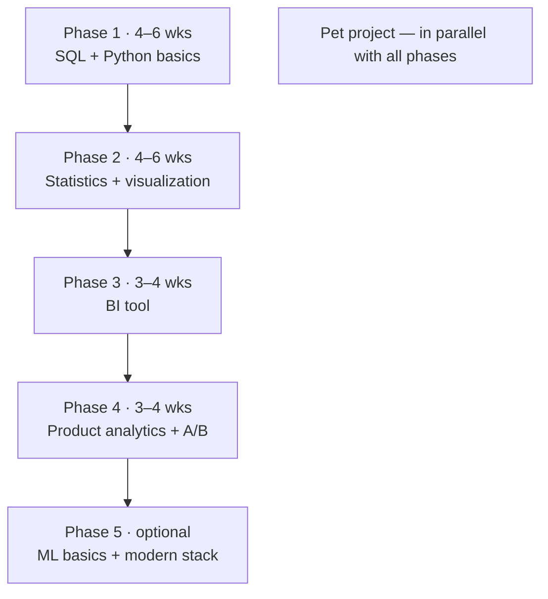

:::tip[In short]
Learn in order of dependencies, not interest. The baseline path to "ready to apply for junior": **SQL → Python/pandas → statistics → visualization and BI → product analytics → A/B**. That takes roughly 4–6 months at ~10–15 hours a week. ML and the modern stack are beyond the minimum, after you're hired. Run a pet project in parallel from the very start — without one your resume is empty.
:::

## Why order matters

Topics depend on each other: A/B tests make no sense without statistics, product metrics make none without SQL. If you hop around by interest, you'll hit gaps and stall. The map below is built so each step rests on the previous one.

## Learning phases

### Phase 1 (4–6 weeks): SQL + Python basics

The foundation. SQL is the analyst's main skill, so give it maximum attention. Bring in Python once SQL is solid.

- [SQL](/en/02-sql/01-rdbms-concepts/): SELECT, filters, aggregations, JOIN, subqueries, CTEs, window functions.
- [Python for analysis](/en/04-python/01-python-basics-for-analyst/): basic syntax, then pandas.

### Phase 2 (4–6 weeks): statistics + visualization

- [Statistics](/en/05-statistics/01-descriptive-stats/): descriptive statistics, distributions, confidence intervals, hypothesis testing.
- [Visualization](/en/06-visualization/01-principles/): which chart for which task, how not to lie with a chart.

### Phase 3 (3–4 weeks): BI tool

Pick **one** tool and bring it to a confident level — don't spread yourself across all of them.

- [BI tools](/en/07-bi-tools/): Power BI or Tableau (follow the market you're aiming at).

### Phase 4 (3–4 weeks): product analytics + A/B

- [Product analytics](/en/08-product-analytics/01-key-metrics/): metrics, funnels, retention, cohorts.
- [A/B testing](/en/09-ab-testing/01-fundamentals/): experiment design, sample size, interpretation.

### Phase 5 (optional): ML basics + modern stack

Not required for junior, but it strengthens the resume and opens growth.

- [ML basics](/en/10-ml-basics/01-ml-landscape/), [modern data stack](/en/11-modern-stack/01-cloud-dwh-overview/).

## Summary plan

| Phase | Topics | Time | Why |
|-------|--------|------|-----|
| 1 | SQL + Python | 4–6 wks | Won't get hired without it |
| 2 | Statistics + visualization | 4–6 wks | Thinking and presenting results |
| 3 | BI tool | 3–4 wks | Dashboards are asked almost everywhere |
| 4 | Product analytics + A/B | 3–4 wks | The main topics of product interviews |
| 5 | ML + modern stack | optional | Growth beyond junior |

:::caution[The beginner's biggest mistake]
Endlessly watching courses and never doing a single project. Theory without practice doesn't stick, and a resume needs a **result**. Start a pet project back in phase 1, on what you've already learned.
:::

:::note[Timelines are a guide, not dogma]
4–6 months is at ~10–15 hours a week from scratch. With a background (Excel, programming, math) you'll clear some phases faster. Don't chase the calendar — chase actually solving problems.
:::

1. Why do A/B tests come after statistics, not before?

Because an A/B test is hypothesis testing in practice: p-value, confidence intervals, type I/II errors, sample size. Without a statistical base the test becomes a ritual with numbers you don't understand. Theory first, application after.

2. Should you learn both Power BI and Tableau at once?

No. Take one and bring it to a confident level — the tools are similar, the second is then picked up in a couple of weeks. Splitting across both at once slows you down and gives depth in neither.

3. When should you start a pet project?

As early as possible — already in phase 1, on available data and SQL. The project grows with your skills: you add Python, then a dashboard, then an A/B breakdown. By the end of your studies you'll have a ready case for your resume, not a panic of "nothing to show".

## What's next

- [How to use this site](/en/00-intro/how-to-use-this-site/) — navigation and page format.
- [SQL](/en/02-sql/01-rdbms-concepts/) — starting phase 1.
- [Pet project ideas](/en/12-career/09-pet-project-ideas/) — to start practicing right away.
