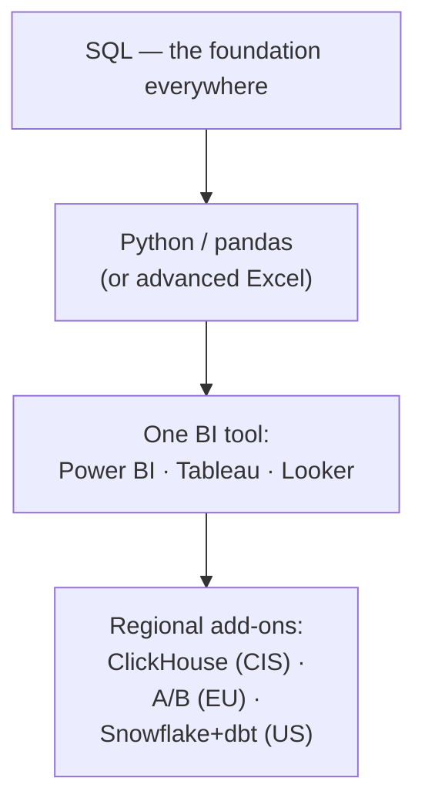

:::tip[In short]
The core is the same in every region: **SQL is mandatory everywhere**, then Python (or advanced Excel) and one BI tool. The differences are in details: the CIS likes Power BI and ClickHouse, Europe favors Tableau/Power BI and an A/B culture, the US leans on cloud warehouses (Snowflake/BigQuery) and dbt. You don't need to learn "everything": close the core, the rest is picked up for a specific job.
:::

## Why look at the market

Studying "into the void" is a waste. If you know what junior/middle DA postings actually say, you won't scatter your effort: first what's asked in 90% of ads, and only then the trendy and niche. Below is a digest of requirements grouped by region.

## What's common everywhere

These skills appear in the vast majority of postings regardless of country — this is your mandatory minimum:

| Skill | How mandatory |
|-------|---------------|
| **SQL** | Required in nearly 100% of postings |
| **Spreadsheets / visualization** | Required (Excel/Sheets + at least one BI) |
| **Analytical thinking** | Tested in every interview (cases, metrics) |
| **Basic statistics** | Expected at middle, a plus for junior |
| **Python (pandas)** | Strong advantage; often mandatory at middle |

## CIS (hh.ru and similar)

A typical junior/middle set:

- **SQL** — the core, always asked. Often **PostgreSQL** and **ClickHouse** specifically.
- **Python** (pandas, sometimes viz) — almost always at middle.
- **Excel / Google Sheets** — still mandatory, especially closer to the business.
- **BI: Power BI** leads, plus **Yandex DataLens**, Superset/Metabase.
- A/B and product metrics — at product companies.

:::note[CIS local specifics]
ClickHouse and the Yandex stack (DataLens, Metrica) show up noticeably more often than in the rest of the world. Power BI is more popular than Tableau. Worth keeping in mind if you're job-hunting here specifically.
:::

## Europe (Glassdoor/LinkedIn: DE, UK, NL, Nordics)

- **SQL** — mandatory.
- **Python or R** — Python dominates, R still appears in research teams.
- **BI: Tableau and Power BI** roughly on par, plus Looker.
- **A/B testing and statistics** — valued higher than the CIS average; mature product culture.
- Cloud warehouses (BigQuery, Snowflake) — at product and tech companies.

## US (LinkedIn, Glassdoor)

- **SQL** — mandatory, often at a solid level (window functions, optimization).
- **Python** — almost everywhere at middle+.
- **BI: Tableau** historically #1, plus Looker and Power BI.
- **Cloud stack: Snowflake / BigQuery / Redshift + dbt** — more common than anywhere else.
- A/B and experimentation — at product companies this is a baseline requirement.

## The overall picture

:::caution[Don't chase the technology list]
Postings often list 15 tools "comma-separated". That's a wishlist, not a requirement. The recruiter really checks SQL, case-based thinking and one BI. A deep core beats a shallow acquaintance with a dozen trendy things.
:::

1. Which skill should you definitely learn first, whatever region you're searching in?

SQL. It's mandatory in nearly 100% of DA postings worldwide, and it's exactly what's checked first in an interview. Everything else comes after it.

2. A posting lists 14 technologies in its requirements. Should you skip applying if you know half?

No. Technology lists are wishlists. Apply if you cover the core (SQL + BI + analytical thinking). Many requirements are "nice to have", and companies train you to fit, especially at junior level.

3. How does the US stack noticeably differ from the CIS one?

The US more often requires cloud warehouses (Snowflake/BigQuery/Redshift) and dbt, and Tableau leads among BI. The CIS has more ClickHouse and Power BI, with a visible Yandex stack. The core (SQL + Python + BI) is the same either way.

## What's next

- [SQL](/en/02-sql/01-rdbms-concepts/) — starting with the foundation.
- [Career section](/en/12-career/) — resume, job search, interviews and salary negotiation.
