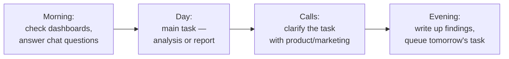

:::tip[In short]
A Data Analyst turns raw data into decisions: pulls numbers from the database, computes metrics, builds reports and answers "what's happening and why". The core tools are **SQL, spreadsheets/Python and BI**. Differs from a Data Scientist in that they more often explain the past (rather than predict the future with models), and from a Data Engineer in that they use data rather than build the infrastructure for it.
:::

## Why the business needs this role

Every company makes decisions: which feature to ship, which channel to spend ad budget on, why revenue dropped. Without an analyst this is done "on gut feeling". The analyst puts numbers under the decision: computes, tests hypotheses, catches anomalies. Their value isn't pretty dashboards — it's that after their work **someone does something differently**.

## What an analyst does

Typical tasks you'll meet in almost any DA role:

- **Ad-hoc queries** — "how many active users in Germany in March?". A quick SQL query, an answer in Slack.
- **Regular reporting** — dashboards that refresh themselves: revenue, funnel, retention.
- **Deep analysis** — "why did purchase conversion drop 3 pp?". Here come hypotheses, segmentation, sometimes an A/B test.
- **Decision support** — compute the unit economics of a feature, estimate a promo's effect, prep numbers for the board.
- **Data quality** — notice a metric is lying, find a duplication in a join, agree a fix with engineers.

## A single working day

Reality: ~40% of the time is SQL and data work, ~30% communication (figuring out what's really being asked), ~20% writing up findings, ~10% learning and tidying up.

## DA vs DS vs DE vs BI Engineer

The roles get confused, and interviews love to ask the difference.

| Role | Main question | Tools | What it delivers |
|------|---------------|-------|------------------|
| **Data Analyst** | What happened and why? | SQL, Excel/Python, BI | Reports, insights, metrics |
| **Data Scientist** | What will happen / how to optimize? | Python, ML, statistics | Models, forecasts, A/B |
| **Data Engineer** | How to deliver data reliably? | SQL, Python, Spark, Airflow | Pipelines, warehouses, marts |
| **BI / Analytics Engineer** | How to make data convenient to analyze? | SQL, dbt, BI | Data models, marts, dashboards |

:::note[The boundaries are blurry]
At a small company one person does everything. At a large one the roles are clearly split. Don't fixate on labels — look at the tasks in the job posting.
:::

## Grades: Junior → Lead

| Grade | What they can do | Autonomy |
|-------|------------------|----------|
| **Junior** | Writes SQL, builds reports to spec | Works on assigned tasks |
| **Middle** | Decides themselves how to answer a business question | Owns a task from question to conclusion |
| **Senior** | Sees what analysis is even needed; mentors others | Influences decisions, sets own tasks |
| **Lead / Head** | Builds analytics processes and a team | Owns analytics for a direction |

The gap between Junior and Middle isn't SQL syntax — it's **autonomy**: a middle turns a vague "look into churn" into a concrete analysis plan on their own.

## Practice tasks

1. How does a Data Analyst differ from a Data Scientist?

An analyst mostly explains the past and present (what happened, why, which metrics) using SQL, BI and descriptive statistics. A Data Scientist builds predictive models (ML) and optimizes the future. In practice the boundaries blur, and statistics and A/B tests are shared ground.

2. A PM asks you to "figure out why revenue dropped". What does a middle analyst do first?

Doesn't rush to write a query, but **clarifies and decomposes**: over what period, which product/region, revenue = traffic × conversion × average check — which part sagged? Hypotheses and breaking down the metric first, SQL second.

3. Does an analyst need to code?

Basically yes: SQL is mandatory everywhere, Python/spreadsheets almost everywhere. But it's a tool, not the goal. You're valued for correct conclusions and explaining them to the business, not for code. A deep CS background (like an engineer's) isn't required.

## What's next

- [Types of analysts](/en/00-intro/analyst-types/) — product, marketing, BI and how they differ.
- [Market stack 2026](/en/00-intro/market-stack-2026/) — what job postings actually require.
- [Learning roadmap](/en/00-intro/learning-roadmap/) — where to start and in what order.
