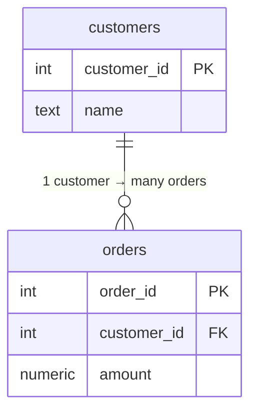

:::tip[In short]
A relational database stores data in **tables** (rows = records, columns = attributes).

- **Primary key (PK)** — uniquely identifies a row (`customer_id`).
- **Foreign key (FK)** — a reference to another table's PK (`orders.customer_id → customers.customer_id`).
- **Normalization** — split data across tables without duplication; reassemble via `JOIN`.
:::

## Why you need it

Before writing queries you need to understand **how the data is structured**. Why customers are in one table, orders in another, and what links them. Without this, `JOIN` feels like magic, and duplicates and lost rows feel inexplicable.

## Table, row, column

A table is like an Excel sheet with strict rules: each column has its own **data type**, and all values in it obey that type.

| customer_id | name  | country | created_at |
|-------------|-------|---------|------------|
| 1           | Anna  | RU      | 2026-01-10 |
| 2           | Boris | RU      | 2026-02-03 |

- **Row (record)** — one object: one customer.
- **Column (field)** — one attribute across all objects: `country` for every customer.

## Keys: PK and FK

A **primary key (PRIMARY KEY)** is a column (or set) that uniquely identifies a row. It's never repeated and never `NULL`. Usually it's an `id`.

A **foreign key (FOREIGN KEY)** is a column that references another table's PK. That's how tables link: `orders.customer_id` says which customer an order belongs to.



```sql
CREATE TABLE customers (
    customer_id int PRIMARY KEY,
    name        text NOT NULL
);

CREATE TABLE orders (
    order_id    int PRIMARY KEY,
    customer_id int REFERENCES customers(customer_id),  -- foreign key
    amount      numeric
);
```

## Types of relationships

| Relationship | Example | How it's implemented |
|--------------|---------|----------------------|
| One-to-one (1:1) | user ↔ their profile | FK with UNIQUE |
| One-to-many (1:N) | customer → orders | FK on the "many" side |
| Many-to-many (N:M) | orders ↔ products | junction table (`order_items`) |

An N:M relationship is always split into two 1:N relationships via a junction table. That's why our schema has `order_items` between `orders` and `products`.

## Data types

| Category | Examples (PostgreSQL) | For |
|----------|-----------------------|-----|
| Numbers | `int`, `bigint`, `numeric`, `real` | ids, amounts, quantities |
| Strings | `text`, `varchar(n)`, `char(n)` | names, statuses |
| Date/time | `date`, `timestamp`, `timestamptz` | events, signups |
| Boolean | `boolean` | flags |
| Structures | `json`, `jsonb`, arrays | flexible data |

:::caution[numeric for money, not float]
Store money in `numeric`/`decimal`, not `real`/`float`. Floating-point numbers cause rounding errors: `0.1 + 0.2 ≠ 0.3`. For finance that's unacceptable.
:::

## Normalization in plain terms

Normalization means laying out data so that **nothing is duplicated**. If you keep everything in one table:

| order_id | customer_name | customer_country | product |
|----------|---------------|------------------|---------|
| 101      | Anna          | RU               | Coffee  |
| 102      | Anna          | RU               | Book    |

Anna's name and country are duplicated. Change the country — you edit many rows (and miss one somewhere → data drifts). The fix: move the customer into its own table and reference it by `customer_id`.

Three normal forms in plain terms:

- **1NF** — one value per cell (no list "Coffee, Book" in one field).
- **2NF** — every column depends on the **whole** key, not part of it.
- **3NF** — no columns depend on other non-key columns (don't store a customer's country in the orders table).

:::note[OLTP vs OLAP]
Normalized schemas are about **OLTP** (apps, many small operations). In analytics (**OLAP**) data is often **denormalized** into wide tables for read speed. More in the [Modern Stack](/en/11-modern-stack/) section.
:::

## Practice tasks

<details>
<summary>1. Why shouldn't you store a customer's country in the orders table?</summary>

It's duplication (3NF): a customer has many orders, and the country repeats in every row. Changing the country means updating all orders, and it's easy to get a mismatch. The country depends on the customer, not the order — so it belongs in `customers`.

</details>

<details>
<summary>2. How do you link orders and products when one order has many products and one product is in many orders?</summary>

That's an N:M relationship. You need a junction table `order_items(order_id, product_id, qty)` with two foreign keys — it splits N:M into two 1:N relationships.

</details>

<details>
<summary>3. How does a PRIMARY KEY differ from a regular UNIQUE column?</summary>

PK = UNIQUE + NOT NULL + (by meaning) the main row identifier that foreign keys reference. A table can have several UNIQUE columns, but only one PK.

</details>

## What's next

- [Environment setup](/en/02-sql/02-environment-setup/) — spin up PostgreSQL and a demo DB to try queries.
- [SELECT and WHERE](/en/02-sql/03-select-basics/) — your first queries against these tables.

**Practice:** an interactive modeling tool — [dbdiagram.io](https://dbdiagram.io/); relationship theory — in the learning section of [sql-ex.ru](https://sql-ex.ru/).
