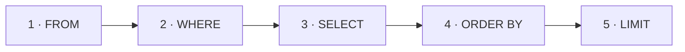

:::tip[In short]
A basic query reads as: "**from** which table (`FROM`), **what** to keep (`WHERE`), **which** columns to show (`SELECT`), **how** to sort (`ORDER BY`) and **how many** rows to return (`LIMIT`)".

```sql
SELECT name, amount
FROM orders
WHERE status = 'paid'
ORDER BY amount DESC
LIMIT 10;
```

Remember: you write `SELECT` first, but it runs almost last.
:::

:::note[Data flow]
Input: a table in the DB
→ Processing: `FROM` takes the table → `WHERE` drops rows → `SELECT` picks columns → `ORDER BY`/`LIMIT` sort and limit
→ Output: a result table.
Why: get exactly the rows and columns you need from the database — the basis of any query.
:::

## Why you need it

`SELECT` means "read the data". 95% of an analyst's work is exactly that: pull, filter, sort. Everything else (`JOIN`, aggregates, window functions) builds on top of this skeleton.

```sql title="Demo data"
CREATE TABLE customers (
    customer_id int PRIMARY KEY,
    name        text,
    country     text
);

CREATE TABLE orders (
    order_id    int PRIMARY KEY,
    customer_id int,
    status      text,
    amount      numeric
);

INSERT INTO customers VALUES
    (1, 'Anna', 'RU'), (2, 'Boris', 'RU'), (3, 'Kira', 'KZ'), (4, 'Lev', 'DE');

INSERT INTO orders VALUES
    (101, 1, 'paid', 2500), (102, 1, 'paid', 1800),
    (103, 2, 'cancelled', 990), (104, 3, 'paid', 4200), (105, 9, 'paid', 700);
```

## SELECT: which columns to show

List the columns you need, comma-separated. `*` means all columns (handy for exploring, but in production queries list them explicitly — faster and more predictable).

```sql
SELECT order_id, amount FROM orders;
```

| order_id | amount |
|----------|--------|
| 101      | 2500   |
| 102      | 1800   |
| 103      | 990    |
| 104      | 4200   |
| 105      | 700    |

In `SELECT` you can compute expressions and name them with `AS` (an alias):

```sql
SELECT order_id, amount, amount * 0.2 AS vat FROM orders WHERE order_id = 101;
```

| order_id | amount | vat   |
|----------|--------|-------|
| 101      | 2500   | 500.0 |

## WHERE: which rows to keep

`WHERE` filters rows by a condition. Comparison operators: `=`, `<>` (not equal), `<`, `>`, `<=`, `>=`. Conditions combine with `AND`, `OR`, `NOT`.

```sql
SELECT order_id, status, amount
FROM orders
WHERE status = 'paid' AND amount > 2000;
```

| order_id | status | amount |
|----------|--------|--------|
| 101      | paid   | 2500   |
| 104      | paid   | 4200   |

:::caution[Text goes in single quotes]
Strings in SQL use `'single'` quotes: `status = 'paid'`. Double quotes `"..."` mean a column/table name, not text. And text comparison is case-sensitive: `'Paid' <> 'paid'`.
:::

## ORDER BY: sorting

`ASC` — ascending (default), `DESC` — descending. You can sort by several columns.

```sql
SELECT order_id, amount
FROM orders
WHERE status = 'paid'
ORDER BY amount DESC;
```

| order_id | amount |
|----------|--------|
| 104      | 4200   |
| 101      | 2500   |
| 102      | 1800   |
| 105      | 700    |

## LIMIT and OFFSET

`LIMIT n` — return only the first `n` rows (top-N after sorting). `OFFSET k` — skip the first `k` (used for pagination).

```sql
-- top-2 paid orders by amount
SELECT order_id, amount
FROM orders
WHERE status = 'paid'
ORDER BY amount DESC
LIMIT 2;
```

| order_id | amount |
|----------|--------|
| 104      | 4200   |
| 101      | 2500   |

## DISTINCT: remove duplicates

`DISTINCT` keeps only unique values (or unique combinations, if there are several columns).

```sql
SELECT DISTINCT status FROM orders;
```

| status    |
|-----------|
| paid      |
| cancelled |

## Logical order of execution

You write in one order, but the database executes in another. This explains common beginner mistakes:



Two consequences:

- In `WHERE` you **cannot** use an alias from `SELECT` — it doesn't exist yet at filtering time. `WHERE vat > 100` fails; you need `WHERE amount * 0.2 > 100`.
- In `ORDER BY` the alias **is** allowed — sorting happens after `SELECT`.

<details>
<summary>1. Output the names and countries of customers not from Russia, alphabetically.</summary>

```sql
SELECT name, country
FROM customers
WHERE country <> 'RU'
ORDER BY name;
```

Kira (KZ), Lev (DE).

</details>

<details>
<summary>2. The single cheapest paid order.</summary>

```sql
SELECT order_id, amount
FROM orders
WHERE status = 'paid'
ORDER BY amount ASC
LIMIT 1;
```

Order 105 for 700.

</details>

<details>
<summary>3. Why does `WHERE revenue > 1000` error, but `ORDER BY revenue` doesn't?</summary>

```sql
SELECT amount AS revenue FROM orders WHERE revenue > 1000;   -- ❌ error
SELECT amount AS revenue FROM orders ORDER BY revenue;       -- ✅ works
```

`WHERE` runs before `SELECT`, so the alias `revenue` doesn't exist yet. `ORDER BY` runs after `SELECT`, so the alias is available.

</details>

## What's next

- [Filtering operators](/en/02-sql/04-filtering-operators/) — `BETWEEN`, `IN`, `LIKE`, `IS NULL`.
- [Aggregations](/en/02-sql/05-aggregations/) — compute sums, averages and counts per group.

**Practice:** [SQLBolt](https://sqlbolt.com/) (lessons 1–6) and [sql-ex.ru](https://sql-ex.ru/) — the first tasks are exactly about `SELECT`/`WHERE`.
