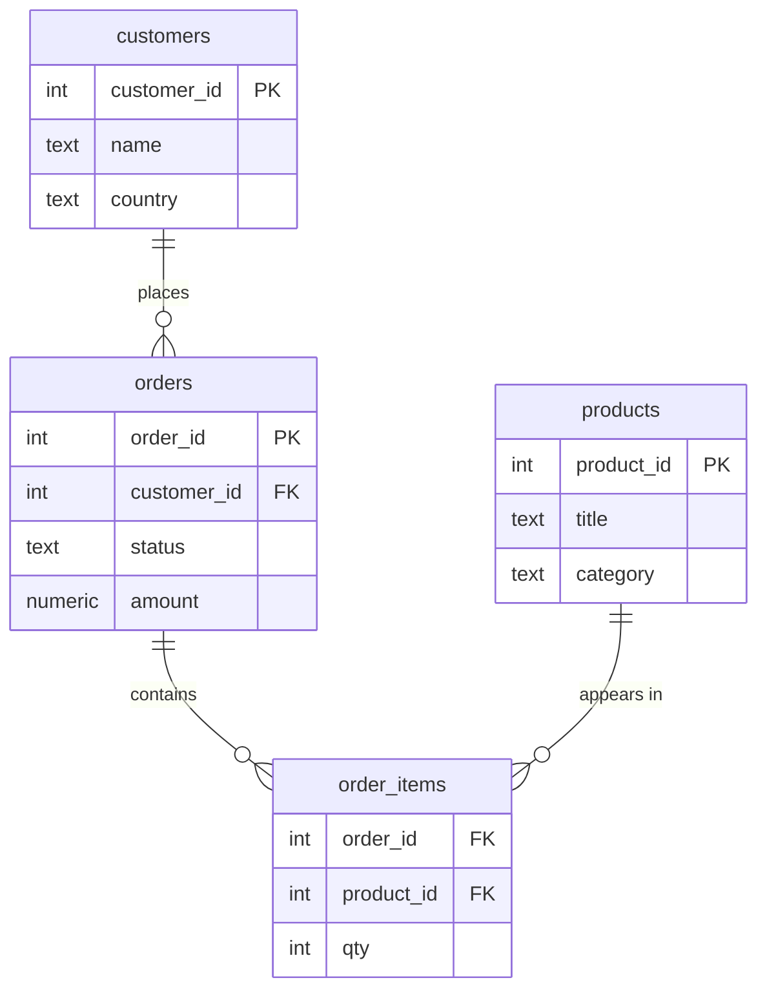

:::tip[In short]
A `JOIN` combines rows from two tables by a condition (usually a key).

- **INNER** — only matches present in both tables.
- **LEFT** — all rows from the left + matches on the right (no match → `NULL`).
- **RIGHT** — mirror of LEFT.
- **FULL** — everything from both, unmatched filled with `NULL`.
- **CROSS** — every row with every row (Cartesian product).

90% of an analyst's queries are `INNER` and `LEFT JOIN`. The main trap is **duplicate rows** after a one-to-many join.
:::

## Why you need it

In a normalized database, data is split across tables: customers in one, orders in another. To answer "how much did each customer spend", you have to **combine** the data. That's what a `JOIN` does.

### Our demo schema

All examples in this section use a simple online-store schema. Create it locally (PostgreSQL) and repeat the queries by hand — it sticks much better that way.



```sql title="Demo data"
CREATE TABLE customers (
    customer_id int PRIMARY KEY,
    name        text,
    country     text
);

CREATE TABLE orders (
    order_id    int PRIMARY KEY,
    customer_id int,
    status      text,
    amount      numeric
);

INSERT INTO customers VALUES
    (1, 'Anna',  'RU'),
    (2, 'Boris', 'RU'),
    (3, 'Kira',  'KZ'),
    (4, 'Lev',   'DE');   -- Lev hasn't ordered anything yet

INSERT INTO orders VALUES
    (101, 1, 'paid',      2500),
    (102, 1, 'paid',      1800),
    (103, 2, 'cancelled',  990),
    (104, 3, 'paid',      4200),
    (105, 9, 'paid',       700);  -- customer_id = 9, no such customer

CREATE TABLE products (
    product_id int PRIMARY KEY,
    title      text,
    category   text
);

CREATE TABLE order_items (
    order_id   int,
    product_id int,
    qty        int
);

INSERT INTO products VALUES
    (10, 'Coffee', 'Food'),
    (20, 'Mug',    'Dishes'),
    (30, 'Book',   'Books');

INSERT INTO order_items VALUES
    (101, 10, 2),   -- order 101 has two line items
    (101, 20, 1),
    (102, 30, 1),
    (104, 10, 1),
    (104, 30, 3);
```

Note the two "mismatches" that reveal the difference between joins:

- **Lev (id 4)** is in `customers` but has no orders.
- **Order 105** references `customer_id = 9`, which doesn't exist in `customers` (this happens with real "dirty" data).

## INNER JOIN

Returns only rows where a match exists **in both** tables. No match — the row drops out.

```sql
SELECT c.name, o.order_id, o.amount
FROM customers AS c
INNER JOIN orders AS o ON o.customer_id = c.customer_id;
```

| name  | order_id | amount |
|-------|----------|--------|
| Anna  | 101      | 2500   |
| Anna  | 102      | 1800   |
| Boris | 103      | 990    |
| Kira  | 104      | 4200   |

Lev is gone (no orders), order 105 is gone (no such customer). `INNER` is the intersection.

:::note[JOIN = INNER JOIN]
If you write just `JOIN`, the database treats it as `INNER JOIN`. The word `INNER` is optional, but in learning queries write it explicitly — it reads clearer.
:::

## LEFT JOIN

Takes **all rows from the left table** and attaches matches from the right. If there's no match — the right-side columns are `NULL`.

```sql
SELECT c.name, o.order_id, o.amount
FROM customers AS c
LEFT JOIN orders AS o ON o.customer_id = c.customer_id;
```

| name  | order_id | amount |
|-------|----------|--------|
| Anna  | 101      | 2500   |
| Anna  | 102      | 1800   |
| Boris | 103      | 990    |
| Kira  | 104      | 4200   |
| Lev   | NULL     | NULL   |

Now Lev is included — with `NULL` instead of an order. This is the most common join in analytics: "show **all** customers, even without orders".

### Finding rows without a match

A classic trick — `LEFT JOIN` + a `NULL` filter. This finds customers without orders, products without sales, etc.:

```sql {4}
SELECT c.name
FROM customers AS c
LEFT JOIN orders AS o ON o.customer_id = c.customer_id
WHERE o.order_id IS NULL;   -- only those with no match
```

| name |
|------|
| Lev  |

Only customers for whom no row was found on the right.

:::caution[ON vs WHERE with LEFT JOIN]
A condition on the right table placed in `WHERE` turns a `LEFT JOIN` back into an `INNER`:

```sql
-- ❌ Lev disappears: WHERE filters out the row with a NULL status
LEFT JOIN orders o ON o.customer_id = c.customer_id
WHERE o.status = 'paid'

-- ✅ condition in ON — Lev stays (with NULL in the order columns)
LEFT JOIN orders o ON o.customer_id = c.customer_id AND o.status = 'paid'
```

Rule: a filter on the **right** table in a `LEFT JOIN` goes in `ON`, otherwise you lose the meaning of the "left" join.
:::

## RIGHT JOIN

Mirror of `LEFT`: takes all rows from the **right** table. Rarely used in practice — it's usually simpler to swap the tables and write `LEFT`. These two queries are equivalent:

```sql
SELECT * FROM customers c RIGHT JOIN orders o ON o.customer_id = c.customer_id;
SELECT * FROM orders o LEFT JOIN customers c ON o.customer_id = c.customer_id;
```

The second (via `LEFT`) will show the "orphan" order 105 — the order exists, but the customer doesn't.

## FULL OUTER JOIN

Takes **everything from both** tables. Unmatched rows on either side are filled with `NULL`. Handy for reconciling two sources: "what's on the left but not the right, and vice versa".

```sql
SELECT c.name, o.order_id
FROM customers AS c
FULL OUTER JOIN orders AS o ON o.customer_id = c.customer_id;
```

| name  | order_id |
|-------|----------|
| Anna  | 101      |
| Anna  | 102      |
| Boris | 103      |
| Kira  | 104      |
| Lev   | NULL     |
| NULL  | 105      |

Here you see both anomalies at once: Lev without an order and order 105 without a customer.

## CROSS JOIN

Cartesian product: **each** row on the left is paired with **each** on the right. No `ON`. If the tables have 4 and 5 rows — the output has 20.

```sql
-- all possible "customer × month" pairs — a scaffold for a report with no gaps
SELECT c.name, m.month
FROM customers AS c
CROSS JOIN (VALUES ('2026-01'), ('2026-02'), ('2026-03')) AS m(month);
```

| name  | month   |
|-------|---------|
| Anna  | 2026-01 |
| Anna  | 2026-02 |
| Anna  | 2026-03 |
| Boris | 2026-01 |
| …     | …       |

4 customers × 3 months = **12 rows**. You then `LEFT JOIN` such a scaffold with the facts so the report includes even empty months (with zeros instead of gaps).

:::caution[CROSS JOIN multiplies rows]
A `CROSS JOIN` on large tables is an explosion: 100k × 100k = 10 billion rows. Use it deliberately (generating calendars, combination grids), not by accident (a forgotten `ON` becomes a cross join in some dialects).
:::

## SELF JOIN

A table joined to itself — via aliases. Needed for hierarchies: employee → manager, category → parent category. Let's create a tiny employees table where `manager_id` references `employee_id` in the same table:

```sql
CREATE TABLE employees (
    employee_id int PRIMARY KEY,
    name        text,
    manager_id  int   -- reference to the manager's employee_id
);

INSERT INTO employees VALUES
    (1, 'Svetlana', NULL),  -- top-level manager
    (2, 'Igor',     1),
    (3, 'Maya',     1),
    (4, 'Oleg',     2);
```

```sql
-- who reports to whom
SELECT e.name AS employee, m.name AS manager
FROM employees AS e
LEFT JOIN employees AS m ON e.manager_id = m.employee_id;
```

| employee | manager  |
|----------|----------|
| Svetlana | NULL     |
| Igor     | Svetlana |
| Maya     | Svetlana |
| Oleg     | Igor     |

`LEFT` is not accidental here: Svetlana has `manager_id IS NULL`, and with `INNER JOIN` she'd drop out of the result.

## Joining multiple tables

`JOIN`s chain together. To get from a customer to product names, we go through `order_items`:

```sql
SELECT c.name, p.title, oi.qty
FROM customers   AS c
JOIN orders      AS o  ON o.customer_id = c.customer_id
JOIN order_items AS oi ON oi.order_id   = o.order_id
JOIN products    AS p  ON p.product_id  = oi.product_id
WHERE o.status = 'paid';
```

| name | title  | qty |
|------|--------|-----|
| Anna | Coffee | 2   |
| Anna | Mug    | 1   |
| Anna | Book   | 1   |
| Kira | Coffee | 1   |
| Kira | Book   | 3   |

Each `JOIN` adds one table and its own `ON` condition. The written order doesn't affect the `INNER JOIN` result (the planner decides how to execute), but it affects readability — follow the logical relationships.

## The main trap: duplicates after a JOIN

The most common junior mistake. You join one-to-many — and rows **multiply**. If you then compute an aggregate, you get inflated numbers.

Anna has two orders. We compute "revenue per customer", accidentally pulling in an extra table:

```sql
-- ❌ amount gets doubled: order_items "multiplied" the order rows
SELECT c.name, SUM(o.amount) AS revenue
FROM customers   AS c
JOIN orders      AS o  ON o.customer_id = c.customer_id
JOIN order_items AS oi ON oi.order_id   = o.order_id
GROUP BY c.name;
```

| name | revenue | should be |
|------|---------|-----------|
| Anna | 6800    | 4300      |
| Kira | 8400    | 4200      |

Anna's order 101 has 2 line items, so its `amount` (2500) was counted twice: `2500 × 2 + 1800 = 6800` instead of `2500 + 1800 = 4300`. Kira's order 104 has two items — `4200 × 2 = 8400`. The more line items per order, the bigger the inflation.

:::caution[How to fix duplicates]
- **Aggregate at the right level before joining** (via a subquery or CTE): first collapse `order_items` into per-order sums, then join.
- Check the **granularity**: what does one result row represent? One order? One line item? If you mix levels — you get duplicates.
- In doubt — compare `COUNT(*)` before and after the `JOIN`. Grew more than expected — look for fan-out.
:::

## When to use what

| Task | JOIN |
|------|------|
| Only matched records (orders with a known customer) | `INNER` |
| All objects, even without relations (all customers, including those without orders) | `LEFT` |
| Find records without a match (customers without orders) | `LEFT` + `WHERE ... IS NULL` |
| Reconcile two sources for discrepancies | `FULL OUTER` |
| All combinations (calendar, grid) | `CROSS` |
| Hierarchy within one table | `SELF` (`LEFT JOIN` on itself) |

Solve them on the demo schema above. The answer is under the spoiler, but write it yourself first.

<details>
<summary>1. Output all customers and the number of their paid orders (including those with 0).</summary>

```sql
SELECT c.name, COUNT(o.order_id) AS paid_orders
FROM customers AS c
LEFT JOIN orders AS o
       ON o.customer_id = c.customer_id
      AND o.status = 'paid'      -- filter in ON, so we don't lose customers without orders
GROUP BY c.name
ORDER BY paid_orders DESC;
```

`COUNT(o.order_id)` counts only non-`NULL`, so Lev and Boris (cancelled order) get 0. The `status = 'paid'` condition is in `ON`, not `WHERE`.

</details>

<details>
<summary>2. Find orders that reference a non-existent customer.</summary>

```sql
SELECT o.order_id, o.customer_id
FROM orders AS o
LEFT JOIN customers AS c ON c.customer_id = o.customer_id
WHERE c.customer_id IS NULL;
```

Result: order 105. This is a typical data-integrity check.

</details>

<details>
<summary>3. Why might this query return more revenue than the real amount?</summary>

```sql
SELECT SUM(o.amount)
FROM orders o
JOIN order_items oi ON oi.order_id = o.order_id;
```

The `JOIN` with `order_items` multiplies the order row by the number of line items (fan-out), and `amount` is summed once per item. The fix — first collapse `order_items` in a subquery, or don't join it at all if you only need the per-order sum.

</details>

## What's next

- [Subqueries](/en/02-sql/07-subqueries/) — how to aggregate "before the JOIN" to kill duplicates.
- [CTEs](/en/02-sql/08-cte/) — the same trick, but more readable, via `WITH`.
- [Aggregations](/en/02-sql/05-aggregations/) — if you've forgotten `GROUP BY` / `HAVING`.

**Practice:** on [sql-ex.ru](https://sql-ex.ru/) tasks 25–50 are about joins; on [LeetCode](https://leetcode.com/problemset/database/) filter by the *Join* tag.
