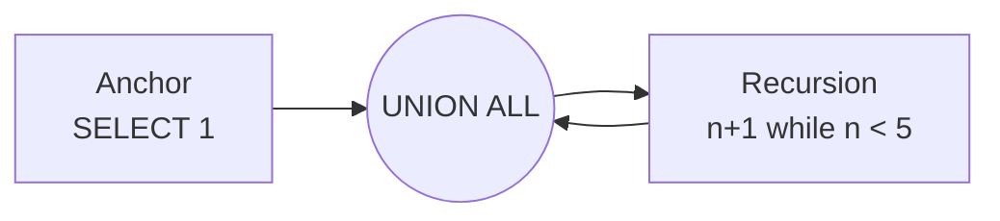

:::tip[In short]
A CTE (`WITH name AS (...)`) is a **named subquery** declared at the start of a query. Same result as a subquery, but reads top to bottom, like steps.

```sql
WITH paid AS (
    SELECT * FROM orders WHERE status = 'paid'
)
SELECT customer_id, SUM(amount) FROM paid GROUP BY customer_id;
```

Several CTEs can be chained, and a recursive CTE traverses hierarchies (employee → manager → manager's manager).
:::

## Why you need it

When a query grows into nested subqueries, it becomes unreadable. A CTE breaks the logic into **named steps**: first "paid orders", then "revenue per customer", then "top". Each step is visible and reusable.

```sql title="Demo data"
INSERT INTO orders VALUES
    (101,1,'paid',2500),(102,1,'paid',1800),
    (103,2,'cancelled',990),(104,3,'paid',4200),(105,3,'paid',700);
```

## Syntax: WITH ... AS

A CTE is declared before the main `SELECT`. Then you reference it like a regular table:

```sql
WITH paid AS (
    SELECT customer_id, amount
    FROM orders
    WHERE status = 'paid'
)
SELECT customer_id, SUM(amount) AS revenue
FROM paid
GROUP BY customer_id
ORDER BY revenue DESC;
```

| customer_id | revenue |
|-------------|---------|
| 3           | 4900    |
| 1           | 4300    |

A subquery in `FROM` would give the same result, but `WITH paid AS (...)` reads as "take the paid ones → group them".

## Multiple CTEs

Declare a chain comma-separated — each one can reference the previous:

```sql
WITH paid AS (
    SELECT customer_id, amount FROM orders WHERE status = 'paid'
),
by_customer AS (
    SELECT customer_id, SUM(amount) AS revenue
    FROM paid
    GROUP BY customer_id
)
SELECT * FROM by_customer WHERE revenue > 4000;
```

| customer_id | revenue |
|-------------|---------|
| 3           | 4900    |
| 1           | 4300    |

That's the main strength of CTEs: **break a complex query into a sequence of clear steps**.

## CTEs against duplicates after a JOIN

An analyst's favorite trick — collapse the "many" side in a CTE, then join (the fan-out fix from [JOINs](/en/02-sql/06-joins/)):

```sql
WITH item_counts AS (
    SELECT order_id, SUM(qty) AS items
    FROM order_items
    GROUP BY order_id
)
SELECT o.order_id, o.amount, ic.items
FROM orders o
LEFT JOIN item_counts ic ON ic.order_id = o.order_id;
```

Same as a subquery in `FROM`, but named and reusable.

## Recursive CTE

`WITH RECURSIVE` traverses hierarchies and graphs: a category tree, an "employee → manager" chain, row numbering. The structure is always the same: an **anchor** (start) + `UNION ALL` + a **recursive part** that references the CTE itself.

```sql
-- generate numbers 1..5
WITH RECURSIVE nums AS (
    SELECT 1 AS n              -- anchor
    UNION ALL
    SELECT n + 1 FROM nums WHERE n < 5   -- recursion step
)
SELECT n FROM nums;
```

| n |
|---|
| 1 |
| 2 |
| 3 |
| 4 |
| 5 |



A classic case — expand an employee hierarchy: "all reports of person X at all levels".

:::caution[Don't loop forever]
A recursive CTE must have a stop condition (`WHERE n < 5`). Without it, the query loops infinitely. For graphs with cycles, add protection against revisiting nodes.
:::

## CTE vs subquery vs temp table

| Tool | When |
|------|------|
| **Subquery** | a simple one-off step inside a query |
| **CTE (`WITH`)** | several steps, readability needed, reuse within one query |
| **Temp table** | a heavy intermediate result needed across **several** queries |

:::note[Performance]
PostgreSQL CTEs used to be an "optimization fence" (always materialized). Since version 12, simple CTEs can be inlined like subqueries. In most analytical queries the difference isn't critical — choose for readability.
:::

<details>
<summary>1. Via a CTE: customers with revenue above the per-customer average.</summary>

```sql
WITH rev AS (
    SELECT customer_id, SUM(amount) AS revenue
    FROM orders WHERE status = 'paid'
    GROUP BY customer_id
)
SELECT * FROM rev
WHERE revenue > (SELECT AVG(revenue) FROM rev);
```

The CTE `rev` is computed once and referenced twice — that's the convenience.

</details>

<details>
<summary>2. Generate a calendar of dates for January 2026 with a recursive CTE.</summary>

```sql
WITH RECURSIVE days AS (
    SELECT DATE '2026-01-01' AS d
    UNION ALL
    SELECT d + 1 FROM days WHERE d < DATE '2026-01-31'
)
SELECT d FROM days;
```

You then `LEFT JOIN` this date scaffold with facts so the report includes even empty days.

</details>

<details>
<summary>3. What's the difference between a CTE and a temp table?</summary>

A CTE lives only within one query and isn't stored anywhere. A temp table (`CREATE TEMP TABLE`) persists for the session and is available in several subsequent queries — useful when a heavy intermediate result is needed repeatedly.

</details>

## What's next

- [Window functions](/en/02-sql/09-window-functions/) — ranks, running totals, top-N per group; often written together with CTEs.
- [Common patterns](/en/02-sql/16-common-patterns/) — RFM, cohorts, retention are almost always built on CTEs.

**Practice:** [LeetCode SQL](https://leetcode.com/problemset/database/) (medium/hard) and [StrataScratch](https://www.stratascratch.com/) — you can't avoid CTEs there.
