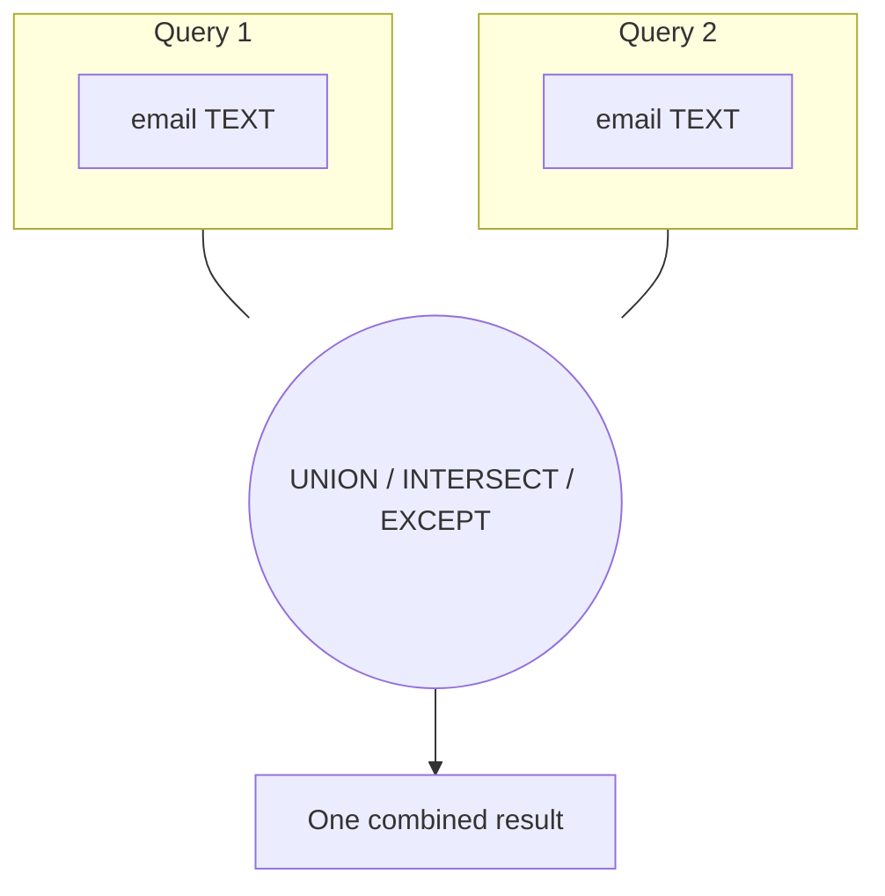

:::tip[In short]
Set operations **stack the results of two queries vertically** (rows under rows), not horizontally (like a `JOIN`).

- `UNION` — combine, **removing duplicates**.
- `UNION ALL` — combine, **keeping duplicates** (faster).
- `INTERSECT` — only rows present in **both**.
- `EXCEPT` — rows from the first that are **not** in the second.

Requirement: the queries have the same number of columns and compatible types.
:::

:::note[Data flow]
Input: two `SELECT` results with the same columns
→ Processing: `UNION` (combine, drop duplicates), `UNION ALL` (keep all), `INTERSECT` (common), `EXCEPT` (difference)
→ Output: one combined set of rows.
Why: stack exports/periods into one table or compare two sets.
:::

## Why you need it

When data sits in different tables of the same structure (archive and current orders, two lead sources) — you stitch them with `UNION`. And `INTERSECT`/`EXCEPT` answer "who's in both" and "who's here but not there" without joins.

```sql title="Demo data"
CREATE TABLE web_users   (email text);
CREATE TABLE app_users   (email text);

INSERT INTO web_users VALUES ('a@x.ru'), ('b@x.ru'), ('c@x.ru');
INSERT INTO app_users VALUES ('b@x.ru'), ('c@x.ru'), ('d@x.ru');
```

## UNION vs UNION ALL

`UNION ALL` just stacks the rows. `UNION` additionally removes duplicates — which means it sorts/hashes, and is therefore **slower**.

```sql
SELECT email FROM web_users
UNION ALL
SELECT email FROM app_users;
```

| email  |
|--------|
| a@x.ru |
| b@x.ru |
| c@x.ru |
| b@x.ru |
| c@x.ru |
| d@x.ru |

```sql
SELECT email FROM web_users
UNION            -- duplicates removed
SELECT email FROM app_users;
```

| email  |
|--------|
| a@x.ru |
| b@x.ru |
| c@x.ru |
| d@x.ru |

:::tip[Default to UNION ALL]
If you **know for sure** there are no duplicates (or they don't bother you) — use `UNION ALL`: it doesn't waste time on deduplication. Write `UNION` only when duplicates really need to be removed.
:::

## INTERSECT: intersection

Rows present in **both** queries. "Users who are in both web and app":

```sql
SELECT email FROM web_users
INTERSECT
SELECT email FROM app_users;
```

| email  |
|--------|
| b@x.ru |
| c@x.ru |

## EXCEPT: difference

Rows from the first query that are **not** in the second. "Web users who didn't reach the app":

```sql
SELECT email FROM web_users
EXCEPT
SELECT email FROM app_users;
```

| email  |
|--------|
| a@x.ru |

In Oracle the same operator is called `MINUS`. `INTERSECT` and `EXCEPT` also remove duplicates (like `UNION`).

## Rules and pitfalls



:::caution[Column compatibility]
- The number of columns in both queries must **match**, and types must be compatible. `SELECT id, name UNION SELECT name` fails.
- Result column names are taken from the **first** query.
- `ORDER BY` is written **once** at the very end — it applies to the whole combined result, not to individual parts.
:::

<details>
<summary>1. All unique emails from both sources.</summary>

```sql
SELECT email FROM web_users
UNION
SELECT email FROM app_users
ORDER BY email;
```

`UNION` removes the repeats `b@x.ru` and `c@x.ru`.

</details>

<details>
<summary>2. Who uses only the app (not in web)?</summary>

```sql
SELECT email FROM app_users
EXCEPT
SELECT email FROM web_users;
```

`d@x.ru`. Query order matters: `app EXCEPT web`, not the other way around.

</details>

<details>
<summary>3. When is UNION ALL preferable to UNION?</summary>

When there are knowingly no duplicates or they're acceptable. `UNION` deduplicates (sorting/hashing the whole result) — extra work. On large volumes `UNION ALL` is noticeably faster.

</details>

## What's next

- [JOINs](/en/02-sql/06-joins/) — combining "horizontally" (columns), unlike `UNION`'s "vertically".
- [CASE and conditionals](/en/02-sql/12-case-and-conditionals/) — sometimes a `UNION` of several queries is replaced by one `CASE`.

**Practice:** `UNION`/`EXCEPT` tasks are on [sql-ex.ru](https://sql-ex.ru/) and [LeetCode SQL](https://leetcode.com/problemset/database/).
