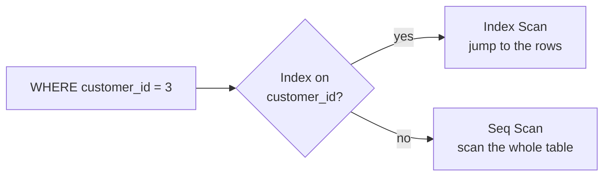

:::tip[In short]
An index is like the alphabetical index in a book: it speeds up finding rows, but takes space and slows down writes.

- An index helps in `WHERE`, `JOIN`, `ORDER BY` on the indexed column.
- `EXPLAIN ANALYZE` shows the **actual plan** of a query — the main diagnostic tool.
- A `Seq Scan` (full scan) on a large table for a filter is a sign an index is missing.
:::

## Why you need it

When a query "hangs" in production, you need to understand **why**. An analyst doesn't have to be a DBA, but reading a query plan and knowing where an index is missing is a basic skill. Otherwise your dashboard loads in a minute instead of a second.

## What an index is (B-Tree)

Without an index the database reads the whole table row by row (`Seq Scan`). An index is a separate sorted structure (usually a **B-Tree**) that finds the needed rows in `log(n)` instead of `n`.

```sql
-- create an index on a column you often filter/join by
CREATE INDEX idx_orders_customer ON orders (customer_id);
```



## When an index helps, and when not

| Helps | Doesn't help / hurts |
|-------|----------------------|
| filter on a column (`WHERE customer_id = 3`) | tiny table (easier to scan) |
| `JOIN` on a key | low-selectivity column (`is_active` = yes/no) |
| `ORDER BY` / `LIMIT` by the index | a function over the column: `WHERE LOWER(email) = ...` (without an expression index) |
| uniqueness (`UNIQUE`) | very frequent `INSERT/UPDATE` (the index updates too) |

:::caution[A function "disables" the index]
`WHERE date_trunc('day', ts) = '2026-01-05'` won't use a regular index on `ts` — the database computes the function for each row. Rewrite as a range: `ts >= '2026-01-05' AND ts < '2026-01-06'` — and the index works (or create an expression index).
:::

## EXPLAIN and EXPLAIN ANALYZE

`EXPLAIN` shows the **plan** (how the database intends to run it). `EXPLAIN ANALYZE` actually runs the query and shows **real** time and row counts.

```sql
EXPLAIN ANALYZE
SELECT * FROM orders WHERE customer_id = 3;
```

```text
Index Scan using idx_orders_customer on orders
  (cost=0.29..8.31 rows=2 width=40)
  (actual time=0.018..0.020 rows=2 loops=1)
Planning Time: 0.1 ms
Execution Time: 0.04 ms
```

What to read in a plan:

- **Access type:** `Index Scan` (good) vs `Seq Scan` (a scan — suspicious on a large table).
- **cost** — an estimate (relative), **actual time** — real time.
- expected vs actual **rows**: a big mismatch → stale statistics, fixed by `ANALYZE table;`.

## Common slowdowns

- **`SELECT *`** instead of the needed columns — extra I/O, blocks index-only scans.
- **A function over a column** in `WHERE` (see above) — the index isn't used.
- **`OR` across different columns** — often doesn't use indexes; sometimes `UNION ALL` is faster.
- **The N+1 query problem** from the app: instead of one `JOIN`, a loop of hundreds of tiny queries. Fixed by a single query with `JOIN`/`IN`.
- **No index on a FK** — slow `JOIN`s and cascade checks.

## Partitioning and denormalization (overview)

- **Partitioning** — split a huge table into pieces (usually by date). A query for one month reads one partition, not everything. Relevant at billions of rows.
- **Denormalization** — deliberately duplicate data (e.g. store `customer_country` right in `orders`) to avoid joining. In OLTP this is bad (see [normalization](/en/02-sql/01-rdbms-concepts/)), but in analytics (OLAP, data marts) it's a common and justified practice for read speed.

:::note[The rule of optimization]
Don't optimize blindly. First `EXPLAIN ANALYZE` → find the bottleneck (Seq Scan, expensive Sort, row blow-up) → then fix precisely (an index, rewrite a condition, drop `SELECT *`). "Premature optimization is the root of all evil."
:::

## Practice tasks

<details>
<summary>1. A query filters by email but is slow. What to check?</summary>

`EXPLAIN ANALYZE` — if it shows a `Seq Scan` on a large table, an index on `email` is missing: `CREATE INDEX ON users (email);`. If the filter is `WHERE LOWER(email) = ...` — you need an expression index on `LOWER(email)` or to normalize the data beforehand.

</details>

<details>
<summary>2. Why is an index on an is_active (true/false) column usually useless?</summary>

Low selectivity: only two values, each covering ~half the table. Reading half the rows via an index is more expensive than just scanning the table, so the planner ignores the index.

</details>

<details>
<summary>3. What is the N+1 problem and how do you fix it?</summary>

It's when the app makes 1 query for a list (N records) and then one query per record — N+1 trips to the database. Fixed by a single query with a `JOIN` or `WHERE id IN (...)` that pulls all related data at once.

</details>

## What's next

- [SQL dialects](/en/02-sql/15-dialects-comparison/) — in columnar databases (ClickHouse, BigQuery) optimization works differently.
- [Modern Stack](/en/11-modern-stack/) — how analytical warehouses (DWH) work and why they denormalize.

**Practice:** an interactive plan analyzer — [explain.dalibo.com](https://explain.dalibo.com/); [Use The Index, Luke](https://use-the-index-luke.com/) — the best deep dive on indexes.
