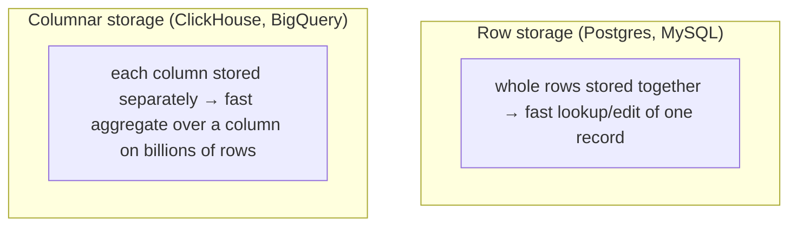

:::tip[In short]
SQL is standardized, but every database has its own dialect: date/string functions, LIMIT syntax and features differ.

- **PostgreSQL / MySQL** — row-based (OLTP) databases, the backbone of apps.
- **ClickHouse / BigQuery / Snowflake** — columnar analytical (OLAP), built for `GROUP BY` over billions of rows.

90% of the syntax (`SELECT`, `JOIN`, `GROUP BY`, windows) is the same. The differences are in functions and in **how** the database stores data.
:::

## Why you need it

An analyst rarely sits on a single database: ClickHouse in production, exports to BigQuery, PostgreSQL locally. It's important to know what ports over easily, what you'll have to rewrite, and why columnar databases fly on analytics.

## Row-based vs columnar



- **Row-based (OLTP):** store a whole row together. Fast to fetch/change one order. That's PostgreSQL, MySQL — app databases.
- **Columnar (OLAP):** store each column separately and compressed. `SUM(amount)` over a billion rows reads only the `amount` column — hence the analytics speed. That's ClickHouse, BigQuery, Snowflake.

## PostgreSQL

The de-facto standard among analysts: rich SQL, window functions, CTEs, `jsonb`, regex, extensions. Characteristic:

```sql
SELECT * FROM orders LIMIT 10;            -- LIMIT
SELECT '2026-01-01'::date;                -- casting with ::
SELECT name || ' ' || country FROM customers;  -- concatenation with ||
```

## MySQL

Also a row-based OLTP, but simpler and with quirks:

```sql
SELECT * FROM orders LIMIT 10;            -- LIMIT as in Postgres
SELECT CONCAT(name, ' ', country) ...;    -- || is NOT concatenation (it's OR!), need CONCAT
SELECT CAST('42' AS SIGNED);              -- casting with CAST, not ::
```

:::caution[MySQL pitfalls]
- `||` in MySQL defaults to logical `OR`, not concatenation. Use `CONCAT`.
- Old MySQL allowed `SELECT` of ungrouped columns with `GROUP BY` (`ONLY_FULL_GROUP_BY` off) — returning a random value. PostgreSQL errors on this immediately.
:::

## ClickHouse

A columnar database for huge volumes (common in the CIS: the Yandex stack, event analytics). Ultra-fast aggregates, but a different approach:

```sql
SELECT count() FROM events;               -- count() without *
SELECT uniq(user_id) FROM events;         -- approximate distinct-count
SELECT groupArray(amount) FROM orders;    -- aggregates into arrays, ARRAY JOIN
```

Weak spots: `JOIN`s are heavier than in Postgres; `UPDATE`/`DELETE` are expensive (the DB is tuned for inserts and reads, not changes).

## BigQuery

Google's cloud columnar database, billed by the volume of data scanned:

```sql
SELECT * FROM `project.dataset.orders` LIMIT 10;   -- names in backticks
SELECT * FROM orders QUALIFY ROW_NUMBER() OVER (...) = 1;  -- QUALIFY: filter by a window
```

A specialty: `QUALIFY` lets you filter by a window function directly (in Postgres you need a CTE for that). You pay for bytes read — hence the habit of not writing `SELECT *` and partitioning by date.

## Snowflake

A cloud warehouse with separated storage and compute. SQL is close to the standard, with `QUALIFY`, `MERGE`, and convenient work with semi-structured data (`VARIANT`/JSON). More in the [Modern Stack](/en/11-modern-stack/02-snowflake/).

## Summary of differences

| Topic | PostgreSQL | MySQL | ClickHouse | BigQuery |
|-------|------------|-------|------------|----------|
| Type | row-based | row-based | columnar | columnar |
| Profile | OLTP/general | OLTP | OLAP | OLAP cloud |
| Concatenation | `\|\|` or `CONCAT` | `CONCAT` | `concat`/`\|\|` | `\|\|` or `CONCAT` |
| Casting | `::type` / `CAST` | `CAST` | `CAST`/`toInt32` | `CAST`/`SAFE_CAST` |
| Filter by window | via CTE | via CTE | via subquery | `QUALIFY` |
| `UPDATE/DELETE` | cheap | cheap | expensive | expensive |

:::note[What ports over easily]
`SELECT`, `WHERE`, `JOIN`, `GROUP BY`, `HAVING`, window functions, CTEs — nearly identical everywhere. What usually needs rewriting: date/string functions, casting, top-level syntax (`LIMIT` vs `TOP`), specific aggregates. Learn the standard core — dialect trivia is a one-minute google away.
:::

<details>
<summary>1. Why is ClickHouse faster than PostgreSQL on "SUM over a billion rows" but slower on "fetch one order by id"?</summary>

Columnar storage: `SUM(amount)` reads only the compressed `amount` column — minimal I/O. But "fetch one whole order" requires assembling all its columns from separate columnar files, which is costly for a single row. Row-based PostgreSQL stores the row together — fetching it is cheap.

</details>

<details>
<summary>2. You moved a query with `||` from PostgreSQL to MySQL and the strings "merged" into 0/1. Why?</summary>

In MySQL `||` defaults to logical `OR`, not concatenation. `'a' || 'b'` is interpreted as a boolean expression. You need `CONCAT('a', 'b')`.

</details>

<details>
<summary>3. What does QUALIFY do in BigQuery and how do you do it in PostgreSQL?</summary>

`QUALIFY` filters by a window function's result right in the query (`QUALIFY ROW_NUMBER() OVER (...) = 1`). In PostgreSQL you can't use a window in `WHERE`, so you move it into a CTE/subquery and filter from outside.

</details>

## What's next

- [Modern Stack](/en/11-modern-stack/) — Snowflake, BigQuery, ClickHouse in detail, plus DWH and modeling.
- [Common patterns](/en/02-sql/16-common-patterns/) — analyst patterns that work across all dialects.

**Practice:** [DB Fiddle](https://www.db-fiddle.com/) can switch the database engine — run the same query on Postgres and MySQL and see the difference.
