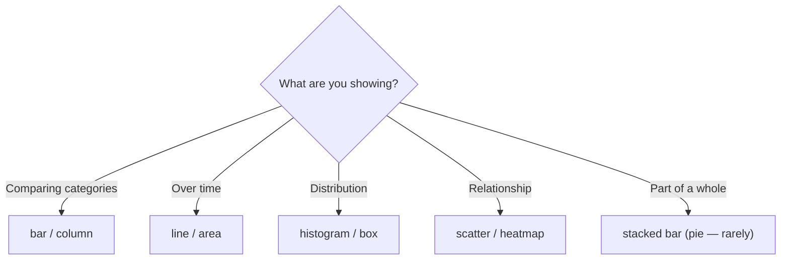

:::tip[In short]
The chart type is determined by the **question**, not the data. Comparing categories → bars; change over time → a line; distribution → histogram/box plot; relationship of two quantities → scatter; part of a whole → (rarely) a pie. First state what you want to show, then pick the chart.
:::

## Why you need it

The same dataset can be shown a dozen ways, but only one or two are good. The wrong chart type either hides the point or misleads. The cheat sheet below saves time and rescues you from classic mistakes.

## By task

| Task (what to show) | Chart |
|---------------------|-------|
| Compare category values | bar / column |
| Change over time | line (area — if volume matters) |
| Distribution of one quantity | histogram, box, violin |
| Relationship of two quantities | scatter |
| Relationship as a matrix (many pairs) | heatmap |
| Part of a whole | stacked bar; pie — carefully |
| Hierarchy / nesting | treemap, sunburst |

## Comparing values

**Bar/column** — the workhorse. For long category labels use horizontal (bar). Sort by value, not alphabetically — comparison reads faster that way.

## Change over time

**Line** — the standard for trends: shows direction and breaks. **Area** — when accumulated volume matters, but be careful with stacking (individual layers are hard to read).

## Distribution

- **Histogram** — the shape of one quantity's distribution (where the "hump" is, whether there's skew).
- **Box plot** — median, quartiles, outliers; handy for comparing groups.
- **Violin** — a box plot + density shape; pretty, but needs explaining to the audience.

The link to [descriptive statistics](/en/05-statistics/01-descriptive-stats/) is direct.

## Relationship

- **Scatter** — the relationship of two numeric quantities (price vs demand); shows the trend, clusters, outliers.
- **Heatmap** — a matrix of values by color: correlations, activity by day/hour.

## Part of a whole

:::caution[A pie is almost never the best choice]
A pie works at most for 2–3 "part of a whole" categories. With more sectors angles are hard to compare — bars or a stacked bar are more honest. Never make a 3D pie or split it into 10 pieces.
:::

## Cheat-sheet diagram

## Practice tasks

1. You need to show how revenue changed by month over 2 years. Which chart?

A line chart: it best conveys change over time — trend, seasonality, breaks. Bars also work, but with 24 points a line reads cleaner. A pie is meaningless here — it's not about time.

2. You want to see whether there's a relationship between price and number of sales. What to plot?

A scatter plot: each point is a product with coordinates (price, sales). The direction of the relationship, clusters and outliers are immediately visible. To assess the strength, add a [correlation](/en/05-statistics/08-correlation-regression/).

## What's next

- [Color and design](/en/06-visualization/03-color-and-design/) — palettes and readability.
- [Visualization principles](/en/06-visualization/01-principles/) — why bars are more honest than pies.
