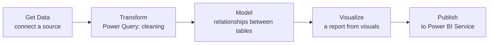

:::tip[In short]
Power BI is Microsoft's BI tool, the leader in the CIS and Europe. The free **Power BI Desktop** (Windows) is where everything is built; **Power BI Service** is the cloud for publishing. The workflow is always the same: **Get Data → Transform (Power Query) → Model → Visualize**. The signature feature is the formula language **DAX**.
:::

## Why you need it

In the CIS and Europe Power BI is required more often than Tableau (especially after Tableau left Russia). It's free to start, tightly integrated with Excel and the Microsoft stack, and covers most reporting tasks.

## Editions

| Edition | What it is | Platform |
|---------|------------|----------|
| **Power BI Desktop** | the main app for developing reports | Windows (free) |
| **Power BI Service** | cloud: publishing, sharing, refresh | web (has a free tier) |
| **Power BI Mobile** | viewing reports | iOS/Android |

:::note[Desktop is Windows-only]
Power BI Desktop officially runs only on Windows. On macOS/Linux — via a VM, Parallels or a cloud Windows. This is a common pain for Mac users; keep it in mind when choosing your tool.
:::

## The interface

Three tabs on the left — these are the three work stages:

- **Report** (chart) — the canvas with visuals, drag fields → build charts.
- **Data** (table) — view the loaded tables.
- **Model** (schema) — the relationships between tables ([data model](/en/07-bi-tools/power-bi/03-data-model/)).

Plus **Fields** (right), **Visualizations** (chart types) and the **Transform data** button (entry to Power Query).

## The workflow

This order is the backbone of the whole section: first clean ([Power Query](/en/07-bi-tools/power-bi/02-power-query/)), then build the model and measures (DAX), then visualize.

## Practice tasks

1. Can you develop Power BI reports on a Mac?

Not directly: Power BI Desktop is Windows-only. On a Mac people use a virtual machine (Parallels), Boot Camp on Intel Macs, or a cloud Windows. So if you're on macOS and choosing a BI, keep this in mind (Tableau is cross-platform).

2. In what order do the work stages go in Power BI?

Get Data → Transform (Power Query) → Model → Visualize → Publish. First the connection, then cleaning in Power Query, building the data model and DAX measures, and only then visualization and publishing to Service.

## What's next

- [Power Query](/en/07-bi-tools/power-bi/02-power-query/) — the Transform stage: loading and cleaning.
- [Tableau — introduction](/en/07-bi-tools/tableau/01-intro/) — the main competitor for comparison.
