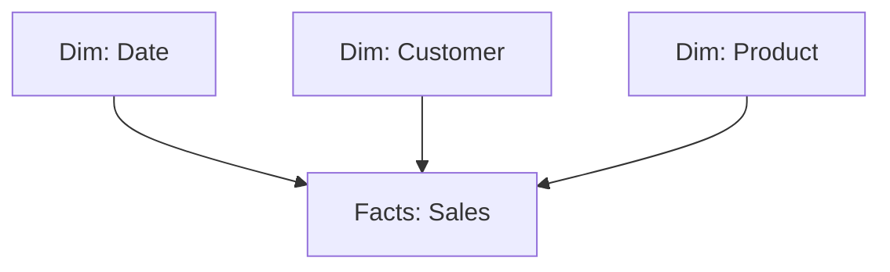

:::tip[In short]
A data model is tables related to each other. The right architecture is a **star schema**: a central fact table (sales) with dimension references (dates, customers, products) around it. **1:N** relationships (one reference → many facts) with filtering from reference to facts are the basis of correct DAX measures.
:::

## Why the model matters

Power BI computes measures **by the relationships between tables**. If the model is wrong, DAX returns wrong numbers or fails to link the data. A good model = simple measures and a fast report; a bad one = pain and bugs.

## Star vs Snowflake

- **Star schema** — the fact table in the center, dimensions directly around it. The **recommended** approach for Power BI: simple, fast, clear for DAX.
- **Snowflake** — dimensions further split into sub-tables (product → category → department). More normalized, but more complex and slower. Where possible, "flatten" into a star.

## Relationship types (cardinality)

| Relationship | Meaning | Where typical |
|--------------|---------|---------------|
| **1:N** (one-to-many) | one reference row ↔ many fact rows | the norm (customer → orders) |
| **1:1** | row ↔ row | rare, usually merge into one table |
| **N:N** (many-to-many) | both sides not unique | avoid, a source of bugs |

:::caution[N:N is a source of problems]
Many-to-many relationships often give ambiguous results and doubling, like [fan-out in joins](/en/02-sql/06-joins/). If an N:N appears — you're almost always missing a dimension reference with unique keys. Add it and reduce to two 1:N relationships.
:::

## Filter direction

A relationship filters in a direction, and by default — **from dimension to facts** (single direction). Picking a country in the reference filters sales — correct. Enable **bidirectional** (both) filtering only when truly needed: it complicates the model and breeds ambiguity.

## Hiding columns

Technical fields (keys, service ids) are hidden from the user (Hide). Only meaningful fields stay in the report — the model is cleaner and doesn't mislead those building visuals.

## Practice tasks

1. Which schema is recommended in Power BI and why?

A star schema: the fact table in the center, dimension references directly around it via 1:N relationships. It's simpler, faster and more predictable for DAX than a snowflake. Measures are easier to write, the report runs faster.

2. An N:N relationship formed between two tables and numbers double. What to do?

Introduce an intermediate dimension reference with unique keys and replace the N:N with two 1:N relationships. Many-to-many almost always signals a missing dimension. It's the same logic as preventing sum doubling in SQL joins.

## What's next

- [DAX — basics](/en/07-bi-tools/power-bi/04-dax-basics/) — measures are computed over this model.
- [JOINs in SQL](/en/02-sql/06-joins/) — relationships and doubling in relational logic.
