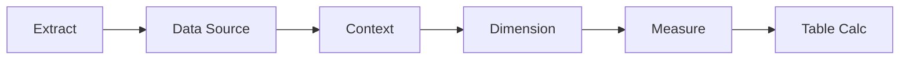

:::tip[In short]
Filters in Tableau are applied in a **strict order** (extract → data source → context → dimension → measure), and this explains "strange" results with [LOD](/en/07-bi-tools/tableau/04-lod-expressions/). A **parameter** is a user-controlled value (a threshold, a metric choice). **Action filters** make a dashboard interactive: a click on one chart filters the others.
:::

## Why you need it

Filters decide which data enters the computation, and parameters let the user adjust the dashboard. Misunderstanding the filter order is the source of "the filter doesn't affect my computation" errors.

## The order of filter application

Tableau always applies filters in this sequence:



| Filter | What it cuts |
|--------|--------------|
| **Extract** | when creating the `.hyper` |
| **Data Source** | at the source level |
| **Context** | sets the "context" for FIXED and top-N |
| **Dimension** | by categories (country, date) |
| **Measure** | by aggregate (sum > 1000) |

:::caution[FIXED is computed before dimension filters]
A `FIXED` LOD is computed **after context filters but before dimension filters**. So a regular dimension filter may not affect a FIXED computation. The fix: promote the needed filter to a **context filter** (right-click → Add to Context) — then it will act on FIXED.
:::

## Parameters

A parameter is a single value the user controls (input box, slider, list). On its own it filters nothing — you wire it into a calculated field or filter:

```
// the "large order" threshold is set by a parameter
[Sales] > [Threshold]
```

Typical uses: a metric switch (Sales/Profit), a cutoff threshold, a period choice, "what-if" scenarios.

## Action filters in dashboards

They make a dashboard alive — interaction between sheets:

- **Filter action** — a click on an element of one chart filters the others (pick a country on the map → the table shows only it).
- **Highlight action** — highlight related values without filtering.
- **URL action** — a click opens a link (e.g. a customer card in an external system).

Configured: Dashboard → **Actions** → Add Action.

## Practice tasks

<details>
<summary>1. A country filter on the dashboard doesn't affect a FIXED computation. Why and how to fix?</summary>

Because `FIXED` is computed before regular dimension filters. For the filter to take effect, convert it to a context filter (Add to Context) — context filters are applied before FIXED. It's a direct consequence of the filter order.

</details>

<details>
<summary>2. You need to let the user change the "large customer" threshold on the dashboard. With what?</summary>

A parameter: create a numeric parameter "Threshold" and use it in a calculated field/filter (`[Sales] > [Threshold]`). The user changes the value in a control — the dashboard recomputes. Parameters are made for user-controlled values.

</details>

## What's next

- [Dashboards](/en/07-bi-tools/tableau/06-dashboards/) — assembling sheets and action filters together.
- [LOD expressions](/en/07-bi-tools/tableau/04-lod-expressions/) — why filter order matters.
