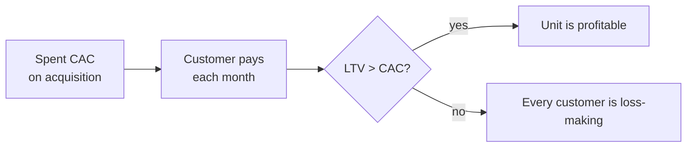

:::tip[In short]
Unit economics answers "are we making or losing money on a single customer?". It's computed via the **contribution margin** (revenue per customer minus variable costs) and comparing **LTV with CAC**. If a customer brings less than it cost to acquire and serve them, scaling only accelerates the losses.
:::

## Why you need it

A business can grow in revenue and still burn: every new customer is loss-making. Unit economics catches this **before** scaling. You'll be asked to compute it in product interviews and cases — it's a basic skill.

## What a "unit" is

A unit is the entity you compute economics for: most often **one customer**, sometimes an order or a ride. The question is always the same: how much does this unit bring and how much is spent on it.

## Contribution margin

Revenue per customer minus the **variable** costs for them (cost of goods, delivery, payment fees, support):

$$\text{Contribution Margin} = \text{Revenue per unit} - \text{Variable costs per unit}$$

This is the money left to cover fixed costs and profit. If the margin is negative — every customer is loss-making, and growth only makes it worse.

## LTV, CAC and payback

The three quantities the conclusion rests on:

- **LTV** — how much a customer brings over their lifetime (by margin, not just revenue).
- **CAC** — the acquisition cost.
- **Payback period** — how many months it takes a customer to "repay" their CAC.

:::caution[Compute LTV by margin, not revenue]
A common mistake — putting all of a customer's revenue into LTV. The right way — **margin** LTV: revenue minus variable costs. A customer with 10,000 turnover and 10% margin brings 1,000, and that 1,000 is what you compare with CAC — otherwise the economics look healthier than they are.
:::

## Cohort-based unit economics

Since customers pay over time, economics is more honest computed by [cohorts](/en/08-product-analytics/04-cohort-analysis/): take a group acquired in one month and watch how their revenue accumulates against the spent CAC. This shows the real payback, not an averaged "hospital mean".

## A worked example

A subscription service:

- Price $5/mo, variable costs $1.5/mo → margin **$3.5/mo**.
- Average lifespan 10 mo → **LTV = $35**.
- CAC = $10.
- **LTV/CAC = 3.5** ✅ (healthy), **payback = 10 / 3.5 ≈ 2.9 months**.

Conclusion: the unit is profitable, pays back in ~3 months — acquisition can be scaled.

## Practice tasks

1. Revenue per customer $100, margin 20%, CAC $15. Is the unit profitable?

Margin LTV = $100 × 20% = $20. LTV/CAC = 20 / 15 ≈ 1.3 — formally >1, but below the healthy benchmark of 3. You can't take all the revenue ($100): then "5×" creates a false sense of well-being. By margin, the economics is fragile.

2. What does a payback period of 8 months mean with a customer lifespan of 6 months?

The customer leaves (6 mo) before repaying their acquisition (8 mo) — i.e. on average they don't recoup CAC at all. Unit economics is negative: scaling acquisition increases losses. You need to lower CAC, raise retention, or improve margin.

## What's next

- [Key metrics](/en/08-product-analytics/01-key-metrics/) — definitions of LTV, CAC, ARPU.
- [Cohort analysis](/en/08-product-analytics/04-cohort-analysis/) — the basis of honest unit economics.
