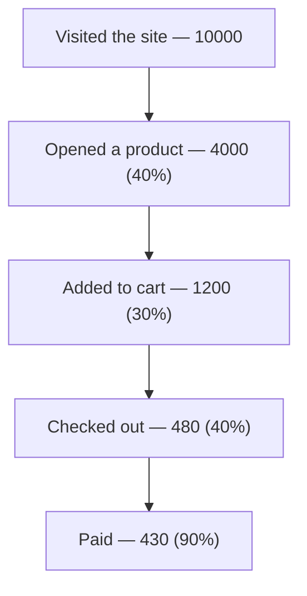

:::tip[In short]
A funnel shows how users **drop off** along their path (visited → added to cart → paid). You compute each step's conversion, find the **biggest drop (dropoff)** — that's the growth point. Fixing the bottleneck pays off more than uniformly "improving everything".
:::

## Why you need it

A final "3% from visit to purchase" conversion says nothing about **where** people are lost. A funnel breaks the path into steps and shows the specific drop — this turns "we need to raise sales" into "we need to fix the payment step".

## Funnel metrics

- **Step conversion** — the share who moved from the previous step to the next.
- **End-to-end conversion** — the share who made it from start to finish.
- **Dropoff** — the share who left at a step (`1 − step conversion`).

| Step | Users | Step conversion | Dropoff |
|------|-------|-----------------|---------|
| Visit | 10000 | — | — |
| Product | 4000 | 40% | 60% |
| Cart | 1200 | 30% | **70%** ← bottleneck |
| Checkout | 480 | 40% | 60% |
| Payment | 430 | 90% | 10% |

End-to-end conversion = 430 / 10000 = **4.3%**.

## Linear and branched funnels

- **Linear** — a strict sequence of steps (registration → onboarding → purchase).
- **Branched** — several paths to the goal (bought via search OR via recommendations). Analyzed by path segments.

## How to find bottlenecks

1. Build the funnel by steps, compute each step's conversion.
2. Find the step with the **maximum dropoff** — in the example it's "Product → Cart" (70%).
3. Segment: does it sag for everyone or a specific group (mobile, a new region)?
4. Form a hypothesis and test it with an [A/B test](/en/09-ab-testing/01-fundamentals/).

:::caution[Fix the big drop, not the last step]
There's a temptation to optimize the payment step (it's closer to the money), but if its dropoff is 10% while "cart" is 70%, the potential is many times higher at the cart. Improving the bottleneck from 30% to 40% conversion gives more revenue than polishing an already-good step.
:::

1. End-to-end conversion dropped from 5% to 4%. Where to start the investigation?

Break the funnel into steps and compare each step's conversion with the prior period — find **which step** the new drop appeared at. A fall in the end-to-end metric alone doesn't say where; the problem is always localized to a specific transition. Then segment (device, channel, region).

2. Which funnel step in the example has the most growth potential?

"Product → Cart" with a 70% dropoff (only 30% conversion). It's the biggest drop, and lifting it is easier and more profitable than the payment step (already at 90%). The rule: optimize the narrowest bottleneck, not what's closest to the money.

## What's next

- [Cohort analysis](/en/08-product-analytics/04-cohort-analysis/) — how groups' behavior changes over time.
- [A/B testing](/en/09-ab-testing/01-fundamentals/) — testing funnel-improvement hypotheses.
