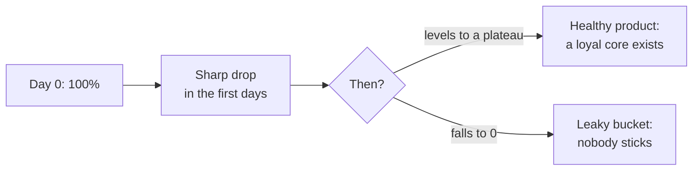

:::tip[In short]
A retention curve shows what share of users return over time. Three ways to compute it: **classic** (returned exactly on day N), **rolling** (returned on day N or later), **range** (returned within a window of days). A healthy product is one whose curve **levels off to a plateau** rather than falling to zero. For subscriptions there's a money analog — **NDR**.
:::

## Why you need it

Retention is the main indicator of whether a product is needed. Acquisition without retention is a "leaky bucket": you pour in traffic and it leaks out. The retention curve shows whether a core of users sticks, and that matters more than a one-off conversion.

## Classic retention

The share of users who returned **exactly on day N** after start:

- Day 1: 40%, Day 7: 20%, Day 30: 12%.
- A strict definition; gives a "jagged" curve (spikes on weekends/weeks).
- The standard for comparison and benchmarks.

## Rolling retention

A user counts if they returned **on day N or later**:

- Gentler than classic, a smoother curve.
- Answers "is the user still alive", not "did they visit on a specific day".
- Convenient for products with irregular usage.

## Range retention

Returned **within a window** (e.g. days 7–14). A compromise: smooths classic's noise but is tied to a range. Often used for weekly/monthly products.

## The retention plateau

:::tip[The key — does the curve reach a plateau]
A healthy product: the curve falls in the first days, then **stabilizes** at a plateau (e.g. ~15%) — this is the loyal core that stays for the long run. A bad product: the curve relentlessly approaches zero — users don't stick, and the business holds only on a constant influx of new ones. Having a plateau matters more than its height.
:::

## Net Dollar Retention (NDR)

Money retention for subscriptions/B2B: how much **revenue** from a cohort remains after a year, accounting for churn, upgrades and downgrades.

- **NDR > 100%** — revenue from existing customers grows even without new ones (upgrades outweigh churn). A sign of a strong SaaS.
- **NDR < 100%** — the cohort "melts" by money.

Unlike user retention, NDR accounts for the fact that remaining customers can pay **more**.

## Practice tasks

1. A product's retention curve stabilized at 18% after day 30. Is that good?

Yes — a plateau means a loyal core that stays long-term rather than leaking to zero. It's a sign of product-market fit. The plateau's height depends on the product type (social network vs a one-off service), but the fact of stabilization itself is a good signal.

2. A company's NDR = 115% with customer churn. How does revenue grow if customers leave?

The remaining customers increase their payments (upgrades, expanded usage) more than is lost on those who left. NDR counts money, not people: even losing some customers by count, you can grow in cohort revenue. NDR > 100% is a strong sign for SaaS.

## What's next

- [RFM segmentation](/en/08-product-analytics/06-rfm-analysis/) — segmentation by behavior.
- [Cohort analysis](/en/08-product-analytics/04-cohort-analysis/) — the data the curves are built on.
