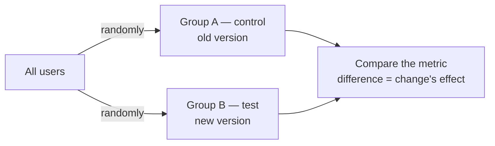
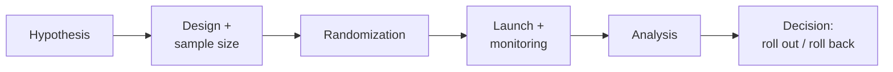

:::tip[In short]
An A/B test is a **controlled experiment**: we randomly split users into groups (A — control, B — change) and compare a metric. Randomization is what turns [correlation into causation](/en/05-statistics/08-correlation-regression/): only this way can you say "the feature **caused** the growth" rather than "it coincided".
:::

## Why you need it

Without an experiment, any "sales rose after the redesign" is a guess: seasonality, a promo, anything could have helped. An A/B test isolates the change's effect. It's the gold standard of product decisions and a mandatory interview topic at product companies.

## Why A/B proves causation

Random assignment makes the groups statistically **identical in everything except the change**. So the difference in the metric is explained by the change itself, not by hidden factors:

This is what separates an experiment from observation: observational data always has [hidden variables](/en/05-statistics/08-correlation-regression/).

## When A/B fits, and when not

| Fits | Doesn't fit |
|------|-------------|
| many users/events | low traffic (the [sample](/en/09-ab-testing/03-sample-size/) won't accumulate) |
| the change can be shown to a subset | the effect is only long-term (brand) |
| the metric is measurable quickly | network effects (social network, marketplace) |
| groups are independent | the audience can't be split |

:::caution[Network effects break independence]
A/B assumes the groups don't affect each other. But in a social network or marketplace, user B interacts with user A — the change "leaks" between groups, and the comparison is distorted. There, special designs are used (cluster, [switchback](/en/09-ab-testing/08-advanced-techniques/)), not a regular A/B.
:::

## Alternatives when A/B isn't possible

- **Quasi-experiments** — no random split, but a "natural" control exists: difference-in-differences (rolled out a feature in one city, compared with a similar one), regression discontinuity.
- **Observational analysis** — only correlations, no guarantee of causation; the weakest, but sometimes the only option.
- **Before/after** without a control — almost always unreliable (seasonality, trends).

## The experiment cycle

Each step is a separate page of this section.

1. Why does an A/B test prove causation, while watching a metric before/after doesn't?

Randomization makes the groups identical in everything except the change, so the difference in the metric is explained by it. In a "before/after" comparison many factors change at once (season, promos, trend), and you can't separate the change's effect from them — only a correlation remains.

2. Can you use a regular A/B to test a new feature in a social network where friends see each other's actions?

It's risky: network effects break group independence — a test user influences the control through connections, and the effect "leaks". A regular A/B will understate or distort the result. You need cluster designs (randomizing by communities/cities) or switchback.

## What's next

- [Hypothesis design](/en/09-ab-testing/02-hypothesis-design/) — how to state what you're testing.
- [Statistics: hypothesis testing](/en/05-statistics/06-hypothesis-testing/) — the foundation under A/B.
