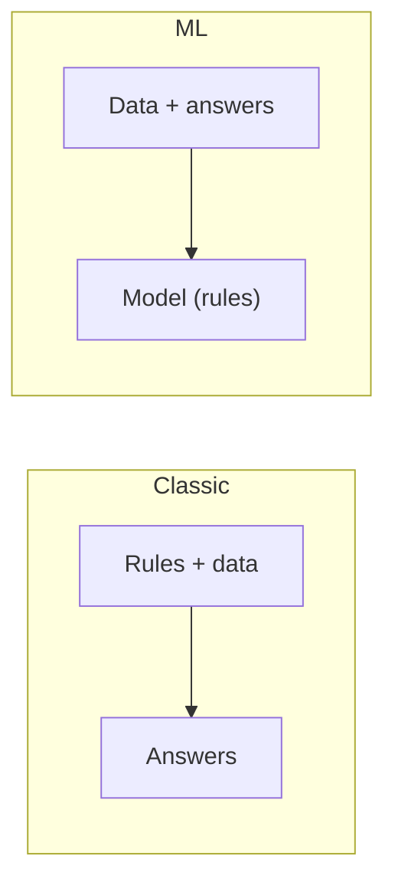

:::tip[In short]
Machine learning is when a model **finds patterns in data itself** instead of explicitly coded rules. For an analyst it matters to understand the task types (regression, classification, clustering) and, above all, **when ML isn't needed**: often a SQL query or a simple rule solves the task better and cheaper than a model.
:::

## Why you need it

Full ML is a Data Scientist's job, but an analyst must speak the same language as a DS, use ready-made models, and not confuse classification with regression in an interview. Plus — soberly judge where ML is really needed and where it's overkill.

## ML in plain terms

Classic programming: a human writes **rules** → the program produces an answer. ML: we give **data and answers** → the model itself derives rules, which it then applies to new data.

## Task types

| Task | What we predict | Example |
|------|-----------------|---------|
| **Regression** | a number | forecasting revenue, price |
| **Classification** | a category/class | churn (yes/no), spam |
| **Clustering** | groups without labels | customer segments |
| **Recommendations** | what to suggest | "you may like" |

The first two are [supervised](/en/10-ml-basics/02-supervised-vs-unsupervised/) (with labels), clustering is unsupervised.

## When ML isn't needed

:::caution[First ask: is ML needed at all?]
ML is an expensive tool (data, training, maintenance, error risk). It's often excessive:

- A **SQL query** or aggregate solves the task — don't build a model for "sums by region".
- A **simple rule** is enough ("if check > X and no visit in 30 days → at-risk group") — it's clearer and more reliable.
- **Little data** — there's nothing to train on.
- You need a **transparent** decision — a rule is explainable, a complex model isn't.

A good analyst proposes ML only when rules genuinely fall short.
:::

## ML vs classic analytics

| | Classic analytics | ML |
|--|-------------------|-----|
| Question | what happened and why | what will happen / how to classify |
| Tool | SQL, BI, statistics | models (sklearn, boosting) |
| Horizon | past and present | forecasting the future |
| Explainability | high | medium to low |

An analyst lives in the left column, but the boundary is blurry: [regression](/en/10-ml-basics/03-linear-regression/) and [model evaluation](/en/10-ml-basics/08-model-evaluation/) are shared ground.

## Practice tasks

1. You need to "find at-risk-of-churn customers". Is that immediately an ML task?

Not necessarily. First try a simple rule: "no visit in 30+ days AND falling purchase frequency → at risk". It often works as well as a model, while being transparent and cheap. ML is worth bringing in when rules are many, nonlinear and poorly capture the pattern — then it's classification (churn yes/no).

2. "Forecast next month's revenue" and "determine whether an email is spam" — what task types?

The first is regression (predicting a number), the second is classification (predicting a yes/no class). Both are supervised: they learn on historical data with known answers. Distinguishing the task type matters — it determines the model choice and [evaluation metrics](/en/10-ml-basics/08-model-evaluation/).

## What's next

- [Supervised vs unsupervised](/en/10-ml-basics/02-supervised-vs-unsupervised/) — the two main learning types.
- [Linear regression](/en/10-ml-basics/03-linear-regression/) — the first and most explainable model.
