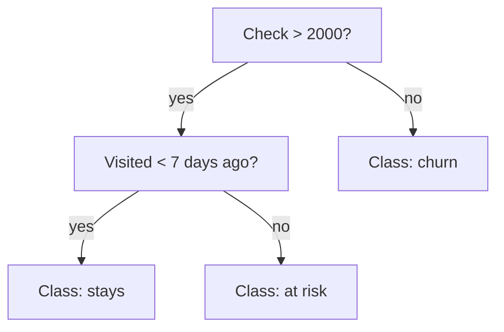

:::tip[In short]
A decision tree splits data with a series of "if-then" questions and overfits easily. To fix this, trees are combined into **ensembles**: **Random Forest** (many independent trees that vote) and **gradient boosting** (trees learn from each other's errors). Boosting (XGBoost/LightGBM/CatBoost) is the champion on tabular data and the industry standard.
:::

## Why you need it

Trees and boosting capture **nonlinear** relationships and interactions that [linear regression](/en/10-ml-basics/03-linear-regression/) misses, and they barely need feature scaling. On tabular data (the analyst's bread and butter) boosting usually beats everything else — that's why it's asked about.

## Decision tree

A series of binary questions on features leading to a prediction:

Where to make a **split** is chosen by reducing "disorder": **gini** or **entropy** for classification (how pure the resulting groups are), MSE — for regression.

:::caution[A single tree almost always overfits]
A deep tree can split the training set perfectly (down to a leaf per customer), but fail on new data — that's classic [overfitting](/en/10-ml-basics/09-overfitting/). So single trees are rarely used in practice — people take ensembles (below) or strictly limit the depth.
:::

## Random Forest

Builds **many trees** on random subsamples of data and features, and averages the answer (regression) or votes (classification). By averaging independent trees it sharply reduces overfitting and is robust "out of the box" — a good default.

## Gradient boosting

Trees are built **sequentially**: each next one corrects the errors of the previous ones. The result is a very accurate model.

| | Random Forest | Gradient Boosting |
|--|---------------|-------------------|
| Trees | independent, parallel | sequential, on errors |
| Overfitting tendency | low | higher (needs tuning) |
| Accuracy | good | usually the best on tabular |
| Tuning complexity | low | higher |

## XGBoost vs LightGBM vs CatBoost

Three top boosting implementations:

- **XGBoost** — the classic, a proven standard.
- **LightGBM** — faster on large data (grows trees leaf-wise).
- **CatBoost** — excellent with **categorical** features out of the box, less manual prep.

For a junior it's enough to know they're all gradient boosting, and the choice between them is nuances of speed and data type, not a fundamental difference.

## Practice tasks

1. Why is a single deep tree a bad idea in practice?

It overfits: it splits the training data almost perfectly (down to individual observations in leaves) but doesn't generalize to new data. The fix — ensembles (Random Forest averages many trees, boosting corrects errors) or limiting depth/leaves. A single tree is used mainly for clear interpretation.

2. What's the key difference between Random Forest and gradient boosting?

Random Forest builds trees independently and in parallel, averaging them (reduces variance, robust to overfitting). Boosting builds trees sequentially, each correcting the previous ones' errors (reduces bias, more accurate but needs careful tuning to avoid overfitting). Boosting is usually more accurate on tabular data.

## What's next

- [Clustering](/en/10-ml-basics/06-clustering/) — unsupervised tasks.
- [Overfitting](/en/10-ml-basics/09-overfitting/) — why trees overfit and how to catch it.
