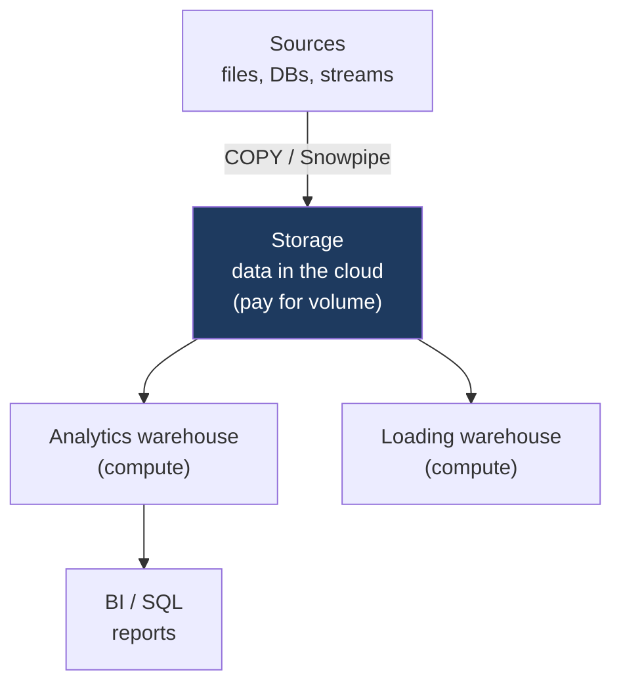

:::tip[In short]
Snowflake's main idea is **separating storage and compute**: data sits separately, and independent **virtual warehouses** process it, scaling and billed separately. This gives flexibility (several teams don't interfere) and cost control. Plus unique features — **Time Travel** and **Zero-Copy Cloning**.
:::

:::note[Data flow]
Input: data from sources (loaded via `COPY`/Snowpipe/connectors)
→ Processing: a virtual warehouse runs SQL and transformations, storage holds the data separately
→ Output: tables and marts for BI and analytics.
Why: scalable cloud storage where you pay only for the compute you use.
:::

## Why you need it

Snowflake is one of the most widespread cloud DWHs, especially in the US and Europe. An analyst should understand the cost model (what "credits" are charged for) and a couple of signature features — interviewers like to ask about them.

## Architecture: storage / compute separation

In a classic DB storage and compute are coupled. Snowflake splits them into three layers:



- **Storage** — data in the cloud, you pay for volume.
- **Compute** — virtual warehouses that run queries; you pay for their running time. There can be several over the same data — teams don't interfere.
- **Cloud services** — the optimizer, metadata, security.

Consequence: you can stop compute (a warehouse "sleeps" — you don't pay) while the data stays; and conversely — scale up power for a heavy query without touching storage.

## How to connect and load data

- **Connecting:** the **Snowsight** web UI, the **SnowSQL** CLI, or drivers (Python `snowflake-connector`, ODBC/JDBC) — BI and [dbt](/en/11-modern-stack/05-dbt-basics/) connect through these too.
- **Loading:** a file goes into a *stage* (internal or S3/GCS), then `COPY INTO` loads it into a table; for a stream — **Snowpipe** (auto-load as files arrive):

```sql
COPY INTO orders
FROM @my_stage/orders.csv
FILE_FORMAT = (TYPE = CSV SKIP_HEADER = 1);
```

## Virtual warehouses

A "warehouse" in Snowflake is a **compute cluster**, not storage (this confuses newcomers). Sizes from XS to 6XL:

- Each team/workload can have its own warehouse — they don't interfere.
- You can set **auto-suspend** (sleep with no queries) and **auto-resume**.

```sql
-- create a compute cluster that sleeps after 60 sec idle
CREATE WAREHOUSE analytics_wh
  WAREHOUSE_SIZE = 'XSMALL'   -- XS, S, M, L, XL ... 6XL
  AUTO_SUSPEND = 60           -- seconds idle before sleeping (don't burn credits)
  AUTO_RESUME = TRUE;         -- wakes up on the next query
```

:::note[Warehouse size and credits]
Each size step **doubles** both power and cost: XS = 1 credit/hour, S = 2, M = 4, L = 8, and so on. A credit is billed per second (minimum 60 sec after waking). Takeaway: XS/S is enough for dashboards and ad-hoc; a large warehouse is only for genuinely heavy transformations — and always with `AUTO_SUSPEND`.
:::

## Time Travel and Zero-Copy Cloning

Two signature features:

- **Time Travel** — query data "as it was N days ago" or restore what was deleted:

```sql
-- the table's state 1 hour ago (before a botched UPDATE)
SELECT * FROM orders AT (OFFSET => -3600);
-- bring back an accidentally dropped table in one command
UNDROP TABLE orders;
```

The default retention window is 1 day (up to 90 on Enterprise).

- **Zero-Copy Cloning** — an instant copy without duplicating data (metadata is copied, the data is physically shared until changes):

```sql
-- a full copy of the prod database for testing in seconds, with no storage cost
CREATE DATABASE analytics_dev CLONE analytics_prod;
```

## SQL features

Snowflake SQL is close to standard, plus useful extensions:

```sql
-- VARIANT stores JSON as-is; access via : and unfold with FLATTEN
SELECT t.value:item_id::int AS item_id
FROM orders, LATERAL FLATTEN(input => orders.items) t;

-- QUALIFY filters by a window function without a subquery wrapper
SELECT order_id, amount,
       ROW_NUMBER() OVER (PARTITION BY customer_id ORDER BY amount DESC) AS rn
FROM orders
QUALIFY rn = 1;     -- the top-1 order per customer
```

`VARIANT` + `FLATTEN` is for semi-structured data (JSON from an API), `QUALIFY` is a common shortcut for filtering by [window functions](/en/02-sql/09-window-functions/).

## Credits and cost optimization

:::caution[In Snowflake you pay for compute running time]
Billing is in **credits** for warehouse running time (not the number of queries). A forgotten large warehouse that didn't "sleep" burns money for nothing. Basic optimization: enable auto-suspend, size for the task (not 4XL for a tiny query), don't scan the excess. An analyst writing inefficient queries on a huge warehouse costs the company dearly.
:::

## Practice tasks

<details>
<summary>1. Is a "warehouse" in Snowflake where data is stored?</summary>

No, a common confusion. A virtual warehouse in Snowflake is a compute cluster that runs queries. Data is stored separately, in the storage layer. The separation of storage and compute is the architecture's key idea.

</details>

<details>
<summary>2. You accidentally deleted data from a table. What in Snowflake helps?</summary>

Time Travel: you can query the table's state before the deletion or restore it within the retention window (by default up to a few days). It's a signature Snowflake feature that saves you after erroneous DELETE/DROP without a slow restore from backup.

</details>

## What's next

- [BigQuery](/en/11-modern-stack/03-bigquery/) — Google's alternative, a different pricing model.
- [dbt](/en/11-modern-stack/05-dbt-basics/) — data transformations on top of the DWH.
