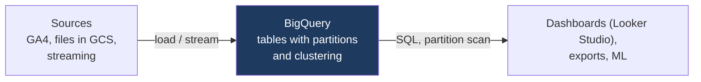

:::tip[In short]
BigQuery is Google's **serverless** DWH: you don't manage servers at all, you just write SQL. The main pricing model is **on-demand: you pay for the volume of data a query reads**. So the key skill is **partitioning and clustering**, to make a query scan less and cost less.
:::

:::note[Data flow]
Input: data is loaded into BigQuery (load jobs, streaming, external tables from GCS)
→ Processing: the serverless engine scans the needed partitions/clusters for the SQL query
→ Output: results for dashboards, exports and ML.
Why: analytics with no server administration; you pay for the volume of data scanned.
:::

## Why you need it

BigQuery is popular at product companies and natively tied to Google's ecosystem (GA4, [Looker Studio](/en/07-bi-tools/looker/01-intro/)). An inefficient query here hits the wallet directly — understanding the pricing model saves real money.

## Architecture

Fully **serverless**: no clusters to manage (unlike Snowflake's warehouses). Google allocates resources for the query itself. You just load data and write SQL — the infrastructure is invisible.



## How to connect and load data

- **Connecting:** the BigQuery web console, the `bq` CLI, client libraries (Python `google-cloud-bigquery`), and natively — [Looker Studio](/en/07-bi-tools/looker/01-intro/).
- **Loading:** a one-off file import, continuous streaming, or **external tables** right over files in GCS:

```bash
bq load --source_format=CSV dataset.orders gs://bucket/orders.csv
```

GA4 can stream events into BigQuery natively — hence its popularity in product analytics.

## Standard vs Legacy SQL

There used to be a proprietary "Legacy SQL"; now the standard is **Standard SQL** (ANSI-compliant, like in regular DBs). Always use Standard SQL; Legacy appears only in very old projects.

## Partitioning and clustering

The main saving tools, since you pay for the scanned volume:

- **Partitioning** (usually by date) — the table is physically split into parts. A query filtering by date reads only the needed partitions, not the whole table.
- **Clustering** — data within a partition is ordered by chosen columns, which further reduces reads when filtering by them.

```sql
-- set partitioning by day and clustering by country at table creation
CREATE TABLE `project.dataset.orders`
PARTITION BY DATE(event_ts)
CLUSTER BY country AS
SELECT * FROM `project.dataset.orders_raw`;

-- a filter on the partitioned field sharply cuts the scan volume and price
SELECT country, SUM(amount)
FROM `project.dataset.orders`
WHERE DATE(event_ts) BETWEEN '2026-01-01' AND '2026-01-31'   -- reads 1 month, not all
GROUP BY country;
```

:::tip[Count the money: how many bytes the query will read]
On-demand costs roughly **$6 per 1 TB** scanned. Before running, check the volume: the BigQuery UI shows an estimate "This query will process X" on the right, or from the CLI — `bq query --dry_run` (doesn't run, just shows the bytes). If an events table is 5 TB but a partition filter cuts the scan to 50 GB, that's a $30 vs $0.30 difference per run.
:::

## Pricing: on-demand vs slots

| Model | How you pay | When |
|-------|-------------|------|
| **On-demand** | per TB read by a query | unpredictable load |
| **Slots (capacity)** | for reserved capacity (fixed/month) | large stable volume |

:::caution[`SELECT *` in BigQuery hits the wallet]
On-demand, you pay for **columns read**. `SELECT *` on a wide table scans all columns and is expensive, even if you need two fields. Select only the needed columns and filter by partition. Note: `LIMIT` itself does NOT reduce the scan volume under on-demand.
:::

## BI Engine

An in-memory accelerator for dashboards: it caches data so BI tools (Looker Studio, etc.) return reports with sub-second latency. Useful when there are many interactive dashboards on top of BigQuery.

<details>
<summary>1. Why is `SELECT *` an expensive habit in BigQuery?</summary>

Under on-demand, billing is by the volume of data read, and BigQuery is columnar — `SELECT *` reads all columns, even unneeded ones. Selecting the 2 needed fields instead of all 50 costs many times less. Plus a filter on the partitioned date cuts the volume even further.

</details>

<details>
<summary>2. The events table is huge, but queries are almost always for a specific period. What to set up?</summary>

Partitioning by event date: then a query filtering by date reads only the needed partitions, not the whole table — faster and cheaper. Additionally — clustering by frequently filtered columns (e.g. country) for an even smaller scan.

</details>

## What's next

- [ClickHouse](/en/11-modern-stack/04-clickhouse/) — an OLAP warehouse popular in the CIS.
- [Looker Studio](/en/07-bi-tools/looker/01-intro/) — connects natively to BigQuery.
