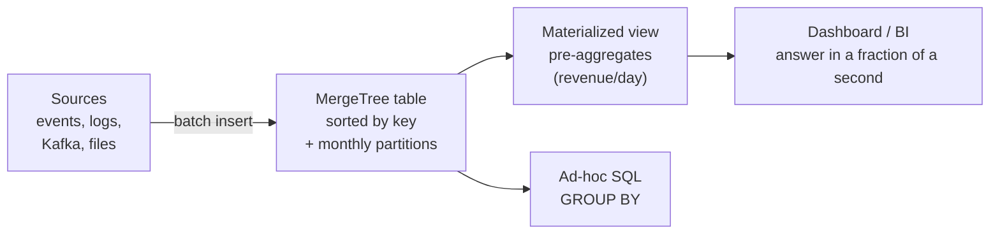

:::tip[In short]
ClickHouse is a super-fast open-source columnar OLAP database created at Yandex. Tuned for **analytical queries at scale** (billions of rows in seconds). At its heart is the **MergeTree** engine family. It appears very often in CIS postings, so knowing its basics is especially useful here.
:::

:::note[Data flow]
Input: events / logs / exports (INSERT, Kafka, files, S3)
→ Processing: MergeTree sorts, compresses and merges parts; a materialized view computes aggregates on insert
→ Output: lightning-fast `GROUP BY` for dashboards and ad-hoc.
Why: analytics over billions of rows in seconds where a regular DB would stall.
:::

## Why you need it

In the CIS ClickHouse is almost a standard for product analytics (used by Yandex and many companies around it). If you're job-hunting here, there's a good chance you'll work with it rather than Snowflake/BigQuery ([stack overview](/en/00-intro/market-stack-2026/)). The typical scenario is event analytics: billions of rows of logs/clicks needing fast `GROUP BY`.

## Columnar storage at a glance

"Columnar" is the key word. Take the same table:

| order_id | country | amount |
|----------|---------|--------|
| 1 | RU | 2500 |
| 2 | KZ | 4200 |
| 3 | RU | 1800 |

The difference is **how it physically sits on disk**:

| Layout | How it sits on disk | What `SUM(amount)` reads |
|--------|---------------------|--------------------------|
| Row-based (PostgreSQL) | `(1,RU,2500)` `(2,KZ,4200)` `(3,RU,1800)` — whole rows | **all** columns of all rows |
| Columnar (ClickHouse) | `[1,2,3]` · `[RU,KZ,RU]` · `[2500,4200,1800]` — each column separately | **only** the `amount` column |

So an aggregate over a billion rows in ClickHouse is reading **one column**, not the whole table. Plus same-type column values compress well. Hence the speed.

## How it all works together

The whole path of data from source to dashboard in one diagram:



Below — step by step through this diagram: how to install, how to load data, how to organize the table and how to work with it.

## How to set it up and connect

Where it comes from — two paths:

- **Self-hosted** — run it yourself. Fastest via Docker:

```bash
docker run -d --name ch -p 8123:8123 -p 9000:9000 clickhouse/clickhouse-server
clickhouse-client            # an interactive SQL client in the terminal
```

- **ClickHouse Cloud** — a managed service, no server to administer.

You connect to it via three interfaces:

| Interface | Port | For what |
|-----------|------|----------|
| **HTTP** | 8123 | queries from code/scripts, REST |
| **Native (TCP)** | 9000 | `clickhouse-client`, the fastest |
| **ODBC / JDBC driver** | — | connecting [BI tools](/en/07-bi-tools/) |

## How data gets in

ClickHouse loves **batch inserts** (insert in thousands of rows, not one at a time):

```sql
INSERT INTO events VALUES (...), (...);          -- manually
INSERT INTO events FROM INFILE 'data.csv' FORMAT CSV;   -- from a file
```

For a continuous stream, **integration engines** are used — tables that pull data from a source themselves: `Kafka` (event stream), `PostgreSQL`/`MySQL` (an OLTP replica), `S3` (files from a lake). A [materialized view](#materialized-views) is often placed over such a source to push the data into a MergeTree table on the fly.

:::caution[Don't insert one row at a time]
ClickHouse creates a separate "part" for each insert and merges them in the background. Thousands of tiny single-row `INSERT`s spawn thousands of parts and kill performance. Accumulate and insert in **batches** — that's the main loading rule.
:::

## How data is organized: MergeTree

The main table family. Data is written in parts that merge in the background, stored sorted by the **sorting key** (`ORDER BY` in the DDL):

```sql
CREATE TABLE events (
    event_date Date,
    user_id UInt64,
    event_type String,
    amount Float64
) ENGINE = MergeTree()
PARTITION BY toYYYYMM(event_date)   -- split into parts by month
ORDER BY (event_date, user_id);     -- sorting key = fast range queries
```

- **`ORDER BY`** (the sorting key) works as a primary index — fast range lookups.
- **`PARTITION BY`** physically splits the table (usually by month): a query filtering by date reads only the needed partitions, and old ones are easy to drop whole (`DROP PARTITION`).

MergeTree has **engine variants** — they "collapse" rows with the same sorting key differently during background merges:

| Engine | What it does on merge | When |
|--------|-----------------------|------|
| **MergeTree** | nothing, keeps all rows | raw events |
| **ReplacingMergeTree** | keeps the latest version per key | deduplication, "latest state" |
| **SummingMergeTree** | sums numeric columns by key | pre-aggregates |
| **AggregatingMergeTree** | stores aggregate states | complex precomputations with MVs |

:::caution["Collapsing" doesn't happen immediately]
ReplacingMergeTree removes duplicates only during a background merge — the timing isn't controllable. To reliably see the collapsed result, add the `FINAL` modifier (`SELECT ... FROM t FINAL`) — but it's slow, don't overuse it on large data.
:::

### ARRAY JOIN

ClickHouse can store **arrays** in a cell (e.g. a list of items in an order). `ARRAY JOIN` "unfolds" the array into rows — the unnest analog:

```sql
SELECT user_id, item
FROM orders
ARRAY JOIN items AS item;     -- one row with [a,b,c] → three rows
```

### Materialized views

A **materialized view** works like an insert trigger: when data is written to the source table, it automatically computes an aggregate and stores it in another table.

```sql
-- the MV computes daily revenue right as new events are inserted
CREATE MATERIALIZED VIEW revenue_daily_mv
ENGINE = SummingMergeTree()
ORDER BY day AS
SELECT toDate(event_date) AS day, sum(amount) AS revenue
FROM events
GROUP BY day;
```

Now the dashboard reads the tiny `revenue_daily_mv` (one row per day) instead of aggregating billions of `events` rows every time it opens.

## How to work with it

Queries are written in near-standard SQL plus its own functions: `uniq()` (an approximate, very fast `COUNT DISTINCT`), `quantile()`, `toDate/toStartOfMonth`, `arrayJoin`. You work through `clickhouse-client`, HTTP, or a connected [BI tool](/en/07-bi-tools/) (Metabase, Tableau, Yandex DataLens — via a driver).

:::caution[ClickHouse isn't for frequent UPDATE/DELETE]
It's an OLAP engine: brilliant at reads and batch inserts, but **pointwise UPDATE/DELETE are expensive and asynchronous** (via `ALTER ... UPDATE`, "mutations"). Don't use it as a transactional application DB — that's what [OLTP](/en/11-modern-stack/01-cloud-dwh-overview/) is for. It's for analytics, not "update the order status".
:::

**The flow end to end:** events stream in batches into a MergeTree table, get sorted and partitioned, MVs compute pre-aggregates — and the dashboard gets an answer over billions of rows in a fraction of a second.

## Practice tasks

<details>
<summary>1. A script does 50,000 single-row INSERTs into ClickHouse and everything lags. What's wrong?</summary>

ClickHouse creates a separate part for each insert and merges them in the background. Thousands of single-row `INSERT`s spawn thousands of parts — degradation. You need to accumulate and insert in **batches** (thousands of rows at a time) or stream via a buffer/Kafka engine. This is the key loading rule in ClickHouse.

</details>

<details>
<summary>2. The team wants to store orders with frequent status updates in ClickHouse. Good idea?</summary>

A bad one. ClickHouse is an OLAP engine, pointwise UPDATEs are expensive and asynchronous (mutations). Frequent status updates are an OLTP load, needing a transactional DB (PostgreSQL). Keep ClickHouse for event analytics: fast reads and batch inserts, not row-by-row updates.

</details>

<details>
<summary>3. Why a materialized view?</summary>

To compute aggregates ahead of time, at insert. An MV works like a trigger: new rows in the source table are automatically aggregated into a target (e.g. revenue by day). Dashboards read a small pre-computed result instead of a heavy recompute over billions of rows.

</details>

## What's next

- [dbt](/en/11-modern-stack/05-dbt-basics/) — data transformations as code (works over ClickHouse too).
- [Market stack 2026](/en/00-intro/market-stack-2026/) — why ClickHouse matters so much in the CIS.
